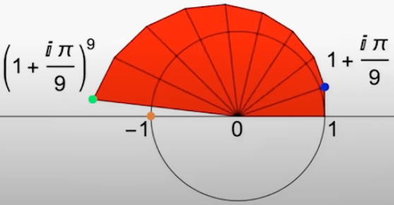
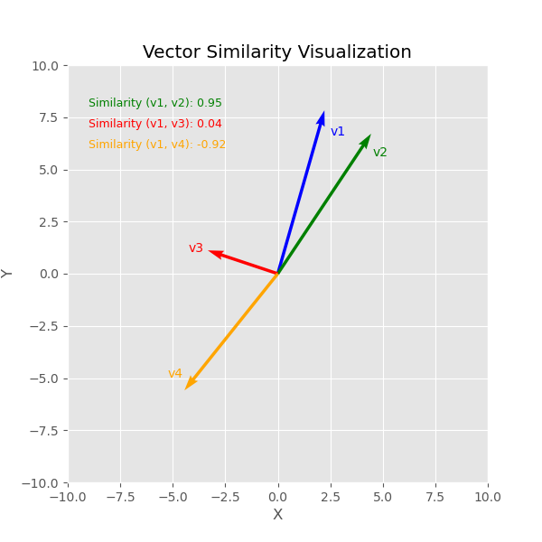
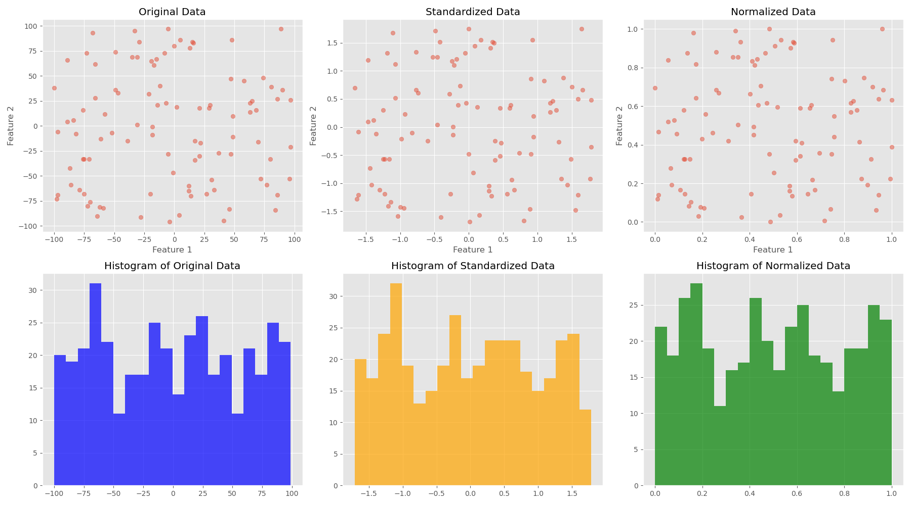
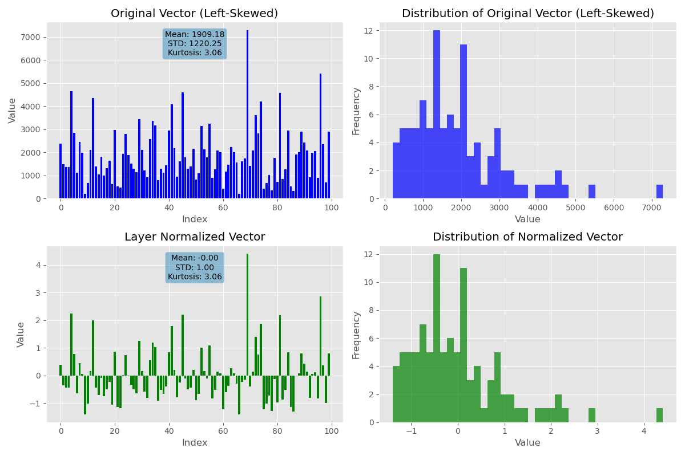
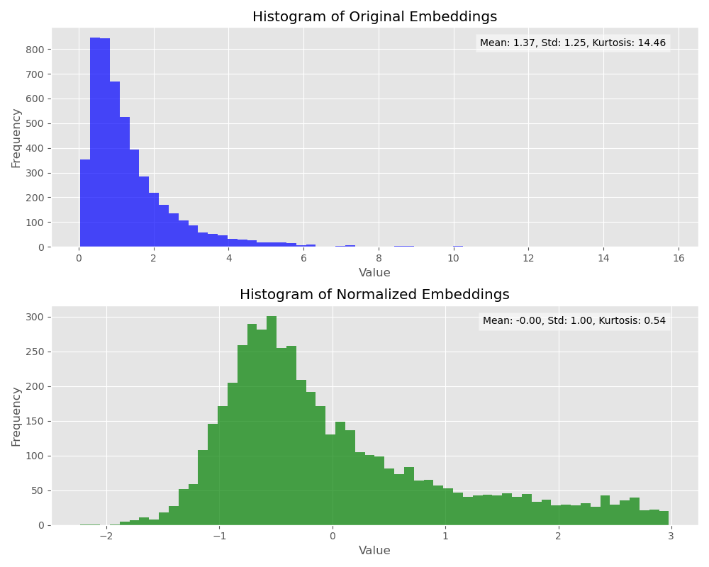
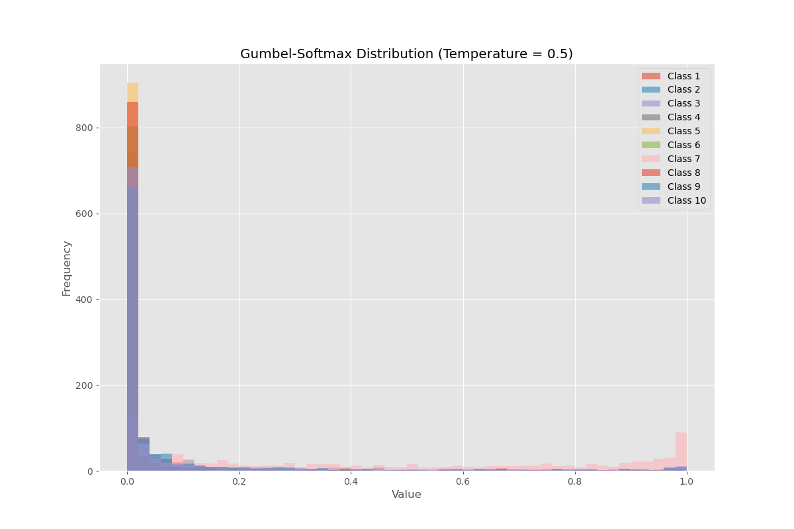
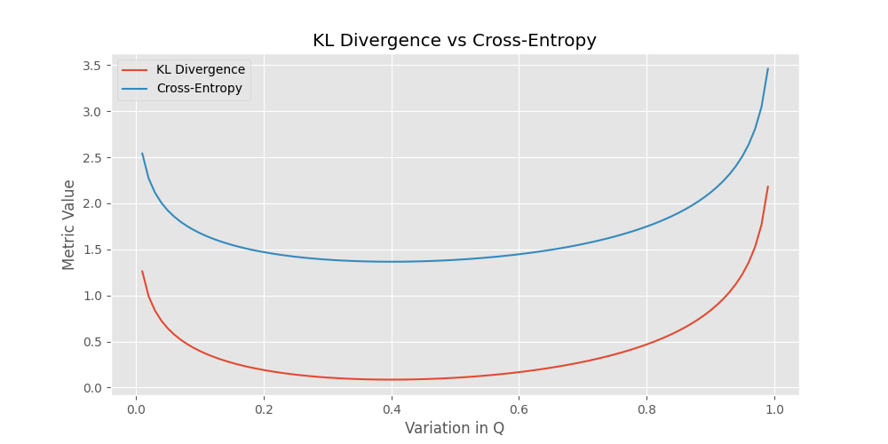

# AI Math



## Cosine Similarity

Cosine similarity is a metric used to measure how similar two vectors are irrespective of their magnitude. It's commonly used in various fields, particularly in the realm of information retrieval, text analysis, and machine learning, for comparing documents, images, or other data represented as vectors.

### Definition of Cosine Similarity



Cosine similarity calculates the cosine of the angle between two vectors. This value ranges from -1 to 1, where:
- 1 indicates that the two vectors are identical (0° angle),
- 0 indicates that the vectors are orthogonal (90° angle),
- -1 indicates that the vectors are diametrically opposed (180° angle).

The formula to calculate cosine similarity between two vectors \( \mathbf{A} \) and \( \mathbf{B} \) is:
\[ \text{cosine similarity} = \frac{\mathbf{A} \cdot \mathbf{B}}{\|\mathbf{A}\| \|\mathbf{B}\|} \]
where \( \mathbf{A} \cdot \mathbf{B} \) is the dot product of the vectors, and \( \|\mathbf{A}\| \) and \( \|\mathbf{B}\| \) are the Euclidean norms (magnitudes) of the vectors.

### Ignoring the Magnitude in Cosine Similarity
The cosine similarity inherently focuses on the direction rather than the magnitude of the vectors. When considering the similarity, the scale of the vectors (i.e., their magnitudes) doesn't affect the outcome because it is normalized by the magnitudes of the vectors in the denominator of the formula.

#### Cases Where Magnitude Can Be Ignored
- **Text Similarity**: In text analysis, such as document comparison or clustering, cosine similarity is particularly useful because it measures similarity in terms of text content orientation regardless of document length. For example, it will consider two documents to be similar if they contain many of the same terms, even if one document is much longer than the other.
- **Recommendation Systems**: In collaborative filtering, where we might want to find users with similar preferences based on their ratings across a range of items, cosine similarity allows us to focus on the pattern of ratings rather than on the scale (how generous or harsh the rater is).
- **Image Similarity**: When comparing image features extracted by models, cosine similarity can help determine the similarity in patterns or textures identified by the features, independent of image size or scale.

### Situations Where Magnitude Matters
While cosine similarity is excellent for comparing directions or orientations of vectors, there are cases where the magnitude of the vectors should not be ignored:
- **Weight of Importance**: If the magnitude of a vector represents a weight of importance, such as frequency counts that matter (e.g., a customer purchasing large quantities vs. small quantities of a product), then using cosine similarity alone might be inappropriate. Here, metrics that consider the magnitude, like Euclidean distance, might be more appropriate.
- **Signal Strength**: In fields like signal processing, the strength of a signal (its magnitude) can be as important as its pattern or direction.

In summary, cosine similarity is highly effective for comparing the orientation of vectors in high-dimensional space, making it a powerful tool in natural language processing, computer vision, and other fields where the direction of the data vectors is more significant than their magnitude.

## Normalization

The term "norm" in the contexts of data scaling (such as normalization using min-max scaling or standardization) and in Layer Normalization (a technique used in deep learning) refers to different concepts and processes. Here’s a brief overview of how "norm" is used in each context:

### Norm in Data Scaling



In data scaling, "norm" typically refers to the process of normalizing data. This involves adjusting the values in the dataset so that they fit within a certain range, such as 0 to 1 or -1 to 1. This is usually done to ensure that all input features (variables) contribute equally to the analysis and to help algorithms perform better and converge faster. The two common types of norms used in data scaling are:
- **Min-Max Normalization**: Rescales data to a fixed range, usually 0 to 1.
- **Z-score Normalization (Standardization)**: Rescales data to mean of 0 and a standard deviation of 1.

### Norm in Layer Normalization



Layer Normalization is a technique used in training deep neural networks. It involves normalizing the inputs across the features for each data sample. This can be particularly useful in stabilizing the hidden state dynamics in recurrent networks, and it is also widely used in transformers and other types of networks. The "norm" in Layer Normalization refers to the process of calculating the mean and standard deviation across each entire layer's outputs for a single training case, and then using these statistics to normalize the outputs of the layer.

- **Process**: For each data sample in a batch, Layer Normalization computes the mean and variance used for normalization from all of the summed inputs to the neurons in a layer on a single training case. Unlike Batch Normalization, which does this across the batch dimension, Layer Normalization does it across the features.

### Key Differences:
- **Scope**: In data scaling, normalization is typically applied to the entire dataset before training to adjust the range of data features. In contrast, Layer Normalization is applied to the outputs of individual layers within a neural network during training.
- **Purpose**: Data scaling normalization aims to adjust the scale of data for better convergence and performance of machine learning algorithms. Layer Normalization aims to stabilize learning and reduce the training time in deep neural networks by reducing internal covariate shift.
- **Application Level**: Normalization in data scaling is a preprocessing step, external to any model, while Layer Normalization is an integral part of model architecture and affects the learning process directly.

Thus, even though both use the term "norm," they apply it in different contexts and for different purposes within data science and machine learning.

### Will the kurtosis be preserved after Layernorm?

The effect of Layer Normalization on the kurtosis of a dataset can vary, but it typically does not preserve kurtosis. Layer Normalization (or any normalization that scales data based on its mean and variance) can significantly alter the shape of the distribution, including its tails and peak, which are key factors in determining kurtosis.

### Understanding Kurtosis:
Kurtosis measures the "tailedness" of a probability distribution:
- A **positive kurtosis** indicates a distribution with heavy tails and a sharp peak (leptokurtic).
- A **negative kurtosis** indicates a distribution with light tails and a flatter peak (platykurtic).
- A **kurtosis of zero** is associated with a normal distribution (mesokurtic).

### Effect of Layer Normalization:



Layer Normalization standardizes data by subtracting the mean and dividing by the standard deviation for each individual example in the dataset. This process reshapes the distribution of the data to have a mean of zero and a standard deviation of one. Here's how it can affect kurtosis:
- **Centralizing the Mean**: This step doesn't directly affect kurtosis, as it simply shifts the distribution.
- **Scaling by the Standard Deviation**: This changes the spread of the distribution. If the original data had extreme values or outliers, scaling would reduce the relative extremity of these points, potentially reducing the kurtosis if the original distribution was leptokurtic.

The degree to which kurtosis is changed depends on the original distribution of the data. If the data were uniformly distributed or normally distributed, the change in kurtosis might be less pronounced. However, for distributions with extreme values or outliers, the change can be significant.

To accurately determine the impact of layer normalization on kurtosis, it's beneficial to perform empirical tests or simulations to see how the distribution shape changes with different types of input data. Layer Normalization may not inherently preserve characteristics like kurtosis because its primary goal is to stabilize the learning process rather than maintain specific statistical properties of the input data.


## What is Gumbel-Softmax trick?


The Gumbel-Softmax trick is a method for sampling from a categorical distribution using a differentiable approximation, which allows for gradient-based optimization where standard categorical sampling cannot be used due to its non-differentiable nature. This method is particularly useful in training neural networks, especially in scenarios where you need to backpropagate through discrete variables.

### Understanding the Gumbel-Softmax Trick

The Gumbel-Softmax trick involves two main concepts: the Gumbel distribution and the Softmax function. Here's how it works:

1. **Gumbel Distribution**:
   - To sample from a categorical distribution with class probabilities \( p_1, p_2, \ldots, p_K \), you first need to introduce a way to convert these probabilities into a sample from the categorical distribution. 
   - For each class \( i \), you generate a Gumbel random variable \( G_i \) which can be obtained by transforming uniform random variables. Specifically, \( G_i \) can be sampled using:
     \[
     G_i = -\log(-\log(U_i))
     \]
     where \( U_i \) is a uniform random variable from 0 to 1. This transformation ensures that \( G_i \) follows a Gumbel distribution.

2. **Logits and Noise Addition**:
   - You compute the logits for each class, which are the unnormalized log probabilities \( \log(p_i) \). 
   - The Gumbel random variables are added to these logits. This step essentially perturbs the log probabilities with noise that has a specific extreme value distribution (Gumbel).

3. **Softmax Function**:
   - The perturbed logits are then passed through a softmax function, which is a differentiable function commonly used in multi-class classification problems in neural networks. The softmax function is given by:
     \[
     y_i = \frac{\exp((\log(p_i) + G_i) / \tau)}{\sum_{j=1}^K \exp((\log(p_j) + G_j) / \tau)}
     \]
   - Here, \( \tau \) is a temperature parameter that controls how closely the Gumbel-Softmax distribution approximates the categorical distribution. As \( \tau \) approaches 0, the samples become one-hot encoded (mimicking exact categorical samples), making the distribution more discrete. As \( \tau \) increases, the distribution becomes smoother and more continuous.

### Applications and Importance

The Gumbel-Softmax trick is particularly important in scenarios where:
- **End-to-End Learning**: You need to learn policies or other components that involve discrete decisions in an end-to-end trainable system.
- **Gradient Backpropagation**: The model involves discrete choices, and you want to use standard gradient-based learning techniques, which require differentiability.

This approach is widely used in reinforcement learning, variational autoencoders (VAEs) for discrete latent variables, and other areas of machine learning where modeling and learning discrete distributions in a differentiable manner are crucial.


## What is the difference between Kullback–Leibler (KL) divergence and cross-entropy?

The Kullback–Leibler (KL) divergence and cross-entropy are two related concepts in the field of information theory, commonly used to measure the difference between two probability distributions.



### Kullback–Leibler (KL) Divergence
KL Divergence, also known as relative entropy, is to measure the difference between two probability distributions. It quantifies the information lost when one distribution (Q) is used to approximate another distribution (P).

For discrete probability distributions, the KL divergence (D) is calculated as:

```
D_KL(P || Q) = ∑ P(x) log(P(x) / Q(x))
```
where:

*  P(x): True probability distribution
*  Q(x): Predicted probability distribution
*  ∑: Summation over all possible values of x

Unlike cross-entropy, KL divergence is not symmetric, meaning `D_KL(P || Q) != D_KL( Q|| P)`, and it is non-negative, where a value of 0 indicates that the two distributions are identical.

**Example Calculation**

```
True Distribution (P):   [0.6, 0.2, 0.2] 
Predicted Distribution (Q): [0.4, 0.3, 0.3]
```

To calculate the KL divergence:

```
D_KL(P || Q) = 0.6 * log(0.6 / 0.4) + 0.2 * log(0.2 / 0.3) + 0.2 * log(0.2 / 0.3)
D_KL(P || Q) ≈ 0.097
```

The KL divergence in this case is approximately 0.097. It indicates the amount of information lost when using Q to approximate P.

**Python Code**

```python
import numpy as np

P = np.array([0.6, 0.2, 0.2])
Q = np.array([0.4, 0.3, 0.3])

kl_divergence = np.sum(P * np.log(P / Q))
print("KL Divergence:", kl_divergence)
```


* KL divergence is always non-negative.
* KL divergence is 0 only when the two distributions are identical.
* KL divergence is not symmetric (D_KL(P || Q) ≠ D_KL(Q || P)).


### Cross-Entropy
Cross-entropy measures the average number of bits needed to identify an event from a set of possibilities if a coding scheme used for the set is based on a different probability distribution (Q) rather than the true distribution (P). It is defined as:

```
H(p, q) = - ∑ p(x) log(q(x))
```
where:

*  p(x): True probability distribution
*  q(x): Predicted probability distribution
*  ∑: Summation over all possible values of x


Cross-entropy is often used in machine learning for classification problems, where (P) represents the true labels and (Q) the predicted probabilities.
In the context of machine learning, it's often used as a loss function to guide the learning process. The lower the cross-entropy, the closer the predicted distribution is to the true distribution.

**Example Calculation**

Let's create two simple distributions over three events (A, B, and C):

```
True Distribution (p):   [0.6, 0.2, 0.2] 
Predicted Distribution (q): [0.4, 0.3, 0.3]
```

Now, let's calculate the cross-entropy:

```
H(p, q) = - (0.6 * log(0.4) + 0.2 * log(0.3) + 0.2 * log(0.3))
H(p, q) ≈ 0.573
```

The cross-entropy in this case is approximately 0.573. This means there's a moderate difference between the true and predicted distributions. If the predicted distribution were identical to the true distribution (e.g., both [0.6, 0.2, 0.2]), the cross-entropy would be 0.

**Python Code**

```python
import numpy as np

p = np.array([0.6, 0.2, 0.2])
q = np.array([0.4, 0.3, 0.3])

cross_entropy = -np.sum(p * np.log(q))
print("Cross-entropy:", cross_entropy)
```

* Cross-entropy is always non-negative.
* Cross-entropy is 0 only when the two distributions are identical.
* Cross-entropy increases as the difference between the distributions increases.


> 🗊 Note that the cross-entropy loss is equivalent to the KL divergence plus the entropy of P. As for the naming convention, probability starts with `P` so P is for true probablity. `Q` is next to `P`, so it is for prediction probability.


## Can we use KL Divergence to replace Cross Entropy as the loss function in classification problems?

Although KL divergence and cross-entropy are closely related, and minimizing cross-entropy is equivalent to minimizing KL divergence (when the true distribution is fixed), cross-entropy is more commonly used as a loss function in machine learning, especially in classification problems.

Here are some reasons why:

* **Computational Efficiency:** In classification problems, true labels are usually represented with one-hot encoding, meaning only one category is 1, and the rest are 0. In this case, calculating cross-entropy is simpler and more efficient than calculating KL divergence.
* **Numerical Stability:** Calculating cross-entropy involves logarithms, which can lead to numerical instability when predicted probabilities approach 0. The cross-entropy formula itself includes logarithms, which can avoid this problem.
* **More Direct Interpretation:** In classification problems, cross-entropy can be directly interpreted as the difference between the predicted probability distribution and the true label distribution. KL divergence, on the other hand, focuses more on information loss between two distributions, making it relatively abstract to interpret.

In summary, while KL divergence can be used to measure the difference between two distributions, cross-entropy is more practical as a loss function in classification problems because it is computationally more efficient, numerically more stable, and has a more direct interpretation.

Of course, KL divergence can also be a suitable loss function in certain cases, such as:

* **Generative Models:**  When training generative models, the goal is to learn the data distribution. KL divergence can be used to measure the difference between the generated distribution and the true distribution.
* **Reinforcement Learning:** In reinforcement learning, KL divergence can be used to measure the difference between policies before and after policy updates.

Therefore, the choice of loss function depends on the specific task and objectives.