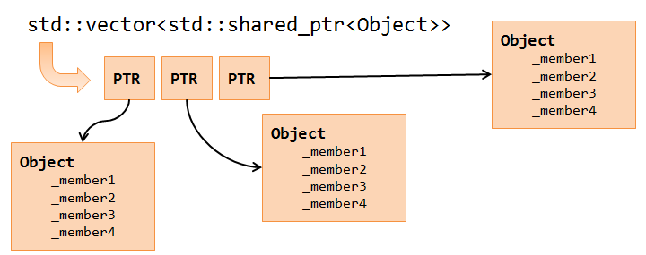

Sample
=============================================

Question 0
----------------------

- Numbered Reference

For code:

See :numref:`this-py` for an example.

For figure:

This is :numref:`xxx`. 

.. note::

    figure numref doesn't work for PDF.

- Clickable Reference

Click it :ref:`this figure <xxx>`

----

.. figure:: ../../material/cover400.png
    :align: center
    :width: 250px
    :name: xxx
    :alt: xxx
    :target: http://www.google.com

    book cover

    The legend consists of all elements after the caption.  In this
    case, the legend consists of this paragraph and the following
    table.

To cross-refer an image, you need to use `figure`, which is an image with caption. The caption is required!

----

.. code-block:: python
    :caption: this.py
    :name: this-py

    print('Explicit is better than implicit.')

Question 1
----------------------

abc

Question 2
----------------------

efg

Question 3
----------------------

this is a follow up of `Question 0`_.

.. raw:: latex

    \begin{OriginalVerbatim}[commandchars=\\\{\}]
    hello too
    \end{OriginalVerbatim}

    \begin{figure}
    \centering
        \includegraphics[width=0.7\textwidth]{../../source/ch0-math/vec2.png}
        \caption{A picture of a gull.}
    \end{figure}

    
    A picture of a gull.

This text includes a smiley face |:smile:| and a snake too! |:snake:|

Don't you love it? |:heart_eyes:|

.. sphinxemojitable::
    

|:loudspeaker:|
|:a:|
|:b:|
|:balance_scale:|
|:bell:|

|:cloud:|
|:clock:|

- Reference

|:link:| `heading <https://lpn-doc-sphinx-primer.readthedocs.io/en/stable/concepts/heading.html>`_
