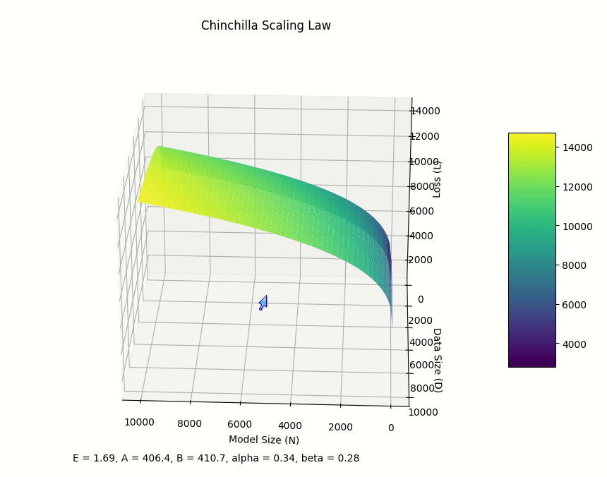
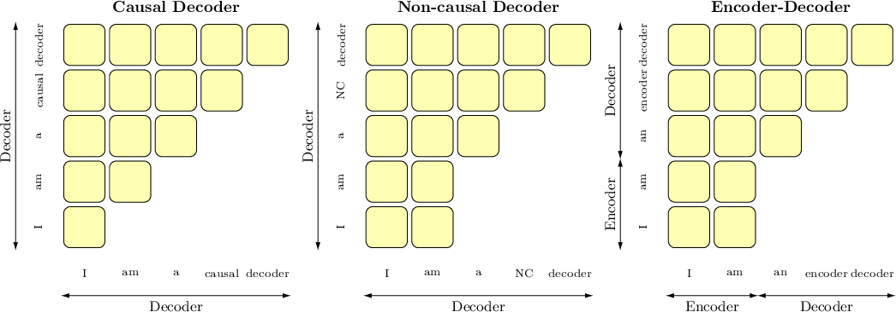
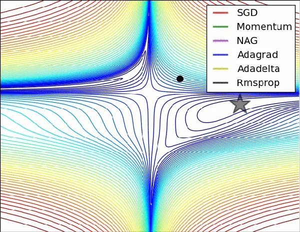
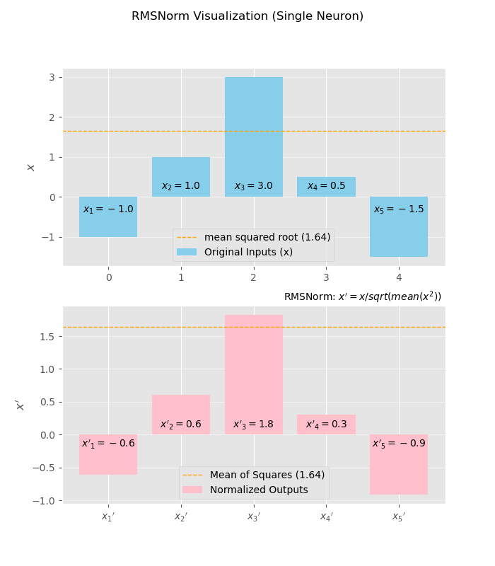
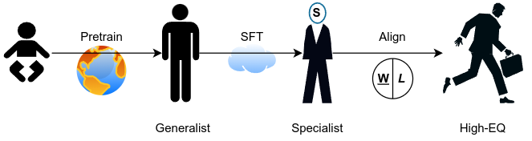
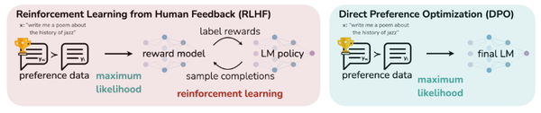
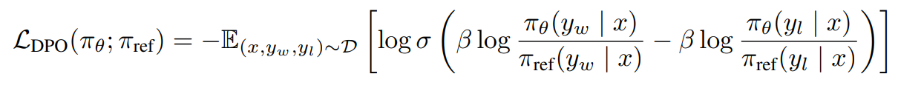

# Large Language Model

- Cast: LLM, Transformer
- Song: [Large Language Model](https://www.youtube.com/watch?v=59UIVmFkxbs), [Attention Is All You Need](https://www.youtube.com/watch?v=g_tvY_pVwKI)


LLMs are advanced artificial intelligence models trained on massive amounts of text data. They can generate realistic text, translate languages, write different kinds of creative content, and answer your questions in informative ways. An LLM's power comes from its training process.  It "learns" to understand and produce language by analyzing enormous amounts of text – think millions of books, articles, and code repositories. Most LLMs are built on a neural network architecture called a transformer. Transformers excel at handling sequential data (like words in a sentence) and pinpointing complex relationships within language.

LLMs streamline how we use search engines, get help from virtual assistants, and even create content. LLMs are still evolving, but the potential is huge. They could revolutionize education, healthcare, customer service, and more.

LLMs sometimes generate incorrect information or output text that seems logical but is factually wrong. It's essential to be aware of their limitations. The quality of data used for training greatly influences the LLM's abilities and potential biases.

## Model Basics


### Why Transformer is used for LLM, instead of CNN, RNN or MLP?

Here's a breakdown of why transformers are favored over CNNs, RNNs, and MLPs for building LLMs:

**Transformers and Their Advantages for LLMs**

* **Sequential Data Mastery:** Transformers excel at handling sequences, which is crucial for LLMs that deal with text. They can analyze the relationships between words across long distances within a sentence, unlike CNNs or MLPs that struggle with long-range dependencies.

* **Attention Mechanism:** A core strength of transformers is their attention mechanism. This allows the model to focus on specific parts of the input sequence that are most relevant to the current processing step. This is particularly beneficial for LLMs where understanding context is critical.

* **Parallel Processing Power:** Transformers are well-suited for parallel processing, which means they can efficiently train on massive datasets using multiple graphics processing units (GPUs) at once. This is essential for LLMs that require enormous amounts of training data.

**Why Other Architectures Fall Short for LLMs**

* **CNNs (Convolutional Neural Networks):** While CNNs are powerful for image recognition, they struggle with sequential data like text. Their strength lies in capturing local patterns, not long-range dependencies in sentences.

* **RNNs (Recurrent Neural Networks):** RNNs can handle sequences, but they suffer from the vanishing/exploding gradient problem, making it difficult to learn long-range dependencies. LSTMs and GRUs partially address this, but transformers offer a more efficient solution.

* **MLPs (Multi-Layer Perceptrons):** MLPs are simpler models that lack the capability to effectively capture the complex relationships between words in a sentence. They are not well-suited for the intricacies of natural language.

**In essence, transformers provide the ideal combination of:**

* **Sequential data processing**
* **Attention mechanism for context**
* **Parallel processing for efficient training**

These factors make them the preferred architecture for building powerful LLMs.

**Additional Points to Consider**

* **Research into Alternative Architectures:** While transformers are dominant, research is ongoing for alternative LLM architectures that address potential shortcomings of transformers, such as computational cost for very long sequences.

----

###  🌡️ What is temperatures in LLM and how does it work under the hood?

In large language models (LLMs), temperature is a hyperparameter that controls the randomness of the model's output. It influences the creativity and diversity of the generated text.

**How it works under the hood:**

1. **Logits:** LLMs produce a probability distribution over the entire vocabulary for each word it generates. The raw, unscaled output scores representing these probabilities are called logits.

2. **Softmax:** To convert logits into actual probabilities, LLMs use a function called softmax. This function normalizes the logits, ensuring that the probabilities of all possible words sum up to 1.

3. **Temperature Scaling:** Before applying softmax, the temperature parameter scales the logits. The formula for this is:
   
   ```
   scaled_logits = logits / temperature
   ```

4. **Probability Distribution:** The scaled logits are then passed through the softmax function, producing the final probability distribution over the vocabulary.

**Effects of Temperature:**

* **Low Temperature (e.g., 0.2):** The model becomes more conservative and deterministic. It will favor the most likely words according to its training data, resulting in more predictable and focused outputs. This is often desirable for tasks that require factual accuracy or specific answers.
* **High Temperature (e.g., 1.5):** The model becomes more creative and diverse. It is more likely to sample less probable words, leading to unexpected and imaginative outputs. This is useful for tasks like creative writing or brainstorming where originality is valued.
* **Temperature = 1:** This is the default setting for many LLMs, providing a balance between predictability and creativity.

**Choosing the Right Temperature:**

The optimal temperature depends on the specific task and desired output. Some general guidelines include:

* **Factual Tasks:** Lower temperatures are preferred when accuracy and conciseness are important.
* **Creative Tasks:** Higher temperatures are useful for generating diverse and original text.
* **Experimentation:** It's often best to experiment with different temperatures to find the one that works best for your specific application.

----

### What is Chinchilla scaling Law? Why is it important?

In general, a neural model can be characterized by 4 parameters: size of the model, size of the training dataset, cost of training, performance after training. Each of these four variables can be precisely defined into a real number, and they are empirically found to be related by simple statistical laws, called "scaling laws".

The Chinchilla scaling law is an empirical relationship that describes the optimal allocation of compute resources between model size (number of parameters, N) and training data size (number of tokens, D) for large language models.

**Formula:**

The Chinchilla scaling law can be approximated by the following equation:

```
Loss(N, D) = 406.4N^-0.34 + 410.7D^-0.28 + 1.69
```

This equation implies that:

* The loss decreases with increasing model size (N) and increasing training data size (D).
* The effect of increasing model size diminishes as the model gets larger.
* The effect of increasing training data size diminishes as the dataset gets larger.

**Implication:**

The Chinchilla scaling law suggests that, for a fixed compute budget, the optimal way to allocate resources is to scale the model size and training data size equally. In other words, for every doubling of model size, the number of training tokens should also be doubled.

This finding challenges the previous trend of primarily focusing on increasing model size while keeping training data relatively constant. By adhering to the Chinchilla scaling law, researchers can train more efficient models that outperform larger models trained on fewer data.




In simpler terms, the Chinchilla scaling law for training Transformer language models suggests that when given an increased budget (in FLOPs), to achieve compute-optimal, the number of model parameters (N) and the number of tokens for training the model (D) should scale in approximately equal proportions. This conclusion differs from the previous scaling law for neural language models, which states that N should be scaled faster than D. The discrepancy arises from setting different cycle lengths for cosine learning rate schedulers. In estimating the Chinchilla scaling, the authors set the cycle length to be the same as the training steps, as experimental results indicate that larger cycles overestimate the loss of the models.

The Chinchilla scaling law is described in the paper titled "Training Compute-Optimal Large Language Models" by researchers at DeepMind. This paper presents a detailed analysis of how the scaling of data and model size affects the performance of large language models, leading to the development of the Chinchilla model. It provides insights into the optimal allocation of computing resources for training these models, emphasizing the importance of using larger datasets relative to model size for enhanced performance. This work has contributed significantly to the ongoing discussions and strategies around the development of AI language models.

**LLaMA3** (https://ai.meta.com/blog/meta-llama-3/):

> To effectively leverage our pretraining data in Llama 3 models, we put substantial effort into scaling up pretraining. Specifically, we have developed a series of detailed scaling laws for downstream benchmark evaluations. These scaling laws enable us to select an optimal data mix and to make informed decisions on how to best use our training compute. Importantly, scaling laws allow us to predict the performance of our largest models on key tasks (for example, code generation as evaluated on the HumanEval benchmark—see above) before we actually train the models. This helps us ensure strong performance of our final models across a variety of use cases and capabilities.
> 
> We made several new observations on scaling behavior during the development of Llama 3. For example, while the Chinchilla-optimal amount of training compute for an 8B parameter model corresponds to ~200B tokens, we found that model performance continues to improve even after the model is trained on two orders of magnitude more data. Both our 8B and 70B parameter models continued to improve log-linearly after we trained them on up to 15T tokens. Larger models can match the performance of these smaller models with less training compute, but smaller models are generally preferred because they are much more efficient during inference.

**QA**

* **Q:** With a 2T tokens for training, what is the optimal size of an LLM considering cost-cost efficiency?
* **A:** According to `Chinchilla Scaling Law`, the optimal model size is 2T/20 = 100B.


- https://en.wikipedia.org/wiki/Neural_scaling_law
- https://www.aisafetybook.com/textbook/2-4 
- https://www.youtube.com/watch?v=joZaCw5PxYs&ab_channel=AICoffeeBreakwithLetitia
- https://www.zhihu.com/question/628395521/answer/3270617687

----

### Why most LLM are decoder-only?

Here's a breakdown of the reasons why most large language models (LLMs) favor a decoder-only architecture:

**1. Task Suitability**

* **Causal Language Modeling:** The primary objective of LLMs has traditionally been generative text tasks. This means predicting the next word or token given a sequence of previous words. Decoder-only architectures are a natural fit for this causal language modeling setup, as they only have access to past context.
* **Efficiency:**  In tasks like translation or summarization, where the input and output sequences have strong dependencies, bidirectional attention (encoder-decoder) might be more beneficial.  However, pure generative text tasks benefit from the computational efficiency of decoder-only models.

**2. Training Advantages**

* **Parallelism:** Decoder-only models enable highly efficient parallelization during training. Since each position attends only to the past, computations for different tokens can happen simultaneously, leading to faster training times.
* **Data Availability:**  Massive text datasets are readily available. Training solely on this type of data aligns perfectly with the causal prediction capabilities of decoder-only models.

**3. The Low-Rank Issue**



* **Expressivity Concerns:** Bidirectional attention can introduce the low-rank problem, potentially reducing the LLM's ability to represent complex relationships in the input. Decoder-only LLMs avoid this issue, ensuring strong baseline performance.

**4. Performance Success**

* **Empirical Evidence:**  Decoder-only models like GPT-3 have achieved impressive results on various language tasks, demonstrating that they can learn rich linguistic representations even with the unidirectional constraint.
* **Refinement over Replacement:** Much of the recent research has focused on refining decoder-only LLMs (scaling, efficient attention mechanisms, etc.) rather than fundamentally shifting towards bidirectional architectures for pure language generation tasks.

**Important Considerations**

* **Not Universal:**  While decoder-only models dominate, there are scenarios where bidirectional attention (encoder-decoder) is beneficial.  Tasks that require understanding the entirety of the input sequence, like machine translation or question answering, often use encoder-decoder architectures.
* **Evolving Landscape:** Research is ongoing. New techniques for mitigating the limitations of bidirectional attention or hybrid approaches combining the strengths of both architectures could emerge in the future.

**In Summary**

The dominance of decoder-only LLMs stems from a combination of factors: their natural alignment with generative text tasks, training efficiency, avoidance of potential expressiveness limitations, and the sheer success they've achieved.

https://www.zhihu.com/question/588325646/answers/updated


### What is Group Query Attention?

Grouped-Query Attention (GQA) is a method that interpolates between multi-query attention (MQA) and multi-head attention (MHA), two common attention mechanisms used in transformer models 
 like large language models (LLMs).


**Key points of GQA:**

* **Interpolation:** GQA aims to achieve the quality of MHA (which is known for its expressiveness) while maintaining the speed of MQA (which is more efficient due to shared key-value projections).
* **Grouping:** The core idea is to divide the query heads into groups, with each group sharing a single key and value head. This reduces the number of key-value projections, leading to faster computation.
* **Flexibility:** The number of groups (G) is a hyperparameter. When G=1, GQA becomes MQA, and when G equals the number of heads (H), GQA becomes MHA.

**Illustrative Code (PyTorch):**

```python
import torch
import torch.nn as nn

class GroupedQueryAttention(nn.Module):
    def __init__(self, d_model, num_heads, num_groups):
        super().__init__()
        assert num_heads % num_groups == 0, "Num heads must be divisible by num groups"

        self.d_model = d_model
        self.num_heads = num_heads
        self.num_groups = num_groups
        self.head_dim = d_model // num_heads

        self.q_proj = nn.Linear(d_model, d_model)
        self.k_proj = nn.Linear(d_model, d_model // num_groups)
        self.v_proj = nn.Linear(d_model, d_model // num_groups)
        self.out_proj = nn.Linear(d_model, d_model)

    def forward(self, q, k, v, mask=None):
        batch_size, seq_len, _ = q.shape

        q = self.q_proj(q).view(batch_size, seq_len, self.num_heads, self.head_dim)
        k = self.k_proj(k).view(batch_size, seq_len, self.num_groups, self.head_dim)
        v = self.v_proj(v).view(batch_size, seq_len, self.num_groups, self.head_dim)

        q = q.transpose(1, 2)  # [batch_size, num_heads, seq_len, head_dim]
        k = k.transpose(1, 2)  # [batch_size, num_groups, seq_len, head_dim]
        v = v.transpose(1, 2)  # [batch_size, num_groups, seq_len, head_dim]

        attn_scores = torch.matmul(q, k.transpose(-2, -1)) / (self.head_dim ** 0.5)
        if mask is not None:
            attn_scores = attn_scores.masked_fill(mask == 0, float("-inf"))
        attn_probs = torch.softmax(attn_scores, dim=-1)

        attn_output = torch.matmul(attn_probs, v)  # [batch_size, num_heads, seq_len, head_dim]
        attn_output = attn_output.transpose(1, 2).reshape(batch_size, seq_len, self.d_model)
        attn_output = self.out_proj(attn_output)

        return attn_output
```

**Explanation:**

1. `__init__`: Initializes the linear projections for queries (q_proj), keys (k_proj), values (v_proj), and output (out_proj). Note that `k_proj` and `v_proj` project to a smaller dimension (`d_model // num_groups`) since keys and values are shared within groups.

2. `forward`:
   * Projects the queries, keys, and values.
   * Reshapes them for multi-head/grouped-query attention.
   * Calculates attention scores and applies the softmax function.
   * Applies the mask (if provided).
   * Calculates the attention output and projects it back to the original dimension.

- https://zhuanlan.zhihu.com/p/647130255 👍
- https://zhuanlan.zhihu.com/p/667259791


### What is RMSProp?

RMSProp (Root Mean Square **Propagation**) is an optimization algorithm used in machine learning, particularly for training deep neural networks. It addresses some limitations of traditional gradient descent by adapting the learning rate for each parameter based on the historical magnitudes of their gradients. This can lead to faster convergence and better performance in scenarios where the loss landscape has varying curvature.



**Key Idea:**

RMSProp maintains a moving average of the squared gradients for each parameter. This moving average is used to normalize the gradient updates, effectively reducing the learning rate for parameters with large gradients and increasing it for parameters with small gradients.

**Mathematical Formulation:**

The update rule for RMSProp is as follows:

```
E[g²]_t = β * E[g²]_(t-1) + (1 - β) * g²_t
θ_t = θ_(t-1) - α * g_t / (√E[g²]_t + ε)
```

Where:

* E[g²]_t: Moving average of squared gradients at time step t
* β: Decay factor (typically between 0.9 and 0.99)
* g_t: Gradient at time step t
* θ_t: Parameter value at time step t
* α: Learning rate
* ε: Small constant to prevent division by zero (e.g., 1e-8)

**Illustrative Code (PyTorch):**

```python
import torch

# Example parameters
params = [torch.randn(10, 5), torch.randn(5, 10)]  # Two weight matrices
lr = 0.01  # Learning rate
beta = 0.9  # Decay factor
eps = 1e-8  # Epsilon
num_iterations = 1000
# Initialize squared gradient averages
square_avg = [torch.zeros_like(p) for p in params]

for t in range(num_iterations):
    # ... (Compute gradients for params based on your loss function)
    for i, param in enumerate(params):
        square_avg[i] = beta * square_avg[i] + (1 - beta) * param.grad ** 2
        param -= lr * param.grad / (square_avg[i].sqrt() + eps)
```

**Explanation:**

1. Initialize: Create empty tensors to store the squared gradient averages.

2. Iterate: For each iteration:

   * Compute Gradients: Calculate gradients for your model's parameters using backpropagation.
   * Update Squared Averages: Update the moving average of squared gradients using the decay factor `beta`.
   * Update Parameters: Update each parameter using the RMSProp update rule, dividing the gradient by the square root of the corresponding squared average (plus epsilon).

https://towardsdatascience.com/understanding-rmsprop-faster-neural-network-learning-62e116fcf29a

### What is RMSNorm?

RMSNorm (Root Mean Square **Layer Normalization**) is a normalization technique used in deep learning models, similar to Layer Normalization (LayerNorm). It aims to stabilize and accelerate training by normalizing the inputs to each neuron within a layer.

**How RMSNorm Works:**

1. **Calculate Sum of Squares:** For each neuron in a layer, RMSNorm calculates the sum of squares of its inputs.

2. **Calculate Root Mean Square:** It takes the square root of the mean of these squared values, essentially computing the root mean square (RMS) of the inputs.

3. **Normalize:** Finally, it divides the original inputs by the calculated RMS value, effectively normalizing them.

**Visualization:**



* The above image illustrates how RMSNorm is applied to the inputs of a single neuron. The inputs (x1, x2, ..., xn) are first squared, then averaged, and finally their square root is taken to obtain the RMS value. The original inputs are then divided by this RMS value, resulting in the normalized outputs.

**Code Example (PyTorch):**

```python
import torch
import torch.nn as nn

class RMSNorm(nn.Module):
    def __init__(self, d_model, eps=1e-8):
        super().__init__()
        self.d_model = d_model
        self.eps = eps
        self.scale = nn.Parameter(torch.ones(d_model))

    def forward(self, x):
        norm = torch.sqrt(torch.mean(x * x, dim=-1, keepdim=True) + self.eps)
        return self.scale * x / norm
```

**Explanation:**

1. `__init__`: Initializes the layer with the input dimension (`d_model`) and a small epsilon (`eps`) for numerical stability. A learnable scaling parameter (`scale`) is also initialized.
2. `forward`:
   * Calculates the sum of squares of inputs along the last dimension (`dim=-1`).
   * Averages the squared values and adds epsilon.
   * Takes the square root to compute RMS.
   * Scales the original input (`x`) by the learned `scale` parameter and divides it by the RMS value to obtain the normalized output.

**Key Points:**

* **Efficiency:** RMSNorm is computationally simpler than LayerNorm because it doesn't require calculating the mean of the inputs, making it faster and more efficient.
* **Rescaling Invariance:** RMSNorm is invariant to rescaling of the inputs, which can be beneficial in some scenarios.
* **Applications:** RMSNorm has been successfully used in various deep learning models, including Transformers and Recurrent Neural Networks (RNNs).

**Paper Link:**

- [Root Mean Square Layer Normalization](https://arxiv.org/abs/1910.07467) by Zhang and Sennrich (2019)


### What is Prefix Decoder Architecture?

A prefix decoder architecture is a type of transformer-based language model that modifies the traditional causal decoder's masking mechanism to allow bidirectional attention over a fixed set of prefix tokens. This enables the model to better utilize contextual information while still maintaining the autoregressive generation process.

**Key Points of Prefix Decoder Architecture:**

* **Prefix Tokens:** A set of special tokens at the beginning of the input sequence, visible to all subsequent tokens in the sequence through bidirectional attention.
* **Causal Masking:** Applied after the prefix tokens, restricting each token to attend only to its past (including the prefix tokens).
* **Benefits:** Enables better utilization of context for improved generation quality, while retaining the autoregressive nature of language modeling.

**Code Example (PyTorch with Hugging Face Transformers):**

```python
from transformers import GPT2LMHeadModel, GPT2Tokenizer

# Load pre-trained model and tokenizer
model_name = "gpt2"
tokenizer = GPT2Tokenizer.from_pretrained(model_name)
model = GPT2LMHeadModel.from_pretrained(model_name)

# Prepare input with prefix tokens
prefix_text = "This is a prefix."
input_text = "This is the main text to be processed."
input_ids = tokenizer.encode(prefix_text + input_text, return_tensors="pt")

# Generate output
output = model.generate(input_ids, max_length=100)
generated_text = tokenizer.decode(output[0], skip_special_tokens=True)
```

**Explanation:**

1. Load Model & Tokenizer: Load a pre-trained GPT-2 model and tokenizer from Hugging Face.
2. Prepare Input: Concatenate the prefix and main text, then tokenize it.
3. Generate: Use the `model.generate` method with the input IDs to generate text.
4. Decode: Convert the generated token IDs back to text.

**Note:**

* The example above assumes the pre-trained model is already capable of handling prefix tokens. If not, you'd need to fine-tune the model with appropriate data and configuration.

**Paper Link:**

A key paper introducing the prefix decoder concept is "Exploring the Limits of Transfer Learning with a Unified Text-to-Text Transformer" (T5) by Raffel et al. (2019). You can find it here: [https://arxiv.org/abs/1910.10683](https://arxiv.org/abs/1910.10683)

**Further Notes:**

* Prefix decoders have been used in various language models like GLM-130B and U-PaLM.
* They can be extended using mixture-of-experts (MoE) scaling techniques for improved performance.
* Prefix decoder architectures are an active area of research with ongoing advancements.


https://www.labellerr.com/blog/exploring-architectures-and-configurations-for-large-language-models-llms/ 👍

### What is an MoE layer?

A Mixture-of-Experts (MoE) layer is a type of neural network architecture where multiple "experts" (sub-networks) are combined to solve a problem. A "gating network" (router) determines which experts to consult for each input, allowing the model to leverage the strengths of different experts for different parts of the input space.

**Key Points of MoE Layers:**

* **Experts:** Each expert is a neural network specialized in a particular aspect of the problem.
* **Gating Network:** The gating network learns to route inputs to the most appropriate experts.
* **Sparse Activation:** Typically, only a few experts are activated for each input, improving efficiency.
* **Benefits:** MoE layers can achieve higher accuracy and efficiency compared to single-expert models for complex tasks.

**Code Example (PyTorch with Tensorflow Mesh):**

```python
import torch
import torch.nn as nn
from torch_scatter import scatter
from transformers.models.t5.modeling_t5 import T5LayerNorm
from torch.utils.checkpoint import checkpoint


# Create expert class (can be any neural network architecture)
class Expert(nn.Module):
    def __init__(self, d_model, d_ff):
        super().__init__()
        self.fc1 = nn.Linear(d_model, d_ff)
        self.fc2 = nn.Linear(d_ff, d_model)
        self.act = nn.ReLU()

    def forward(self, x):
        return self.fc2(self.act(self.fc1(x)))

# Create MoE layer
class MoELayer(nn.Module):
    def __init__(self, d_model, d_ff, num_experts, k=2):
        super().__init__()
        self.experts = nn.ModuleList([Expert(d_model, d_ff) for _ in range(num_experts)])
        self.gate = nn.Linear(d_model, num_experts)
        self.k = k
        self.norm = T5LayerNorm(d_model)

    def forward(self, x):
        gate_output = self.gate(x)
        top_expert_indices = torch.topk(gate_output, self.k, dim=-1).indices

        expert_outputs = [checkpoint(expert, x) for expert in self.experts]
        expert_outputs = torch.stack(expert_outputs, dim=1)

        x = scatter(
            expert_outputs[torch.arange(x.size(0)).unsqueeze(1), top_expert_indices],
            top_expert_indices.view(-1),
            dim=0,
            reduce="mean",
        ).view(x.shape)

        return self.norm(x)
```

**Explanation:**

1. `Expert`: A simple feed-forward network is used as the expert in this example. You can replace it with more complex architectures like transformers.

2. `MoELayer`:
   * Initializes a list of `num_experts` experts.
   * Creates a linear gate to compute logits for routing.
   * Defines `k`, the number of experts to use for each input.
   * Includes layer normalization for stability.

3. `forward`:
   * Computes gate logits and selects top-k experts for each input.
   * Computes expert outputs using checkpointing for memory efficiency.
   * Gathers the outputs of the selected experts for each input and averages them.
   * Applies layer normalization.

**Important Note:**

* The code above provides a basic MoE implementation. In practice, more sophisticated techniques like **_load balancing_** and **_auxiliary losses_** are often used to improve training and performance.
* Libraries like Tensorflow Mesh offer specialized tools for building and training MoE models efficiently.

**Paper Link:**

A seminal paper on MoE is "Outrageously Large Neural Networks: The Sparsely-Gated Mixture-of-Experts Layer" by Shazeer et al. (2017). You can find it here: [https://arxiv.org/abs/1701.06538](https://arxiv.org/abs/1701.06538)

- https://huggingface.co/blog/moe
- https://stackoverflow.blog/2024/04/04/how-do-mixture-of-experts-layers-affect-transformer-models/
- https://github.com/XueFuzhao/OpenMoE


## LLM Finetuning and Aligning



### What is Best-of-n sampling? Can it be an alternative of RLHF?

Best-of-n sampling is a technique used to generate higher-quality outputs from language models (LLMs). It involves sampling multiple outputs (n) for a given input and then selecting the "best" one according to some criterion, typically a reward model or a heuristic.

**How Best-of-n Sampling Works:**

1. **Generate Multiple Outputs:** The LLM generates *n* different completions for a given input prompt.
2. **Evaluate Outputs:** Each of the *n* outputs is evaluated using a reward model (or a heuristic) to assign a score reflecting its quality.
3. **Select the Best:** The output with the highest score is selected as the final output of the system.

**Advantages of Best-of-n Sampling:**

* **Improved Output Quality:** By sampling multiple outputs and selecting the best, it increases the chances of generating higher-quality, more relevant, and less harmful content compared to a single sample.
* **Simplicity:** It's a relatively simple technique compared to RLHF, which requires complex training procedures and a separate reward model.
* **Efficiency:** It can be more computationally efficient than RLHF, especially when the number of samples (n) is relatively small.

**Best-of-n Sampling as an Alternative to RLHF:**

Yes, best-of-n sampling can be considered an alternative to RLHF, especially in scenarios where:

* **Limited Resources:** When computational resources are limited, best-of-n sampling is a more feasible option than RLHF, which requires significant computational power for training.
* **Simplicity and Interpretability:** Best-of-n sampling is a simpler and more interpretable method compared to RLHF, making it easier to understand and debug.
* **Decoding-Time Alignment:** Best-of-n sampling can be applied at decoding time, allowing for real-time adaptation to user preferences without requiring model retraining.

However, it's important to note that best-of-n sampling is not a perfect replacement for RLHF. RLHF can potentially lead to higher quality outputs in the long run due to its iterative learning process. Also, the effectiveness of best-of-n sampling heavily depends on the quality of the reward model or heuristic used for evaluation.

**Example Code (Conceptual):**

```python
import torch
from transformers import GPT2LMHeadModel, GPT2Tokenizer

# Load pre-trained model and tokenizer
model = GPT2LMHeadModel.from_pretrained("gpt2")
tokenizer = GPT2Tokenizer.from_pretrained("gpt2")

# Define input prompt
prompt = "Translate the following English sentence to French: 'Hello, how are you?'"

# Generate multiple outputs (n=4 in this example)
input_ids = tokenizer(prompt, return_tensors="pt").input_ids
output_sequences = model.generate(input_ids, num_return_sequences=4, max_length=50)

# Evaluate outputs using a reward model or heuristic (not shown here)
reward_scores = None # TODO

# Select the best output
best_output_index = torch.argmax(reward_scores)  # Assuming reward_scores is a tensor of scores
best_output = tokenizer.decode(output_sequences[best_output_index], skip_special_tokens=True)
print(best_output) 
```

**Paper Links:**

* **Best of N sampling: Alternative ways to get better model output without RL based fine-tuning:** [https://huggingface.co/docs/trl/main/en/best_of_n](https://huggingface.co/docs/trl/main/en/best_of_n)
* **Regularized Best-of-N Sampling to Mitigate Reward Hacking for Language Model Alignment:** [https://arxiv.org/html/2404.01054v1](https://arxiv.org/html/2404.01054v1)


### Why do we need RL after pre-training LLM? Isn't SFT enough?

Supervised learning can be effective when the task has well-defined labels or quality metrics. However, for tasks where human preferences are complex and subjective (like judging the quality or helpfulness of generated text), supervised learning can struggle.

**Supervised Learning:**

* **Focuses on data patterns:** Supervised learning algorithms are trained on labeled data, where each data point has a corresponding label or target value. The goal is to learn a mapping function that can accurately predict labels for new, unseen data.
* **Limited Generalization:** However, supervised learning can struggle with generalization, especially when the training data is limited or does not fully represent the distribution of real-world data. This can lead to poor performance on unseen data.

RLHF with a reward model can provide a way to incorporate these subjective preferences into the training process. However, the effectiveness of RLHF depends heavily on the quality and relevance of the human feedback data used to train the reward model. There's an ongoing debate in the field regarding the interpretability and potential biases of reward models in RLHF settings.

**Reinforcement Learning:**

* **Feedback-driven:** RL algorithms operate in an interactive environment, receiving feedback (rewards or penalties) based on their actions. The goal is to learn a policy that maximizes the cumulative reward over time.
* **Stronger Generalization:** RL's ability to learn from feedback can lead to stronger generalization because it's not limited to patterns in the training data. Instead, it can adapt to new situations and tasks based on the feedback it receives.


In LLM pre-training, the target is to predict next token, without considering the output's 3H(helpful, honest, harmless). That is why we need to align it with human's preference. And because human preferences are complex and subjective, RL comes into play.


* **Generalization and Transferability:** The main takeaway is that RL's feedback-driven nature can lead to better generalization and transferability to new data forms compared to supervised learning. This is particularly beneficial in situations where the training data is limited or the target task is difficult to define precisely.

**Real-world Example:**

Imagine training a language model using supervised learning to generate text in a specific style. If the training data is limited or doesn't cover the full range of desired styles, the model might struggle to generalize well to new prompts or contexts.

In contrast, an RL approach could be used to train the language model by providing feedback on its generated text. This feedback could come from human evaluators or other metrics that assess the quality or style of the text. By learning from this feedback, the RL-trained model could adapt to different styles and generalize better to new tasks.

**Conclusion:**

The statement accurately captures the distinction between supervised learning and RL in terms of generalization. RL's emphasis on feedback and adaptation makes it a promising approach for tasks with complex or subjective evaluation criteria.

### How does Fine-tuning with PPO work?

Fine-tuning a language model via PPO consists of roughly three steps:

- Rollout: The language model generates a response or continuation based on query which could be the start of a sentence.
- Evaluation: The query and response are evaluated with a function, model, human feedback or some combination of them. The important thing is that this process should yield a scalar value for each query/response pair.
- Optimization: This is the most complex part. In the optimization step the query/response pairs are used to calculate the log-probabilities of the tokens in the sequences. This is done with the model that is trained and a reference model, which is usually the pre-trained model before fine-tuning. The KL-divergence between the two outputs is used as an additional reward signal to make sure the generated responses don’t deviate too far from the reference language model. The active language model is then trained with PPO.
This process is illustrated in the sketch below:


https://github.com/openai/spinningup/blob/master/spinup/algos/pytorch/ppo/ppo.py#L269

### In RLHF+PPO, why do we need a reward model?

In RLHF (Reinforcement Learning from Human Feedback) with PPO (Proximal Policy Optimization), a reward model is essential for several reasons:

**1. Dealing with Sparse and Delayed Rewards:**

* **Sparsity:**  In many real-world tasks like dialogue or text generation, the only natural reward signal might be at the very end of a long text sequence (e.g., was the overall text helpful? Did it fulfill the user's goal?). This makes traditional RL methods difficult.
* **Delay:** The reward signal for a specific action/word choice might only become obvious much later in the text sequence.

**2.  Scalable Human Feedback:**

* **Direct Feedback is Expensive:**  Getting humans to rank or score every single variation of text a large language model can generate is time-consuming and impractical.  
* **Reward Model as Proxy:**  A reward model trained on a smaller dataset of human preferences can be used to provide estimated rewards at scale. This makes it computationally feasible to guide the RL optimization.

**3. Shaping the Model's Behavior:**

* **Beyond Supervised Learning:** While supervised fine-tuning on a dataset helps a language model learn basic patterns, the reward model allows you to incorporate more nuanced aspects of human preference.
* **Safety and Alignment:** The reward model can learn signals related to harmlessness, avoiding bias, or being truthful, which are difficult to capture directly in a standard language modeling dataset.

**How It Works in the RLHF + PPO Context**

1. **Human Feedback Dataset:** You collect a dataset of text samples with human ratings or pairwise comparisons (which text is "better").
2. **Train the Reward Model:** You train a model (like the `GPTRewardModel`) to predict reward scores that try to mimic these human judgments. 
3. **PPO with the Reward Model:** The PPO algorithm then acts to update a policy (in this case, the large language model itself) in a direction that maximizes the expected reward _according to the trained reward model_.

**Important Note:** The reward model is never perfect. It's continuously improved as you gather more human feedback or see failures of the language model, forming an iterative cycle of enhancement.


### How the reward score is calculated in the reward model?

Here's a breakdown of how the reward score is calculated:

**1. Language Model as Feature Extractor:**

* The pretrained language model acts as a powerful text feature extractor. As input text flows through its transformer layers, it produces hidden states at each position corresponding to each token. 
* These hidden states contain rich contextual information about the text. 

**2. The Linear Layer (v_head):**

* The `v_head` is a simple linear layer that takes these hidden states as input.
* Its role is to learn a mapping (a linear transformation) that projects the language model's hidden representation of each token into a single reward score.

**3. Training Process Teaches Reward Assignment**

* During training, the model sees pairs of "chosen" (good) and "rejected" (bad) text.
* The goal is to force the model to assign higher reward scores to tokens in the "chosen" sequences compared to the "rejected" sequences. 
* The training loss function (`-torch.log(torch.sigmoid(c_truncated_reward - r_truncated_reward))`) pushes the model in this direction.

**At Inference Time**

* After training, you give the model a new text sample.
* Hidden states are generated by the language model.
* The `v_head` layer transforms these hidden states into reward scores for each token.

**Key Points**

* The reward scores are not absolute values. Their primary purpose is relative comparisons. 
* What constitutes "good" vs. "bad" quality is entirely defined by the dataset you train the model on.

### What is DPO?

Direct Preference Optimization (DPO) is a method for fine-tuning language models (LLMs) that directly optimizes the model to align with human preferences, _without the need for explicit reward modeling or reinforcement learning_. It works by training the model on pairs of its own outputs, where one is preferred over the other based on human feedback.



In the most common DPO implementations, you need both an active model and a reference model. The reference model provides a stable baseline to compare against, while the active model is the one being fine-tuned to better align with human preferences.

**Loss Function:**



The formula shown in the image is indeed the loss function for Direct Preference Optimization (DPO). It aims to maximize the likelihood of the preferred response over the less preferred response by adjusting the model's parameters directly.

Here's a breakdown of the formula:

* **LDPO(πθ, πref):** The DPO loss function, which depends on the active model's policy (πθ) and the reference model's policy (πref).
* **E(x, yw, yl) ~ D:**  The expectation is taken over all samples (x, yw, yl) drawn from the dataset D, where:
    * x is the input prompt.
    * yw is the preferred response.
    * yl is the less preferred response.
* **log σ (β log ...):**
    * log σ denotes the log sigmoid function, which squashes the values into a range suitable for training.
    * β is [a parameter controlling the deviation from the base reference policy πref. (page 4 of DPO paper)](https://arxiv.org/abs/2305.18290)
* **The rest of the expression:**
    * The terms inside the log sigmoid represent the log odds of the preferred response (yw) being generated by the active model versus the reference model, and similarly for the less preferred response (yl).
    * Subtracting these log odds encourages the active model to assign higher probabilities to the preferred response and lower probabilities to the less preferred response.

In essence, the DPO loss function guides the active model to align its output preferences with those indicated by the human feedback data, with the reference model providing a stable baseline for comparison.

**A Simplified Version with β = 1**

When β = 1 in the DPO loss function, the reference model's influence is maximized, and the loss simplifies to a form that closely resembles Kullback-Leibler (KL) divergence:

```
Loss_DPO (β=1) = E[KL(π_ref(·|x) || π_θ(·|x))] - E[KL(π_ref(·|x) || π_θ(·|x))]
```

where:

* KL(P || Q) denotes the KL divergence between probability distributions P and Q.
* π_ref(·|x) is the probability distribution over the vocabulary produced by the reference model given the input x.
* π_θ(·|x) is the probability distribution over the vocabulary produced by the active model (parameterized by θ) given the input x.

The first term encourages the active model's distribution (`π_θ(·|x)`) to be close to the reference model's distribution (`π_ref(·|x)`) when generating the preferred response (`y_w`). The second term encourages the active model's distribution to be far from the reference model's distribution when generating the less preferred response (`y_l`).

> While this simplified KL-divergence-based loss is easier to interpret, in practice, using a non-zero value for β (less than 1) can provide more flexibility and stability during training, as it allows for a smoother transition from the reference model's preferences to the actual human preferences.

**Code Sample:**

Here's a simplified PyTorch code sample demonstrating DPO with β==1:

```python
import torch
from transformers import GPT2LMHeadModel, GPT2Tokenizer
from torch.nn.functional import kl_div

# Load pre-trained models and tokenizer
tokenizer = GPT2Tokenizer.from_pretrained("gpt2")
active_model = GPT2LMHeadModel.from_pretrained("gpt2")
reference_model = GPT2LMHeadModel.from_pretrained("gpt2").eval()

optimizer = torch.optim.Adam(active_model.parameters(), lr=0.001)
# Prepare preferred and less preferred outputs (same as before)
winner_output = tokenizer("This is a winner response.", return_tensors="pt")
loser_output = tokenizer("This is a loser response.", return_tensors="pt")

# Compute loss and optimize
with torch.no_grad():
    reference_logits = reference_model(winner_output.input_ids).logits

active_logits = active_model(winner_output.input_ids).logits
loss = kl_div(active_logits.log_softmax(dim=-1), reference_logits.softmax(dim=-1),
              reduction="batchmean")

active_logits = active_model(loser_output.input_ids).logits
loss -= kl_div(active_logits.log_softmax(dim=-1), reference_logits.softmax(dim=-1),
               reduction="batchmean")

loss.backward()
optimizer.step()
```

**Key Points:**
* **Reference Model:** A separate `reference_model` is loaded. 
* **KL Divergence:** The loss is now calculated using the KL divergence between the probability distributions of the `active_model` and the `reference_model` outputs.
* **No Gradients for Reference Model:** The `reference_model` is put into evaluation mode (`model.eval()`) to ensure its parameters are not updated during training.

**Explanation:**
1. **Load Models:** Load both `active_model` and `reference_model`, often initialized with the same weights.
2. **Prepare Outputs:** Tokenize the preferred and less preferred responses.
3. **Compute Loss:**
    * Get logits from both models for the preferred output.
    * Calculate the KL divergence between the active model's logits and the reference model's logits.
    * Repeat for the less preferred output.
    * The final loss is the difference between the KL divergences for the preferred and less preferred outputs.
4. **Optimize:** Backpropagate the loss and update the `active_model` parameters.

**Why Reference Model?**

The reference model serves as a stabilizing factor during training. By comparing the active model's outputs to the reference model's, the KL divergence term in the loss helps to prevent the active model from deviating too far from the initial distribution while still allowing it to learn from the preference data.

https://huggingface.co/datasets/trl-internal-testing/hh-rlhf-trl-style

- DPO: Direct Preference Optimization 论文解读及代码实践 https://zhuanlan.zhihu.com/p/642569664

### What is ORPO?

During SFT, the probability of generating undesirable responses along with preferred ones also increases.

Preference alignment is then employed to address this issue. It aims to increase the likelihood of generating preferred responses and decrease the likelihood of generating rejected responses. Traditionally, preference alignment is achieved through techniques like Reinforcement Learning with Human Feedback (RLHF) or Direct Preference Optimization (DPO). However, these methods require a separate reference model, increasing computational complexity.

ORPO elegantly solves this problem by **_combining SFT and preference alignment into a single objective function_**. It modifies the standard language modeling loss by incorporating an **_odds ratio (OR)_** term.

**Core Idea of ORPO:**

The central idea is to modify the loss function during SFT to include an odds ratio term that encourages the model to prefer **chosen** responses to **rejected** ones. This _eliminates the need for a separate reference model_, simplifying the process and reducing computational complexity.

**PyTorch Code Example (Conceptual):**

```python
import torch
import torch.nn as nn
from transformers import GPT2LMHeadModel, GPT2Tokenizer

# Load pre-trained model and tokenizer
model = GPT2LMHeadModel.from_pretrained("gpt2")
tokenizer = GPT2Tokenizer.from_pretrained("gpt2")

# Prepare preferred (chosen) and rejected responses as datasets
optimizer = None # TODO
chosen_dataset = None # TODO
rejected_dataset = None # TODO

for batch in chosen_dataset:
    chosen_logits = model(batch["input_ids"]).logits
    chosen_logprobs = nn.functional.log_softmax(chosen_logits, dim=-1)

    # Calculate SFT loss
    labels = batch["labels"]  # Assuming labels are included in the dataset
    shift_logits = chosen_logits[..., :-1, :].contiguous()  # Shift logits to align with labels
    shift_labels = labels[..., 1:].contiguous()  # Shift labels to align with logits
    sft_loss = nn.functional.cross_entropy(shift_logits.view(-1, shift_logits.size(-1)), shift_labels.view(-1))

for batch in rejected_dataset:
    rejected_logits = model(batch["input_ids"]).logits
    rejected_logprobs = nn.functional.log_softmax(rejected_logits, dim=-1)

# Calculate ORPO loss
orpo_loss = torch.mean(chosen_logprobs - rejected_logprobs)

# Optimize the model (combine ORPO loss with standard SFT loss)
total_loss = orpo_loss + sft_loss
total_loss.backward()
optimizer.step()
```

**Explanation:**

1. **Load Model and Tokenizer:** Start with a pre-trained model and tokenizer.
2. **Prepare Datasets:** Gather a dataset of preferred (chosen) responses and rejected responses.
3. **Calculate Log Probabilities:** For each response in both datasets, calculate the log probabilities of the model generating those responses.
4. The **sft_loss** would typically be calculated using the _standard cross-entropy loss_ between the model's predicted logits and the true labels (the chosen responses in the SFT dataset).
5. **ORPO Loss:** Calculate the mean difference between the log probabilities of chosen and rejected responses. This represents the **OR (Odds Ratio)** term, pushing the model to favor chosen responses.
6. **Optimize:** Combine the ORPO loss with your standard SFT loss (e.g., cross-entropy loss) and backpropagate to update the model parameters.

**Important Notes:**

* The provided code is a conceptual illustration. Actual ORPO implementations may involve additional techniques like temperature scaling and label smoothing.
* You would need to iterate over batches from your datasets and accumulate the ORPO loss over multiple steps.

**Paper Link:**

- [ORPO: Monolithic Odds Ratio Preference Optimization without Reference Model](https://arxiv.org/abs/2403.07691)


## LLM in Production

### Why BitLinear can quantize LLM model to 1.58 bit without much loss on performance?

Here's a breakdown of why BitLinear can quantize LLM models to 1.58 bits, along with the principles behind this technique:

**Understanding BitLinear**

* **Beyond 8-bit Quantization:** Traditional quantization often scales parameters to 8-bit integers for efficiency. BitLinear goes further by considering the importance of different parameters within the LLM. 
* **Ternary Representation:**  It assigns higher precision to parameters that have a larger impact on the model's output, and lower precision to those with less impact.  In BitLinear, weights are stored in a ternary format of [-1, 0, +1].
* **1.58 Bits on Average:**  Due to the mix of precisions in ternary representation, the *average* storage per parameter comes out to about 1.58 bits. 

**Why It Works**

1. **LLM Redundancy:** Large language models have an inherent level of redundancy.  Not every parameter is equally crucial for accurate output.
2. **Sparsity:**  Introducing 0 values in the ternary representation creates sparsity, further aiding computational efficiency.
3. **Simple Operations:**  Since matrix weights are limited to -1, 0, and +1, the underlying multiplications are replaced by simple additions and subtractions – these are much faster to compute.

**Results**

* **Significant Compression:** BitLinear can drastically reduce model size compared to standard 32-bit floating-point representations.
* **Memory Savings:**  This leads to reduced memory consumption, potentially allowing for larger models to be deployed on resource-constrained devices.
* **Computational Speedups:** The simplified operations in BitLinear can lead to faster inference times.

**Important Considerations**

* **Accuracy Tradeoff:**  While BitLinear achieves good compression, there is often a slight decrease in model accuracy compared to the full-precision version. Researchers continually fine-tune the method to minimize this gap.
* **Not a Universal Solution:**  The optimal quantization strategy depends on the specific model architecture and the task at hand.

**Paper Reading**

- [The Era of 1-bit LLMs: All Large Language Models are in 1.58 Bits](https://arxiv.org/abs/2402.17764)


## Prompt Engineering

Prompt engineering, then, is the practice of crafting a prompt whose completion contains a high quality answer to **whatever** your current question is, or a solution to your current problem.


### In-Context Learning (ICL)

**Definition**

* **Learning from Examples within the Prompt:** In-context learning is a technique where you provide a large language model (LLM) with a few examples of the task you want it to perform, directly within the input prompt itself. The model then learns to perform that  task *without* the need for extensive fine-tuning on a specific dataset. 
* **Adapting on the Fly:** ICL allows the model to adapt to new tasks or situations based on the examples you provide, giving it more flexibility than traditional supervised learning methods.

**How In-Context Learning Works**

1. **Task Description & Examples:**  You provide the LLM with a prompt that includes:
    *  A clear description of the task you want it to do.
    *  A few examples of input-output pairs that demonstrate how the task should be performed.
2. **Pattern Recognition:** The LLM examines the examples in your prompt, searching for patterns and relationships between the inputs and the desired outputs.
3. **Inference:** When you give the LLM a new input, it uses the patterns learned from the examples to infer the correct output, essentially performing the new task.

**Why In-Context Learning is Significant**

* **Zero-shot or Few-shot Learning:**  ICL allows LLMs to perform tasks they haven't been explicitly trained on (zero-shot), or to learn from far fewer examples than traditional training requires (few-shot).
* **No Fine-Tuning:**  You don't have to modify the model's massive set of parameters, saving time and computational resources.
* **Unlocking New Applications:**  ICL makes LLMs adaptable to a wider range of tasks without large-scale retraining, potentially opening up entirely new use cases. 

**Example: Sorting Lists**

**Input to the Model:**
```
1. Given the following lists, sort each one in ascending order:
   - List 1: [5, 2, 9, 1, 5]
   - List 2: [8, 12, 3, 0, 7]
   - List 3: [22, 13, 9, 5, 31]

2. Here are the sorted lists:
   - List 1: [1, 2, 5, 5, 9]
   - List 2: [0, 3, 7, 8, 12]
   - List 3: [5, 9, 13, 22, 31]
```

**Follow-up Input:**
```
Now sort this list: [4, 11, 8, 6, 3]
```

**Expected Output (by the model, using in-context learning):**
```
[3, 4, 6, 8, 11]
```

In this example, the model infers from the provided context that its task is to sort lists of numbers in ascending order. When given a new list, it applies the learned pattern from the earlier examples to produce the correct output, demonstrating in-context learning.

When language models like me process tasks such as sorting a list, we don't actually execute an algorithm like a traditional computer program would. Instead, we generate responses based on patterns and examples we've seen during our training. For instance, if a model is frequently exposed to tasks where lists are sorted, it learns to recognize this as a sorting task and mimics the pattern of sorting in its responses.

In the example of sorting lists, the model doesn’t technically use a specific sorting algorithm such as QuickSort or MergeSort. Rather, it predicts the most likely output (the sorted list) based on the training data it has seen that involves similar tasks. This process involves understanding the context of the question, recognizing it as a sorting task, and then generating a list that appears to be sorted in ascending order.

This is different from how a computer program sorts a list, where it would explicitly execute steps defined by a sorting algorithm to rearrange the items in the list into the correct order.

**Time Complexity & Comparison With Well-defined Sorting Algorithm**

The time complexity of sorting a list using a language model like GPT isn't straightforward to define in traditional computational terms such as those used for algorithms (like O(n log n) for MergeSort). This is because language models don't sort through computational steps or algorithms in the conventional sense.

When a language model processes a sorting task, it doesn't manipulate or iterate through the elements of the list as a sorting algorithm would. Instead, it generates an output based on the learned patterns from the training data. The model essentially "guesses" the sorted order based on its training on similar tasks. Thus, the efficiency of a language model in producing a sorted list isn't measured in terms of operations on elements of the list (as in traditional time complexity), but rather by how well it has been trained to recognize and produce patterns.

However, if we were to discuss the computational cost of generating a response by a language model, it would be related to the number of tokens processed and the operations involved in generating each token. This involves matrix multiplications and activations across the layers of the neural network. The actual computational complexity for generating each token can be considered in terms of the number of operations required per token, which depends on the model's architecture (e.g., number of layers, size of each layer). But this doesn't translate directly into the traditional time complexity metrics used for algorithms like sorting.

**Paper**:
- https://arxiv.org/pdf/2301.00234


**Reference Links**:
- https://zhuanlan.zhihu.com/p/660759033
- 多epochs是否会降低大模型性能 https://mp.weixin.qq.com/s/DBP_eafGeKMEuSIma9Z9Tg
- 强化学习（RLHF）与直接偏好学习（DPO） https://zhuanlan.zhihu.com/p/649337044
- 大模型的PPO、DPO偏好优化算法玩不起？那建议你看一下ORPO（更有性价比！）https://zhuanlan.zhihu.com/p/688583797
- RLHF的替代之DPO原理解析：从RLHF、Claude的RAILF到DPO、Zephyr https://blog.csdn.net/v_JULY_v/article/details/134242910
- 天下苦RLHF久矣！来看看不同的训练方式！Direct Preference Optimization, Your Language Model is Secretly a Reward Model https://zhuanlan.zhihu.com/p/633539131
- 拆解大语言模型RLHF中的PPO https://zhuanlan.zhihu.com/p/645225982