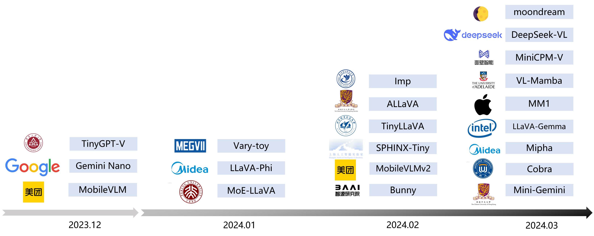

# Multimodal AI

----

----

## SAM

### In segment anything model, how the text embeddings and image embeddings are fused?

In the Segment Anything Model (SAM), text embeddings and image embeddings are fused in a few key ways:

**1. Prompt Encoder**

* **Sparse Prompts (Points, Boxes, Text):**
    * Positional embedding for spatial information (location of points or boxes).
    * Learned embeddings represent different prompt types (point, box, text) 
    * Text is directly encoded using a text encoder (e.g., CLIP)

* **Dense Prompts (Masks):**
    * Downsampled to match image resolution.
    * Convolved and embedded with learned weights.

**2. Fusion via Element-Wise Addition**

* **The Core Mechanism:** The central way SAM fuses image and prompt embeddings is by simple element-wise addition. After processing, both prompt embeddings and image embeddings have the same dimensionality (256 channels).

* **Handling No Mask:** If no mask prompt is provided, a learned, neutral "no mask" embedding is added to each spatial location of the image embedding.

**3. Mask Decoder**

* **Processing the Combined Embedding:** The mask decoder takes the fused embedding (image + prompt) and generates the final segmentation masks. This decoder network learns to interpret the combined information from the image and whatever prompt was provided.

**Why this Approach?**

* **Efficiency:** Element-wise addition is computationally very efficient, allowing for fast and flexible prompting. 
* **Adaptability:** The same mechanism works for different prompt types (points, boxes, masks, text), highlighting SAM's versatility.
* **Informative Fusion:** By combining information directly at the embedding level, SAM forces its learning process to find meaningful relationships between visual features and linguistic concepts.

Refer: https://learnopencv.com/segment-anything/

## Chameleon

----

Reference:

- https://blog.csdn.net/qq_37015327/article/details/134222044 简述多模态学习中，对齐、融合和表示
- https://blog.csdn.net/weixin_52471370/article/details/129798870
- 
