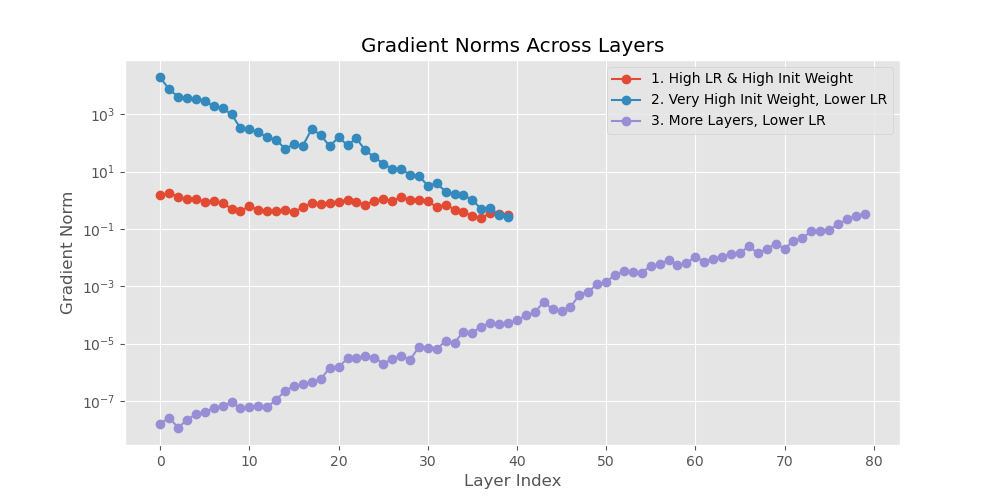
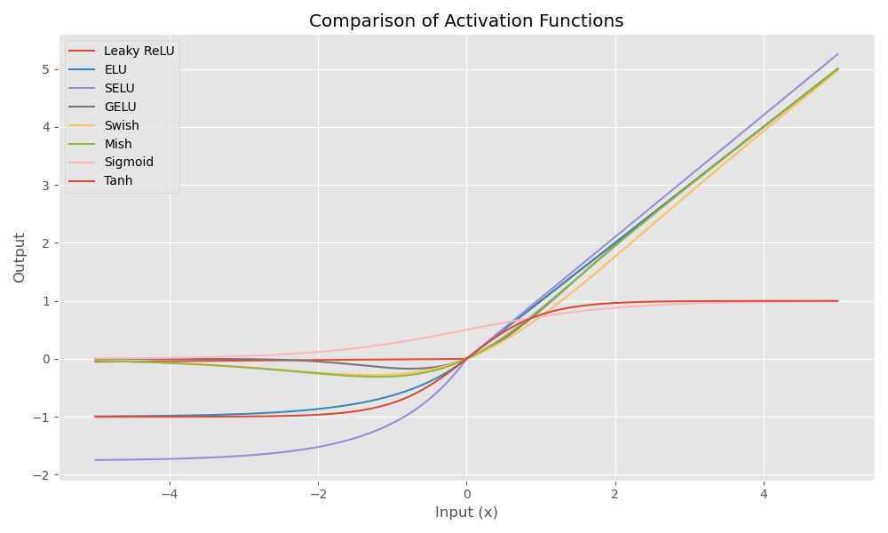
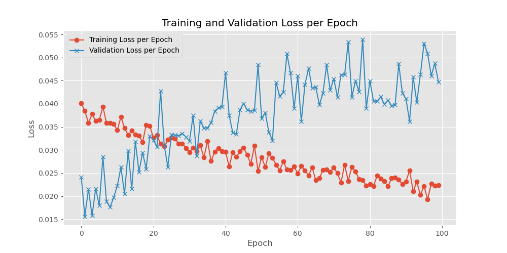

# Let's Train The Model

<div style="float: right; margin-left: 20px;">
    
</div>

[Youtube Music📀▶️](https://music.youtube.com/playlist?list=OLAK5uy_mxQFu_bdbL9nplWkvmsBfowqsgzXoJKCc) | 
[Amazon Music📀▶](https://music.amazon.com/tracks/B0D2M61V61?marketplaceId=ATVPDKIKX0DER&musicTerritory=US&ref=dm_sh_2DPOGOaQWe6BMUmCjVcMP5lpi)

## Initialization

Weight Initialization was first discussed as a "trick" (LeCun et al; 1998) to prevent certain undesirable behaviours during neural network training. The initial values of the weights can have a significant impact on the training process.

## The Vanishing/Exploding Gradients Problems

### Vanishing

As gradients propagate back through each layer during backpropagation, they can get smaller and smaller due to multiplication with weights and derivatives of activation functions. When gradients are very small, the weights in the early layers of the network do not change significantly, which can slow down or completely halt the learning process in these layers.

Gradients tend to vanish towards the beginning of the network (i.e., the layers closer to the input). This is especially true in networks using activation functions like sigmoid or tanh, where derivative values are small and can cause the gradients to become smaller as they are propagated back through the network during training.

### Explosion

The exploding gradient problem occurs when the gradients of a model's parameters become excessively large during training, which can lead to unstable network behavior and divergence in the loss function, often causing model parameters to overshoot optimal values. This problem is particularly common in deep networks with many layers and certain types of recurrent neural networks (RNNs).

Unlike vanishing gradients, exploding gradients can occur with activation functions like ReLU if not properly managed because ReLU does not inherently limit the size of the output (it does not saturate as sigmoid or tanh does).

Exploding gradients are more common in layers closer to the output, or generally in networks where there are long sequences or very deep networks without any form of gradient normalization (like gradient clipping). This might also happen with improper weight initialization or high learning rates.

> Exploding can Occur in Any Layer but More Likely in the Output Side.

To demonstrate the exploding gradient problem, let's set up a simple recurrent neural network example using PyTorch. RNNs are notorious for experiencing exploding gradients, especially with long sequences and without any gradient clipping.



## Activation




A SiwGLU activation used in LLaMA.

```angular2html
class SwiGLU(nn.Module):
    
    def __init__(self, w1, w2, w3) -> None:
        super().__init__()
        self.w1 = w1
        self.w2 = w2
        self.w3 = w3
    
    def forward(self, x):
        x1 = F.linear(x, self.w1.weight)
        x2 = F.linear(x, self.w2.weight)
        hidden = F.silu(x1) * x2
        return F.linear(hidden, self.w3.weight)
```

## Normalization

## Regularization


> Question: What is wrong with the graph below? How to fix the issue?



From the graph you've shown, there are a few observations and potential reasons why the validation loss might show fluctuations and periodic increases:

1. **Model Overfitting**: The steady decrease in training loss combined with spikes in validation loss suggests that the model might be overfitting the training data. Essentially, the model is learning patterns specific to the training data which don't generalize well to unseen data in the validation set.

2. **Learning Rate**: If the learning rate is too high, the model might be making too large updates, leading to erratic jumps in validation loss. It might help to lower the learning rate or implement learning rate scheduling to decrease the rate as training progresses.

3. **Batch Size**: A small batch size can sometimes cause the training process to be unstable, leading to fluctuations in validation loss. Increasing the batch size might help stabilize the loss curves.

4. **Data Split or Shuffling**: If the validation set does not represent the overall data distribution well, or if there are issues with how the data is shuffled and split between training and validation, it could cause inconsistencies in validation performance.

5. **Regularization Techniques**: Implementing regularization techniques such as dropout, L2 regularization (weight decay), or early stopping might help in controlling overfitting. Early stopping, for instance, would halt training when the validation loss begins to rise, potentially avoiding overfitting.

To address these issues, you might consider the following steps:
- **Implement Early Stopping**: Monitor the validation loss and stop training when it begins to degrade.
- **Adjust the Learning Rate**: Lower the learning rate or use learning rate schedulers like step decay, exponential decay, or cyclical learning rates.
- **Increase Batch Size**: If feasible, increasing the batch size could lead to more stable estimates of the gradient.
- **Review Data Splitting**: Ensure that the train-validation split is random and representative of the overall dataset.
- **Use Regularization**: Introduce dropout in your model or increase L2 regularization factor in your optimizer.

These steps should help in stabilizing the validation loss and improving the model's generalization to unseen data.

## Optimizer

## LR Scheduler


