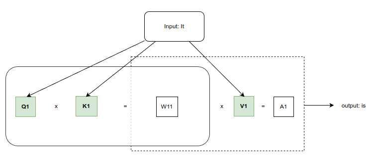
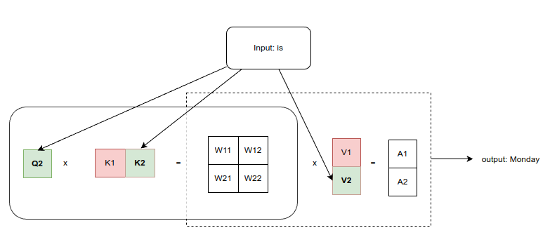
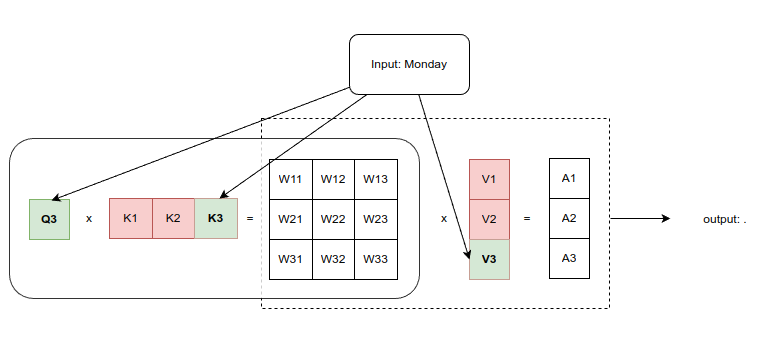
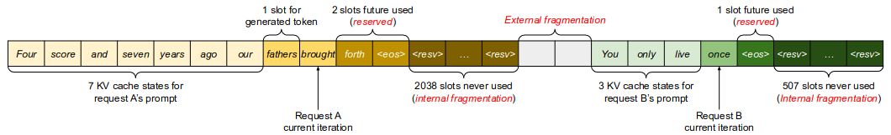

# AI Model Inference

## Model Inference on CPU


## Model Inference on GPU

## Understanding KV-Cache in Autoregressive LLM

Let's walk through the process of how the next token is predicted in an autoregressive (AR) language model (LLM) given the prompt `It` and assuming there is no "start of sentence" (SOS) token. We'll use the example sentence `It is Monday.` to illustrate how the model generates each subsequent token.

Scenario: Given Prompt "It"



### Step 1: Predicting the word "is" given the input "It"

1. **Input: "It"**
   - The figure starts with the input token "It". This input is used to generate the query (Q1), key (K1), and value (V1) vectors through linear transformations.

2. **Q1 and K1 Multiplication (Attention Score Calculation):**
   - **Q1 (Query Vector for "It"):** This represents the query vector for the input token "It". It is a projection of the input token "It" after being processed by the query linear layer.
   - **K1 (Key Vector for "It"):** This represents the key vector for the input token "It". It is a projection of the input token "It" after being processed by the key linear layer.
   - The query vector Q1 is multiplied with the key vector K1. This operation gives a single attention score/weight (`W1`), which reflects the relevance of the token "It" with itself. Since "It" is the only token at this stage, this score essentially measures the importance of "It" in predicting the next word.

3. **Application of the Attention Weight:**
   - **W1 (Attention Weight):** The resulting attention score is then used as a weight to scale the value vector V1. This scaling operation adjusts the importance of the information stored in V1, based on the relevance determined by W1.
   - **V1 (Value Vector for "It"):** This represents the value vector for the input token "It". It is a projection of the input token "It" after being processed by the value linear layer (`wv`).

4. **A1 (Aggregated Output):**
   - The scaled value vector V1 is then summed (or in this case, directly used since it's the only token) to produce the aggregated output A1. This output encapsulates the information about the input token "It" after being processed by the attention mechanism.

5. **Output: "is":**
   - The aggregated output A1 is passed through other blocks in the model to predict the next token in the sequence. Given the context provided by A1, the model predicts the next token as "is".



### Step 2: Predicting the next word "Monday" given the input "is"

> Note: Q1 is not used in step 2.

1. **Input: "is"**
   - The input token at this step is "is". The model now needs to predict the next word based on the current input "is" and the previous context provided by the token "It".

2. **Q2, K1, K2 Multiplication (Attention Score Calculation):**
   - **Q2 (Query Vector for "is"):** This represents the query vector generated from the input token "is". It is computed using a linear transformation from the embedding of "is".
   - **K1 (Key Vector for "It") & K2 (Key Vector for "is"):** These are the key vectors generated from the previous tokens "It" and "is". `K1` was cached from the previous step, and `K2` is generated from the current input "is".
   - The query vector `Q2` is multiplied with both `K1` and `K2` to compute attention scores. The result is a matrix of attention scores:
     - `W1`: The attention score between `Q2` and `K1` (how much "is" should focus on "It").
     - `W2`: The attention score between `Q2` and `K2` (how much "is" should focus on itself).

3. **Application of Attention Weights:**
   - **V1 (Value Vector for "It") & V2 (Value Vector for "is"):** The value vectors associated with the keys. `V1` comes from the previous token "It", and `V2` comes from the current token "is".
   - The attention scores (W1, W2) are applied to the corresponding value vectors as a weighted sum:`A1 = W1 * V1 + W2 * V2`

4. **Output: "Monday"**
   - The output `A1` is then passed through the rest of the model. It predicts the next token is "Monday".

### Step 3: Predicting the next token "." given the input "Monday"

> Note: Q1 and Q2 are not used in step 3.



Step 3 is very similar to step 2.

The KV cache is used to store the key (K) and value (V) tensors from each previous token in the sequence. By caching these vectors, the model does not need to recompute them for each new token in the sequence. **This is crucial in autoregressive models where each new token relies on the entire context of previously generated tokens.**


## Naive KV-Cache Implementation

The following is a sample implementation from Llama's code:

```Python
class Attention(nn.Module):
    def __init__(self, args: ModelArgs):
        super().__init__()
        self.n_local_heads = args.n_heads // 1
        self.head_dim = args.dim // args.n_heads
        self.wq = nn.Linear(...)
        self.wk = nn.Linear(...)
        self.wv = nn.Linear(...)
        self.wo = nn.Linear(...)
        self.cache_k = torch.zeros((args.max_batch_size, args.max_seq_len, self.n_local_heads, self.head_dim))
        self.cache_v = torch.zeros((args.max_batch_size, args.max_seq_len, self.n_local_heads, self.head_dim))

    def forward(self, x: torch.Tensor, start_pos: int, freqs_cis: torch.Tensor, mask: Optional[torch.Tensor]):
        bsz, seqlen, _ = x.shape
        xq, xk, xv = self.wq(x), self.wk(x), self.wv(x)
        ...
        xq, xk = apply_rotary_emb(xq, xk, freqs_cis=freqs_cis)
        ...
        self.cache_k[:bsz, start_pos : start_pos + seqlen] = xk
        self.cache_v[:bsz, start_pos : start_pos + seqlen] = xv
        keys = self.cache_k[:bsz, : start_pos + seqlen]
        values = self.cache_v[:bsz, : start_pos + seqlen]
        xq = xq.transpose(1, 2)
        keys = keys.transpose(1, 2)
        values = values.transpose(1, 2)
        scores = torch.matmul(xq, keys.transpose(2, 3)) / math.sqrt(self.head_dim)
        if mask is not None:
            scores = scores + mask  # (bs, n_local_heads, slen, cache_len + slen)
        scores = F.softmax(scores.float(), dim=-1).type_as(xq)
        output = torch.matmul(scores, values)  # (bs, n_local_heads, slen, head_dim)
        output = output.transpose(1, 2).contiguous().view(bsz, seqlen, -1)
        return self.wo(output)
```

Consider Llama 7B(n_local_heads=32, head_dim=128, hidden_dim=4096, max_len=1024) and prompt: `I believe the meaning of life is`. In the first iteration, there are 8 tokens, including `SOS`, so we have:
- x.shape: (1,8,32,128)
- shape of q, k, v, and output: (1,8,32,128)
- shape of scores: (1,32,8,8)

For the rest iterations, the input is 1 token, so we have:
- x.shape: (1,1,32,128)
- shape of q and output: (1,1,32,128)
- shape of k, v: (1,L,32,128)
- shape of scores: (1,32,1,L)

where L is [9,10,11....]

### The problems of `Naive KV-Cache Algorithm`

- reserved memory waste
- internal fragmentation
- external fragmentation



## PagedAttention


### Multiple Requests


### Parallel Sampling


### Reference

- How a Transformer works at inference vs training time (https://www.youtube.com/watch?v=IGu7ivuy1Ag)

