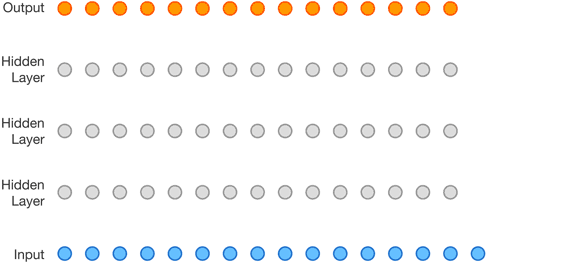
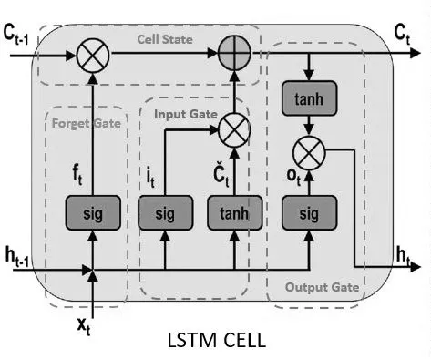

# Autoregressive Model

- Cast: RNN, LSTM, GRU, Transformer
- Song: [RNN](https://www.youtube.com/watch?v=g_tvY_pVwKI), [Attention Is All You Need](https://www.youtube.com/watch?v=g_tvY_pVwKI)

Let's break down the world of autoregressive models in AI:

**What are Autoregressive Models?**

* **Core Idea:**  Autoregressive (AR) models predict the next element in a sequence based solely on the previous elements of that sequence.  It's like the model has its own short-term memory it uses for forecasting.
* **Statistical Foundation:** They have roots in classical time series analysis.
* **"Auto" Explanation:**  The "auto" part means "self." The model uses its own previous outputs as inputs for the next prediction.



**Applications**

Autoregressive models shine in a variety of AI tasks where sequences matter:

* **Natural Language Processing** 
    * Text generation (think chatbots like GPT-3)
    * Machine translation
    * Text summarization
* **Image Processing**
    * Pixel-by-pixel image generation (like PixelCNN)   
* **Audio Synthesis:**  Generating realistic-sounding speech or music 
* **Time Series Forecasting:** Predicting future stock prices, weather patterns, etc.

**Types of Autoregressive Models**

* **Classic Statistical Models:**
    * ARIMA (for time series forecasting)  
* **Deep Learning-based:**
    * Transformer models (powerhouse behind GPT-3 and similar)
    * Recurrent Neural Networks (vanilla RNNs, LSTMs, GRUs)
    * WaveNet (for audio generation)
    * PixelRNN/PixelCNN (for image generation)


## 📌 RNN

### What is `Gates` in RNN?

In Recurrent Neural Networks (RNNs), "gates" are mechanisms that control the flow of information through the network's cells. They play a crucial role in addressing a common issue with standard RNNs called the vanishing/exploding gradient problem.

**Types of Gates in RNNs**

The most common RNN architectures that use gates are:

* **Long Short-Term Memory (LSTM):** 
    * **Forget Gate:** Decides what information from the previous cell state should be discarded.
    * **Input Gate:** Determines which new information from the current input should be added to the cell state.
    * **Output Gate:** Controls which parts of the updated cell state become the output.

* **Gated Recurrent Unit (GRU):**
    * **Reset Gate:** Determines how much of the past information to forget.
    * **Update Gate:** Acts like a combination of LSTM's forget and input gates, deciding what information to keep and what new information to add.

**How Gates Work**

* **Neural Networks with Sigmoid:** Each gate is a small neural network with a sigmoid activation function. The sigmoid function squashes outputs between 0 and 1.
* **Controlling Information:**  A value closer to 0 means "let nothing through" while a value closer to 1 means "let almost everything through".  
* **Selective Memory:** This allows the network to learn which information is important to keep for longer periods and which information can be discarded, improving long-term memory capabilities.

**Addressing the Vanishing/Exploding Gradients Problem**

Gates help mitigate the vanishing/exploding gradient problem in RNNs. Without them, gradients (used for updating weights during training) can either shrink towards zero (vanish) or become extremely large (explode). This makes learning long-term dependencies within sequences difficult. Gates make training more stable, enabling RNNs to process longer sequences effectively.

**In Summary**

Gates in RNNs are like adjustable valves that regulate what information is retained, updated, and passed further within the network. They are essential for RNNs to learn and manage long-term dependencies in sequential data. 


### What is the difference between BPTT(backprop through time) and normal backprop?

Here's a breakdown of the key differences between Backpropagation Through Time (BPTT) and normal backpropagation:

**Normal Backpropagation (e.g., in MLPs)**

* **Structure:** Used in feedforward networks with distinct layers, like Multilayer Perceptrons (MLPs), where there are no loops or recurrent connections.
* **Error Propagation:** Errors are backpropagated from the output layer towards the input layer, one layer at a time. Gradients are calculated with respect to the weights within each layer.
* **Independent of Sequence:** Each training example is treated independently. The length of the input does not inherently change the nature of backpropagation.

**Backpropagation Through Time (BPTT)**

* **Structure:**  Specifically tailored to Recurrent Neural Networks (RNNs) which process sequential data.
* **Unrolling the Network:** The RNN is conceptually "unrolled" over the time steps of the input sequence. This creates an equivalent, very deep feedforward network where the weights are shared across each unrolled time step.
* **Error Propagation across Time:**  Errors are propagated backwards through the unrolled network, effectively flowing back through time along the sequence. Gradients are calculated and accumulated across all time steps.
* **Handling Long-Term Dependencies:**  BPTT is crucial for learning how to use information from earlier steps in a sequence to influence later outputs.

**Key Points at a Glance**

| Feature  | Normal Backpropagation | Backpropagation Through Time (BPTT) |
|---|---|---|
| Network Type | Feedforward (e.g., MLP) | Recurrent (e.g., RNN, LSTM, GRU) |
| Error Propagation | Backwards through layers | Backwards across time steps in an unrolled network |
| Gradient Handling| Within layers | Across time steps and then aggregated |
| Handles Sequences | Treats input examples independently | Designed to capture sequential dependencies |


### Why RNN is difficult to train than normal DNN like MLP?

Recurrent Neural Networks (RNNs) are inherently more difficult to train than traditional Deep Neural Networks (DNNs) like Multilayer Perceptrons (MLPs) for several key reasons:

**1. Vanishing and Exploding Gradients**

* **The Core Problem:** In RNNs, gradients are propagated back through time across the entire unrolled network. This repeated multiplication of the same weight matrices can lead to gradients either shrinking exponentially (vanishing) or growing exponentially (exploding).
* **Consequences:**
    * Vanishing gradients mean early layers struggle to learn from errors, hindering the network from capturing long-term dependencies.
    * Exploding gradients cause updates to be too large, destabilizing training and leading to potential divergence.

**2. Sensitivity to Sequence Length**

* **Longer Sequences, Bigger Problems:** The gradient issues described above become more severe as the length of the input sequence increases. It's harder for RNNs to learn from information that happened many time steps in the past.
* **DNNs vs. RNNs:** In MLPs, different instances of data are treated independently. Sequence length doesn't directly impact the difficulty of training.

**3. Computational Complexity**

* **Sequential Processing:**  RNNs, by nature, cannot fully parallelize computations across time steps.  Each time step depends on the hidden state from the previous one. This limits training speed compared to MLPs where often more parallelization is possible.

**4. Lack of Explicit Memory**

* **DNNs as Transformers:** MLPs and other DNNs can implicitly learn to store information from inputs within their weights. 
* **RNNs' Need for Structure:**   Simple RNNs struggle with this, making specialized architectures like LSTMs and GRUs, with their explicit cell state, essential for many tasks.

**Techniques to Mitigate Issues**

* **LSTMs and GRUs:** These architectures with their gating mechanisms are designed specifically to combat vanishing and exploding gradients.
* **Gradient Clipping:**  Limits the magnitude of gradients during training to prevent explosion.
* **Truncated Backpropagation Through Time (TBPTT):** Limits the number of time steps considered for gradient updates.
* **Skip Connections:**  Similar to residual connections in other DNNs, these can help with gradient flow in RNNs.

**In Summary**

The interconnected nature of RNNs along the time dimension introduces challenges that don't plague DNNs to the same degree. However, specialized techniques and architectures have allowed RNNs to succeed in many domains where sequential information is critical!


### Why LSTM is better than vanilla RNN and why is it called that weird name?

* **Long-Term Memory:** The key advance of LSTMs over traditional Recurrent Neural Networks (RNNs) is their ability to remember information over longer periods within a sequence. They achieve this through their internal cell state and gating mechanisms (forget, input, and output gates). This is the "Long" part of the name.

* **Short-Term Memory:**  While LSTMs excel at remembering over longer intervals, they still possess the ability to process and learn from recent information within the sequence. This is where the "Short-Term" aspect comes in.

* **Why Both?** LSTMs are valuable for tasks where both the long-term context and the immediate sequence of events matter.  Examples include:

    * **Natural Language Processing:** Understanding a sentence depends on both the immediate word order and broader context established earlier in the sentence or paragraph. 
    * **Time Series Prediction:** Stock prices can be based on long-term trends and recent fluctuations.

**In Summary**

The name "Long Short-Term Memory" highlights its unique ability to retain and process information over both longer time spans and the immediate steps within a sequence. 
 


### Why use Sigmoid and Tanh in LSTM? 



Here's a breakdown of why sigmoid and tanh functions are used within LSTM (Long Short-Term Memory) cells:

**Sigmoid Function (σ)**

* **Gating Mechanism:** The sigmoid function acts as a gatekeeper in LSTM cells. It outputs values between 0 and 1, representing the degree to which information should be allowed to pass through.  LSTM cells have three gates:

    * **Forget Gate:** Decides how much information from the previous cell state should be retained.
    * **Input Gate:** Determines how much of the new information should be stored in the cell state.
    * **Output Gate:** Controls how much of the cell state should be exposed as part of the output.

* **Why Sigmoid?** Its output range (0 to 1) perfectly suits the gating mechanism:
    * A value close to 0 means "forget/block this information"
    * A value close to 1 means "remember/pass this information"

**Tanh Function (tanh)**

* **Regulating Cell State:**  The tanh function squashes values between -1 and 1.  It's used to regulate the values that are added to the cell state, helping maintain stability.

* **Why Tanh?**
    * **Zero-Centered Outputs:** Unlike the sigmoid, tanh helps keep values in the cell state centered around 0, which improves gradient flow during backpropagation.
    * **Larger Gradients:**  The tanh function tends to have larger gradients than the sigmoid function, especially near the input of 0. This can lead to faster learning and convergence.

**Key Points**

* **Collaboration:**  The sigmoid and tanh functions work together to manage the flow of information into, within, and out of the LSTM cell.
* **Vanishing Gradients:**  LSTM architectures, with their use of gating mechanisms and the tanh function, were designed specifically to mitigate the vanishing gradient problem that plagued earlier RNNs.


### Why Tanh? Can we use sigmoid to replace tanh in LSTM?

Zero-Centered Outputs: Unlike the sigmoid, tanh helps keep values in the cell state centered around 0, which improves gradient flow during backpropagation.
Larger Gradients: The tanh function tends to have larger gradients than the sigmoid function, especially near the input of 0. This can lead to faster learning and convergence.

Technically, you could try replacing the tanh function in an LSTM with the sigmoid function. However, this is generally not recommended and the reasons highlight the specific roles of tanh and sigmoid within the LSTM architecture:

**Why tanh is preferred**

* **Zero-centered outputs:** Unlike sigmoid, which outputs values between 0 and 1, tanh outputs values between -1 and 1. This zero-centered nature of tanh helps stabilize the values in the cell state and improves gradient flow during training.
* **Stronger gradients:**  Especially near 0, the tanh function usually has larger gradients than the sigmoid function. This can lead to faster learning and convergence of the model.

**Problems with using sigmoid**

* **Non-zero centered:**  Using sigmoid in place of tanh can shift the cell state values to become predominantly positive. This can create biases during learning and make it harder for the network to adjust its memory.
* **Potential for weaker gradients:** The smaller gradients of the sigmoid, especially near its saturation points (near 0 or 1), can potentially slow down training.

**Possible Workarounds (but not ideal)**

* **Scaling and shifting:** You could scale and shift the output of a sigmoid to mimic the range of tanh. However, this wouldn't fundamentally change its gradient characteristics.
* **Experimentation:**  While not the standard approach, there might be niche scenarios where a sigmoid substitution could yield interesting results.  This would likely require extensive hyperparameter tuning and would depend on the specific task.

**In Summary**

* The tanh function's properties are generally more suitable for regulating the cell state values within an LSTM. 
* Substituting sigmoid would likely hinder performance rather than improving it.

### In LSTM, what is cell state? What does it mean to regulate the cell state values within an LSTM?

Here's a breakdown of the cell state in an LSTM and what it means to regulate its values:

**What is the Cell State?**

* **The Memory Highway:** Imagine the cell state as a conveyor belt running through the entire LSTM network. It carries information along the sequence of inputs.
* **Long-Term Memory Backbone:**  The cell state is the primary mechanism by which an LSTM retains information over longer periods within a sequence. Unlike regular RNNs, it's not completely overwritten at each step.
* **Selective Modification:** LSTMs have gates (forget, input, output) that carefully control what gets added to the cell state, what is removed from it, and what parts of it are exposed in the output. 

**What Does "Regulating the Cell State Values" Mean?**

* **Controlling Information Flow:**  The gates and the tanh function work together to manage the contents of the cell state. This includes:
    * **Adding:** New information can be selectively added from the current input through the input gate.
    * **Removing:** The forget gate can selectively erase information that's no longer deemed relevant.
    * **Balancing:** The tanh function squashes the values that are added to the cell state, helping keep the range of values balanced (typically around zero).

**Why is Regulation Important?**

* **Preventing Overwriting:**  Without careful regulation, the cell state could be completely overwritten at each time step, eliminating the LSTM's long-term memory advantage.
* **Vanishing Gradients:**  Balancing the values in the cell state helps mitigate the vanishing gradient issue and enables better learning over long sequences.
* **Focusing on Relevance:** The ability to selectively add and remove information from the cell state allows the LSTM to focus on the most important aspects of the input sequence for the given task.

**Example: Language Modeling**

Imagine an LSTM predicting the next word in a sentence. The cell state might carry information about:

* The overall subject of the sentence (e.g., is it about science, history, etc.)
* Grammatical structures used earlier in the sentence
* Specific keywords that appeared a few words back

Regulating the cell state allows the LSTM to update this knowledge with new words while preserving the most important context.

https://g.co/gemini/share/3fbdb14b2a78

### In LSTM, what is the difference between hidden states and cell states?

Cell state for long memory, and hidden state for short memory.

Here's a breakdown of the difference between hidden states and cell states in Long Short-Term Memory (LSTM) networks:

**Cell State (Long-term Memory)**

* **Purpose:** The cell state is the core "memory" of an LSTM cell. It functions like a conveyor belt carrying information across time steps, selectively being modified to retain long-term dependencies.
* **Mechanism:** The cell state is carefully regulated by the LSTM's gates (forget, input, and output gates). These gates control what information gets removed (forgotten), added (input), and used for output (output). 
* **Persistence:** Information can be stored in the cell state for many time steps, allowing LSTMs to overcome the vanishing gradient problem common in basic RNNs.

**Hidden State (Short-term Working Memory)**

* **Purpose:**  The hidden state represents the short-term working memory of the LSTM cell.  It encapsulates the network's understanding of the most recent inputs and their context, making it useful for prediction.
* **Mechanism:** The hidden state is generated from a combination of the current input and the cell state, both processed through the output gate.
* **Output:** The hidden state serves as the main output of the LSTM cell at a given time step and is passed on to the next time step.

**Key Points:**

* **Scope:** The cell state maintains long-term memory, while the hidden state captures short-term dependencies.
* **Transmission:** The hidden state is passed to the next LSTM cell, while the cell state can persist across a whole sequence.
* **Output vs. Memory:** The hidden state is the output of the LSTM unit, while the cell state remains an internal mechanism for information storage.

**Analogy:**

Think of the cell state like a long-term memory notebook where you store important information from past experiences. The hidden state is like your working memory when doing a task, where you use both recently learned information and relevant long-term memory from your notebook.

Thus, in an LSTM, the cell state is designed to carry relevant information across longer sequences, mitigating the vanishing gradient problem common in earlier recurrent neural network architectures, while the hidden state handles information pertinent to the current and immediate past context, influencing both outputs and the next cell state.

### Are hidden states and cell states are node weights? If no, what is the difference?

No, hidden states and cell states are not the same as node weights in neural networks like LSTMs. Here's a breakdown of the differences:

- **Hidden States and Cell States**: These are values that represent the internal state of the network at each time step. They are dynamically computed based on the input data at each step, the previous hidden states, and the previous cell states (in the case of LSTMs). These states are what the network "remembers" of the input data as it processes a sequence, allowing it to make decisions based on both recent and more distant information in the sequence.

- **Weights**: These are the parameters of the neural network that are learned during training. Weights in an LSTM are used in the gates (input, output, and forget gates) and in computing the new candidate values for the cell states. The weights determine how the inputs and the previous states affect the current state and the output.

In simpler terms, **weights** are fixed parameters that the network learns during training, which determine how input data and states influence each other, while **hidden states** and **cell states** are variable outputs of the network's computation, changing with each input over time. They are part of what makes recurrent networks capable of handling sequences where context and the order of data points matter.

### Difference between GRU and LSTM?


GRUs (Gated Recurrent Units) simplify the LSTM architecture in a few key ways:

1. **Combining Gates:**

   * **LSTM:** Three gates – forget gate, input gate, and output gate.
   * **GRU:** Two gates – reset gate and update gate. The reset gate in GRU acts somewhat like a combination of the LSTM's forget and input gates. This simplification reduces the number of parameters and computations.

2. **Merging Cell State and Hidden State:**

   * **LSTM:** Separate cell state (long-term memory) and hidden state (short-term output).
   * **GRU:** Merges the cell state and hidden state into a single hidden state. Information flows directly to the output with fewer steps involved.

3. **Exposure of the Full Hidden State:**

   * **LSTM:** The output gate carefully controls what parts of the cell state are exposed.
   * **GRU:** The entirety of the hidden state is exposed as part of the output, though the reset gate does provide a degree of control over what's retained.

**Consequences of Simplification**

* **Fewer Parameters:**  GRUs have fewer parameters overall than LSTMs, due to fewer gates and the merged state. This generally leads to:
    * **Faster Training:** Less computation required at each step.
    * **Less Overfitting:** Can be preferable for smaller datasets.

* **Potential for Slightly Reduced Accuracy:**  LSTMs, with their more complex structure, can sometimes capture more intricate dependencies in sequences. The choice between GRU and LSTM often involves a trade-off between computational efficiency and potential accuracy gains.

**When GRUs Shine**

* **Large Datasets:** With ample data, the slight accuracy advantage of LSTM might not be worth the extra computational cost. GRUs are often faster.
* **Limited Computational Resources:** If your model needs to run on devices with less power, GRUs might be the only feasible option.
* **Need for Speed:** If fast training or real-time inference is a high priority, GRUs can be preferable.

**Important Note:** The choice between GRU and LSTM is often task-dependent. There's no single "best" choice for all scenarios. Experimentation is often needed to see which performs better for your specific needs!

https://www.youtube.com/watch?v=AsNTP8Kwu80 (RNN from StarQuest)

## 📌 Transformer


### How to preserve Token Order in High-Dimensional Space? Why we can add position and token embedding?

Each position has a unique encoding based on sine and cosine functions across different dimensions. Even though individual dimensions repeat periodically, the combination across dimensions remains unique for each position in practical sequence lengths.

The model uses the differences in positional encodings to understand the order. Since the positional encoding changes systematically with the position, even if two words are the same, their combined embeddings will differ due to their different positional encodings, allowing the model to distinguish not only which tokens are present but also their order in the sequence.

In high-dimensional space, the order of tokens is not directly apparent as in a 1D list of tokens. The tokens are encoded into the embeddings through mathematical transformations that integrate both the semantic and positional information. The Transformer uses these embeddings, combined with its attention mechanisms, to interpret and maintain the order of tokens throughout its processing layers. This method effectively retains the order information despite the embeddings being in a space where the original order is not immediately visible. So the order is preserved, but it is just not visible to human.

The order of a token significantly impacts its semantic meaning. In a one-dimensional context, semantic content and positional information seem like distinct concepts, often measured in different units, which makes direct addition non-intuitive. However, in a high-dimensional space, both types of information can be abstracted into similar forms, allowing them to be combined more seamlessly. Some variations might concatenate these vectors instead, but addition is preferred because it maintains the dimensionality and allows the model to directly learn interactions between the word's semantic content and its positional context.

Let's take the example for clarity and consistency in explaining how positional embeddings affect the interpretation of sentences:

#### Sentence Pair

1. "He will promise to mail the package tomorrow."
2. "Tomorrow, he will promise to mail the package."

These sentences illustrate the importance of word placement in defining when an action is scheduled versus when a commitment to the action is made:

- **Sentence 1**: "tomorrow" is associated with when the promise will be acted upon. Here, the promise to mail the package is being planned for today, but the mailing action itself is scheduled for tomorrow.
- **Sentence 2**: By starting with "Tomorrow," this sentence shifts the timing of making the promise itself to tomorrow. Thus, not only the action of mailing the package but also the commitment to it is deferred to the next day.

#### Detailed Analysis of Positional and Semantic Embeddings

- **Semantic Embedding**: Each word, such as "tomorrow," "will promise," and "mail," converts into a high-dimensional vector capturing its inherent meaning. "Tomorrow" still refers to a future time point, "will promise" indicates a future commitment, and "mail" continues to denote the action of sending.

- **Positional Embedding**:
  - In **Sentence 1**, "tomorrow" modifies the commitment related to "mail," implying that while the promise is made now, the fulfillment is set for the next day.
  - In **Sentence 2**, "Tomorrow" adjusts the timeline not only for the action but also for the promise, indicating a full deferral of all related activities to the next day.

- **Model Processing**: In Transformers, these embeddings help the model understand how each word affects others, especially regarding sequence and timing. The self-attention mechanism evaluates the positional relationships, using the differences in embeddings to determine that "tomorrow" in the first sentence affects the action timing, while in the second, it influences when the commitment is made.

#### Outcome and Applications

This distinction in timing, enabled by positional embeddings, allows Transformer models to handle subtleties in language that are crucial across various applications:
- **Dialogue Systems**: Understanding the nuance in planning and promises can significantly affect how responses are generated.
- **Scheduling and Planning Tools**: Accurate interpretation of timings in commitments and actions can aid in more effective scheduling, especially in automated systems that interact with human inputs.
- **Legal and Business Document Analysis**: In contexts where the timing of commitments can have legal or financial implications, correctly interpreting such nuances is essential.

These examples show how Transformers can effectively use positional embeddings to navigate the intricacies of language, providing nuanced understanding and responses based on the context provided by the positioning of words like "tomorrow."

### If my data is a time series data, like stock price, where data itself has time info, is sine and cosine position embedding a good choice?

For time series data like stock prices, using sinusoidal positional embeddings as done in NLP **may not be directly applicable or beneficial**. Instead, consider using time directly as a feature, applying transformations relevant to time series analysis, or experimenting with cyclical encoding methods tailored to the periodicity of your data. Always validate the effectiveness of these approaches based on your specific dataset and task requirements.

Transformers, originally developed for natural language processing tasks, have shown promising results in various domains, including time series data prediction. When considering their application for tasks such as predicting stock prices, there are several advantages and considerations to take into account.

#### Advantages of Using Transformers for Time Series Prediction:

1. **Handling Long Dependencies**: One of the key strengths of Transformers is their ability to handle long-range dependencies. In time series data like stock prices, being able to look back over extended periods to identify trends and patterns can be crucial. Transformers, with their self-attention mechanism, can weigh the importance of earlier points without the decay associated with RNNs and LSTMs.

2. **Parallel Computation**: Unlike RNNs, which process data sequentially, Transformers process all data points simultaneously. This parallel processing capability makes them faster and more efficient when training on large datasets.

3. **Flexibility and Customization**: Transformers can be customized with specific attention mechanisms that might be better suited for time series data. For instance, incorporating dilated attention can help focus on periodic patterns, which are common in financial data.

4. **Feature Integration**: Transformers allow for easy integration of various types of features (e.g., volume, open, close, high, low prices) into the model, treating them as additional dimensions in input embeddings.

#### Considerations and Challenges:

1. **Data Preprocessing**: Time series data requires careful preprocessing and normalization. Unlike text data, time series data might have trends, seasonality, and noise that need to be addressed through techniques like differencing, detrending, or seasonal adjustment.

2. **Overfitting Risk**: Given their complexity and capacity, Transformers can easily overfit on time series data, which is often noisy and non-stationary. Regularization, dropout, and proper training/validation splitting are essential to mitigate this.

3. **Lack of Inherent Temporal Order Processing**: Since Transformers do not inherently process temporal order (as they do not have recurrence), positional encodings (or other methods to incorporate time information) are necessary to maintain the sequence order of data.

4. **Computational Intensity**: Transformers require significant computational resources, especially when dealing with large datasets, which can be a limitation for some practical applications.

#### Applications in Stock Price Prediction:

Given these advantages and challenges, Transformers have been applied successfully in financial contexts, but often with modifications:

- **Temporal Fusion Transformers**: An architecture specifically designed for time series forecasting that combines typical Transformer advantages with a gating mechanism to handle the different types of time series-specific variabilities and dependencies.
- **Incorporating External Data**: Transformers can effectively handle additional inputs like news sentiment, economic indicators, or market conditions, integrating them into the stock price prediction model.

#### Example

Here is a simple example of how you might set up a Transformer model for stock price prediction using Python and PyTorch:

```python
import torch
import torch.nn as nn
from torch.utils.data import DataLoader, TensorDataset

# Define a simple Transformer model (for illustration purposes)
class StockPriceTransformer(nn.Module):
    def __init__(self, feature_size, num_layers, nhead):
        super(StockPriceTransformer, self).__init__()
        self.embedding = nn.Linear(feature_size, feature_size)
        encoder_layer = nn.TransformerEncoderLayer(d_model=feature_size, nhead=nhead)
        self.transformer_encoder = nn.TransformerEncoder(encoder_layer, num_layers=num_layers)
        self.decoder = nn.Linear(feature_size, 1)

    def forward(self, src):
        src = self.embedding(src)
        output = self.transformer_encoder(src)
        output = self.decoder(output[-1])
        return output

# Example usage
feature_size = 10  # e.g., open, high, low, close, volume + other features
num_layers = 2
nhead = 2
model = StockPriceTransformer(feature_size, num_layers, nhead)

# Dummy data
data = torch.rand(100, 30, feature_size)  # 100 samples, 30 time steps
labels = torch.rand(100, 1)  # 100 samples, 1 output per sample
dataset = TensorDataset(data, labels)
dataloader = DataLoader(dataset, batch_size=10)

# Example training loop
criterion = nn.MSELoss()
optimizer = torch.optim.Adam(model.parameters())
for epoch in range(2):
    for inputs, targets in dataloader:
        optimizer.zero_grad()
        outputs = model(inputs)
        loss = criterion(outputs, targets)
        loss.backward()
        optimizer.step()
```

#### Conclusion

Transformers can be a powerful tool for time series prediction like stock prices, provided that they are carefully adapted and tuned for the specific characteristics and requirements of financial data. Their ability to capture complex dependencies and integrate diverse types of data makes them an intriguing option for advanced forecasting models.

### What is the pretraining objective in T5?

T5 span-masked language modeling is a pre-training objective used for the T5 (Text-to-Text Transfer Transformer) model. It's a form of self-supervised learning where the model learns by predicting missing parts of its input.


**How it works:**

1. **Span Masking:** Instead of masking single tokens like in traditional masked language modeling (MLM), T5 masks entire spans of text. These spans can vary in length.
2. **Sentinel Tokens:** Unique tokens called "sentinel tokens" (e.g., <extra_id_0>, <extra_id_1>, etc.) are used to replace the masked spans. Each sentinel token indicates the start of a new masked span.
3. **Prediction Target:** The model's task is to predict the original masked spans in the correct order. The output sequence is a concatenation of the sentinel tokens and the corresponding masked spans.

**Example:**

Input sentence:  "The quick brown fox jumps over the lazy dog."

Masked sentence: "The quick <extra_id_0> jumps <extra_id_1> lazy dog."

Target sequence: "<extra_id_0> brown fox <extra_id_1> over the"

**Why span masking:**

* **Captures Longer Dependencies:** Span masking allows the model to learn relationships between words that are farther apart in a sentence, leading to better understanding of context.
* **More Challenging Task:** Predicting entire spans is more difficult than predicting single tokens, potentially leading to a more robust model.
* **Suitable for Text-to-Text Tasks:** Since T5 is designed for various text-to-text tasks (translation, summarization, etc.), span masking aligns well with the model's architecture and objectives.

**In the T5 model:**

Span-masked language modeling is a key component of T5's pre-training. It's one of the factors that contributes to T5's strong performance on a wide range of natural language processing tasks. The model learns to fill in the blanks, effectively understanding how different parts of a text relate to each other. This knowledge can then be transferred to other tasks by fine-tuning the model.

- T5: a detailed explanation https://medium.com/analytics-vidhya/t5-a-detailed-explanation-a0ac9bc53e51

## 📌 Reference

- Transformer升级之路：1、Sinusoidal位置编码追根溯源 https://kexue.fm/archives/8231