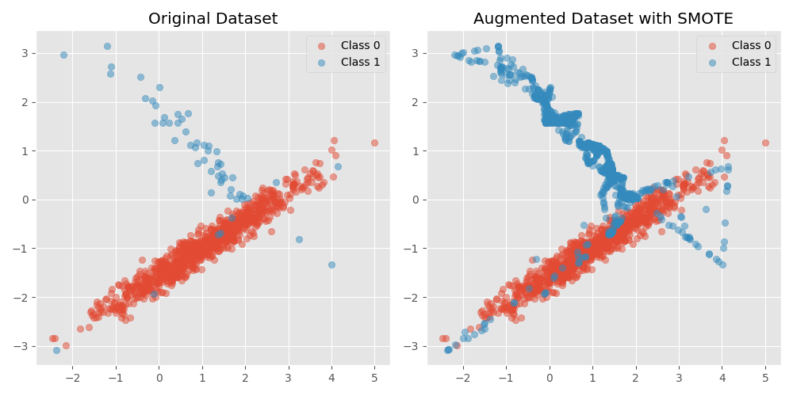

# Introduction


- CNN

https://stanford.edu/~shervine/teaching/cs-230/cheatsheet-convolutional-neural-networks

```angular2html
🌳 LeNet5<all params:61706>
├── Conv2d(conv1)|weight[6,1,5,5]|bias[6]
├── Conv2d(conv2)|weight[16,6,5,5]|bias[16]
├── Linear(fc1)|weight[120,400]|bias[120]
├── Linear(fc2)|weight[84,120]|bias[84]
└── Linear(fc3)|weight[10,84]|bias[10]
```

## Data Augmentation


