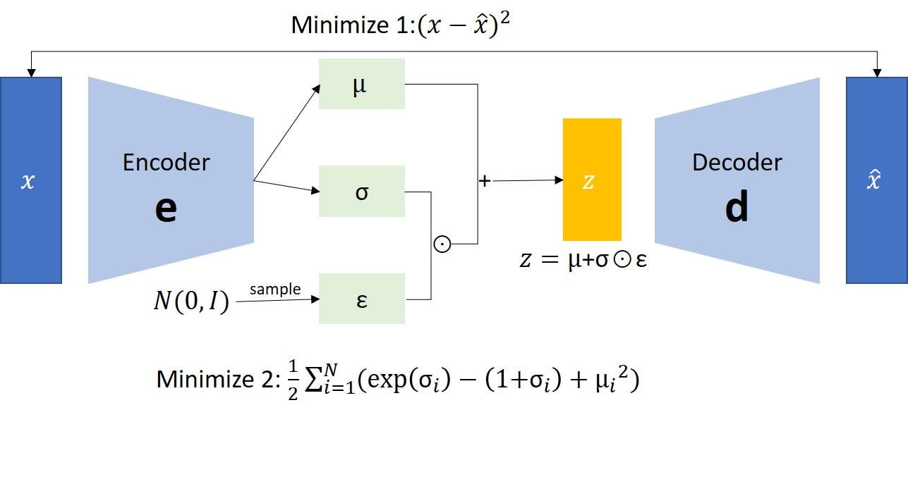

# Autoencoder

## VAE



**Variational Autoencoders (VAEs): A Bayesian Approach to Representation Learning**

VAEs are a powerful tool for learning meaningful, compressed representations (latent variables) from complex data, such as images.  They combine the strengths of neural networks with the principles of Bayesian inference.

**The Bayesian Framework:**

* **Prior Belief (p(z)):** Before observing any data, we hold certain assumptions about the underlying structure. This is often modeled as a simple distribution, like a standard Gaussian, over the latent variables.

* **Data as Evidence (x):**  The data we observe serves as evidence that can be used to update our prior beliefs.

* **Posterior Belief (p(z|x)):**  This is the revised understanding of the latent variables after considering the observed data. In VAEs, we seek to approximate this intractable posterior distribution.

**VAE Structure:**

1. **Generative Model:** The VAE assumes that the observed data is generated from a set of latent variables through a probabilistic process.  This can be thought of as a decoder network that takes latent variables as input and generates the data.

2. **Approximate Posterior (q(z|x)):** Calculating the exact posterior distribution is often infeasible.  VAEs use a neural network (the encoder) to approximate this posterior. It takes the observed data as input and outputs parameters for a distribution over the latent variables.

3. **Evidence Lower Bound (ELBO):** The ELBO serves as the objective function for training VAEs.  It's a lower bound on the log-likelihood of the data and balances two key aspects:

```
ELBO = E[log p(x|z)] - DKL[q(z|x) || p(z)]
```

* **E[log p(x|z)] - Reconstruction:** This is the expected log-likelihood of the data `x` given the latent representation `z`. It measures how well the VAE can reconstruct the original data from the latent variables. It encourages the model to learn meaningful latent variables that capture the essential features of the data.

* **DKL[q(z|x) || p(z)] - Regularization:** This is the Kullback-Leibler (KL) divergence between the approximate posterior distribution `q(z|x)` (encoded by the encoder network) and the prior distribution `p(z)`. It acts as a regularizer, encouraging the learned latent space to be close to the chosen prior distribution (often a standard normal distribution).


**The Bayesian Connection:**

VAEs can be seen as performing approximate Bayesian inference. The prior distribution represents our initial beliefs, the likelihood is encoded in the generative model, and the approximate posterior is learned through optimization. Maximizing the ELBO helps us find the best approximation of the true posterior distribution.

**Key Takeaways:**

* VAEs are powerful for unsupervised learning of meaningful representations.
* They combine neural networks with Bayesian principles.
* The ELBO balances data reconstruction accuracy with the complexity of the latent space model.

## VQ-VAE


