# Autoencoder

## Latent Space and Representative Learning

There are 24 bits per pixel, with 8 bits for each of the three color channels, leading to a total of 2^24 possible colors. Given an image of height 𝐻 and width 𝑊, the total number of pixels in the image is 𝐻×𝑊. Each pixel is represented by 24 bits. Therefore, the total number of possible images is:(2^24)^(𝐻×𝑊)=2^(24×H×W). This demonstrates the vastness of the space of all possible images of a given size with 24-bit RGB color representation.

A pixel in an image is a point in a 5-D Space with 5 orthogonal axis: RGBHW(当然RGBHW都是有取值范围的整数). For a specific image, the points cloud clusters in the 5D space. We know DNN can project the manifold from this 5D space into feature spaces. 


比如在CNN的前几层（靠近输入层），特征图通常保持较大的空间维度（H和W），但通道数（C，特征的深度）较少。随着网络的深入，通过卷积和池化操作，特征图的空间维度（H和W）逐渐减小，而特征图的深度（通道数）逐渐增加。这意味着图像的空间信息被逐步压缩，而特征信息（抽象表示）则被逐步增加和强化。特征提取的过程实际上是在原始数据中找到某些有意义的模式或特征，并忽略那些不相关或噪声信息。当我们说提取某个特定特征时，可以理解为网络识别出这个特征并将其表示出来，同时，网络通过权重学习和激活函数抑制那些与这个特征正交（不相关）的信息。 正交的信息指的是那些在特征空间中与当前特征不相关或没有贡献的信息，这些信息在特征提取的过程中被逐渐丢弃。


如果原始图片是3x128x128, 假设feature map的大小是18x16x16，可以理解为有18个不同的features,每一个点可以用18个F（Feature）维度的直来描述，总共有256个这样的点，原始图片中的每一个16×16区域被编码成一个18维的特征向量。所以原始图片变成18维空间的256个点。

可以把原始图像想象成一本书，每个像素是一个字。 特征是对这本书内容的总结，比如主题、情感、风格等。特征图是对这本书的摘要，每个点代表一个章节的总结。潜在空间是对这本书的极简概括，用几个关键词就能大致描述这本书的内容。

ImageNet-1K has 1M images, then there are 256M 18-D points, which is $2^28$ 18-D points. 这些点在空间中形成点云，好比宇宙中的星云和星系，数量巨多又间隔遥远。

## Autoencoder

### How to Reconstruct an Image?

The facial image above can be described with various attributes, such as smiling, dark skin, male, bearded, not wearing glasses, and black hair. To reconstruct this facial image using a neural network architecture, you can first encode the image into different attributes and then decode these attributes to obtain the reconstructed image. This is the conventional approach of an autoencoder.

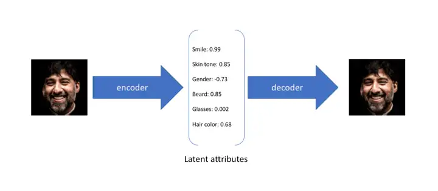

However, there's a problem to solve here: how to encode the attributes of an image. Attributes can be described either as discrete values or as probability distributions (sampling discrete values from the probability distribution). For instance, the smile attribute of the first image of a little boy can be represented as a discrete value, e.g., -0.8, or as a probability distribution, e.g., a normal distribution ranging from -1 to 0 (then sampling a discrete value from it, most likely around the x-coordinate of the peak of the normal distribution, which is -0.5).


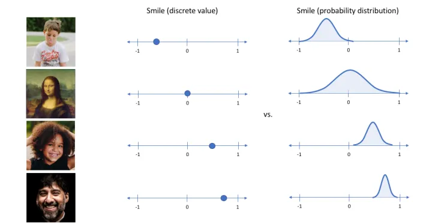

### Autoencoder

The most basic autoencoder consists of an Encoder and a Decoder. The Encoder encodes the input image to obtain a latent code, which is then used by the Decoder to reconstruct the image. The reconstruction error between the input image and the generated image is calculated, and during training, this reconstruction error is minimized.

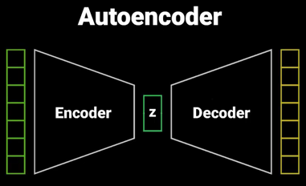

An autoencoder can be understood as learning any probability distribution through the network, and then using the x-coordinate of the highest point of this probability distribution as the discrete value of the encoding. This leads to the generation process of the autoencoder being uncontrollable and sensitive to input noise, as the learned probability distribution cannot be known in advance.

### Example

The same flower's images from different angles as follows:


After encoding, they can locate far away in vector spaces.

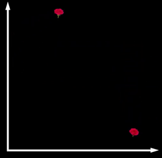

The encoding can scatter everywhere.

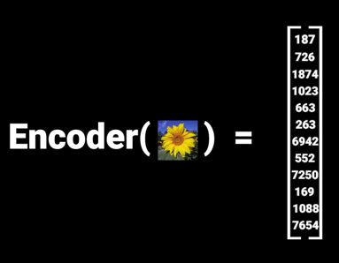

----

## Variational Autoencoder (VAE)

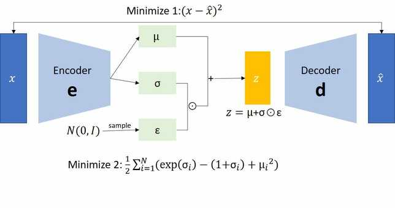

**Variational Autoencoders (VAEs): A Bayesian Approach to Representation Learning**

VAEs are a powerful tool for learning meaningful, compressed representations (latent variables) from complex data, such as images.  They combine the strengths of neural networks with the principles of Bayesian inference.

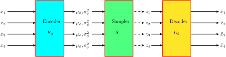

In a VAE, the Encoder learns two encodings: the mean and the standard deviation. It then randomly samples a code from a normal distribution, and through the formula `sampled_code = epsilon * std + mean`, it resamples to get the latent code, which is then reconstructed by the Decoder.

Using the flower example above, the encodings by VAE are normalized due to Gaussian sampling:

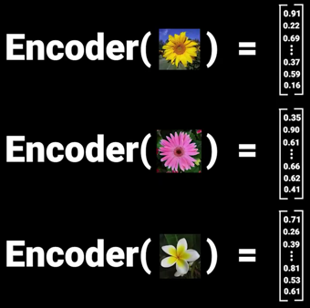

Due to the normalization, all features use the same scale, so similar flowers are close to each other and also closer to vector space center.

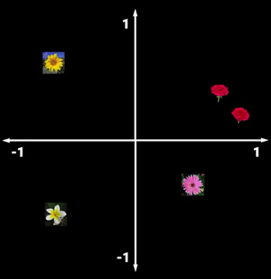

Due to the continuity of the normal distribution, there is no issue with differentiability. The reparameterization trick allows for the recovery of the latent code and enables gradient updates through the chain rule.

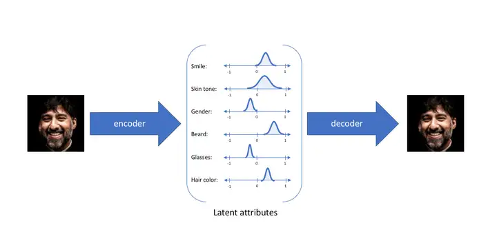

A VAE can be understood as a network learning the mean and standard deviation encodings of each attribute's normal distribution. Then, using the mean, standard deviation, and a normal distribution `N(0,1)`, each attribute's normal distribution is recovered, and discrete values for each attribute are randomly sampled.

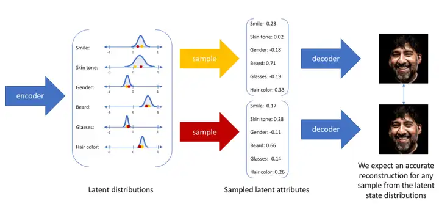

As shown, the advantage of VAE over a traditional autoencoder is that when different samples are input, the VAE can robustly reconstruct images for any given sample. The VAE's generation process is controllable and insensitive to input noise, as each attribute is known to follow a normal distribution in advance.

**The Bayesian Framework:**

* **Prior Belief (p(z)):** Before observing any data, we hold certain assumptions about the underlying structure. This is often modeled as a simple distribution, like a standard Gaussian, over the latent variables.

* **Data as Evidence (x):**  The data we observe serves as evidence that can be used to update our prior beliefs.

* **Posterior Belief (p(z|x)):**  This is the revised understanding of the latent variables after considering the observed data. In VAEs, we seek to approximate this intractable posterior distribution.

**VAE Structure:**

1. **Generative Model:** The VAE assumes that the observed data is generated from a set of latent variables through a probabilistic process.  This can be thought of as a decoder network that takes latent variables as input and generates the data.

2. **Approximate Posterior (q(z|x)):** Calculating the exact posterior distribution is often infeasible.  VAEs use a neural network (the encoder) to approximate this posterior. It takes the observed data as input and outputs parameters for a distribution over the latent variables.

3. **Evidence Lower Bound (ELBO):** The ELBO serves as **the objective function** for training VAEs.  It's a lower bound on the log-likelihood of the data and balances two key aspects:

```
ELBO = E[log p(x|z)] - DKL[q(z|x) || p(z)]
```

* **E[log p(x|z)] - Reconstruction:** This is the expected log-likelihood of the data `x` given the latent representation `z`. It measures how well the VAE can reconstruct the original data from the latent variables. It encourages the model to learn meaningful latent variables that capture the essential features of the data.

* **DKL[q(z|x) || p(z)] - Regularization:** This is the Kullback-Leibler (KL) divergence between the approximate posterior distribution `q(z|x)` (encoded by the encoder network) and the prior distribution `p(z)`. It acts as a regularizer, encouraging the learned latent space to be close to the chosen prior distribution (often a standard normal distribution).

**The Bayesian Connection:**

VAEs can be seen as performing approximate Bayesian inference. The prior distribution represents our initial beliefs, the likelihood is encoded in the generative model, and the approximate posterior is learned through optimization. Maximizing the ELBO helps us find the best approximation of the true posterior distribution.

**Key Takeaways:**

* VAEs are powerful for unsupervised learning of meaningful representations.
* They combine neural networks with Bayesian principles.
* The ELBO balances data reconstruction accuracy with the complexity of the latent space model.

### Clarification on VAE

In VAE, each training sample x is mapped to a distribution p(z|x) in the latent space. Different samples x_i yield different distributions p(z_i | x_i).

The KL divergence loss term encourages these p(z_i | x_i) distributions to approximate a **standard normal distribution N(0, I)**. VAE does **not encode the latent space as multiple normal distributions for different attributes**. Instead, VAE maps each input sample to a distribution in the latent space and uses the KL divergence to ensure that these distributions are close to the standard normal distribution. This allows for more structured and smooth sampling in the latent space, facilitating better generation and interpolation of new samples.

## What will happen if no KL divergence in loss of VAE?

> Potential Degeneration of VAE into a Standard Autoencoder

VAEs aim to reconstruct input data (X) by minimizing the reconstruction loss between the original input and its reconstructed version (X^k). The latent variable (Z) is sampled from a distribution, introducing noise into the reconstruction process. This noise makes reconstruction harder. **To make reconstruction easier, the model might try to reduce the variance of the latent distribution to zero.** This eliminates the randomness and essentially turns the VAE into a standard autoencoder, where the latent representation simply becomes the mean value calculated by a neural network. If the noise disappears, the model loses its ability to generate new data, as it's just learning to encode and decode specific points rather than understanding the underlying distribution of the data.

**The Solution: Regularization with the KL Divergence**

VAEs address this issue by incorporating a regularization term in their loss function: the Kullback-Leibler (KL) divergence.

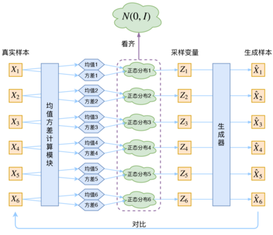

1. **KL Divergence:** This term measures the difference between the learned latent distribution (p(Z|X)) and a standard normal distribution (N(0, I)).

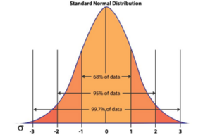

2. **Encouraging Similarity:** By minimizing the KL divergence, the VAE encourages the latent distribution to be close to the standard normal distribution. This prevents the variance from collapsing to zero and maintains the randomness necessary for generating new data.
3. **Ensuring Generative Ability:** When all p(Z|X) are close to the standard normal distribution, the overall distribution of Z (p(Z)) also becomes close to the standard normal distribution. This allows us to sample from N(0, I) to generate new data points.

This following is what I got from my VAE training code:

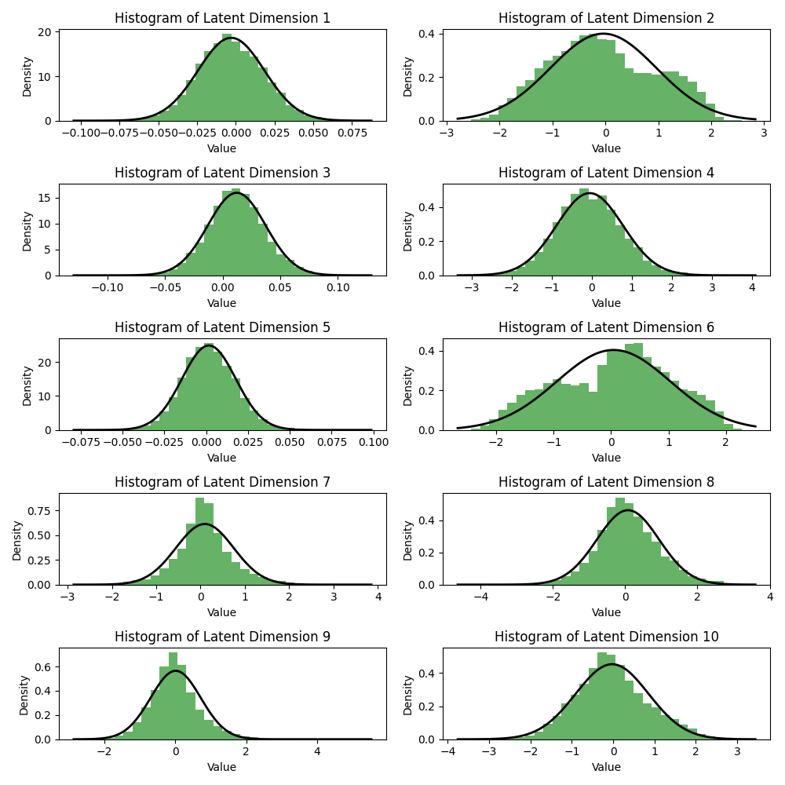

**In Summary**

* The KL divergence term in the VAE loss function acts as a regularizer, preventing the model from degenerating into a simple autoencoder.
* By keeping the latent distribution close to a standard normal distribution, the VAE ensures that it retains its generative capabilities.
* This allows us to sample from the latent space and generate new data points that are similar to the training data.

## Does the KL divergence in a VAE force the encoder output of each sample x to be exactly of standard normal distribution?

No, the KL divergence in a VAE does not force the output of each sample x to be exactly following the standard normal distribution. Instead, it **encourages** the distribution of the latent representation z, given x (denoted as p(z|x)), to be close to the standard normal distribution N(0, I).

**Explanation:**

* **Latent Representation Distribution:** The encoder in a VAE maps an input sample x to a distribution p(z|x) in the latent space, not a single point. This distribution is typically assumed to be a multivariate Gaussian with a mean vector μ(x) and a covariance matrix Σ(x).

* **Role of KL Divergence:** The KL divergence term in the VAE loss function encourages the mean vector μ(x) to be close to 0 and the covariance matrix Σ(x) to be close to the identity matrix I. This serves two purposes:

    * **Promotes Smoothness in Latent Space:**  A smoother latent space makes interpolation and other operations in the latent space more meaningful.
    * **Improves Generation Quality:** When sampling from the standard normal distribution to generate new samples, the decoder can more accurately capture the distribution of the training data.

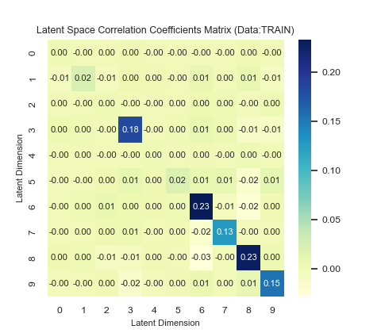

* **Not Exact Equality:** The KL divergence term is an "encouragement" rather than a "force". In practice, p(z|x) doesn't usually exactly match N(0, I), but it maintains a certain degree of similarity. This similarity is sufficient for the VAE to learn meaningful latent representations and have good generative capabilities.

**Example**

Imagine a VAE trained to generate images of handwritten digits. For the image of the digit "7", the distribution of its latent representation z, p(z|"7"), might be concentrated in a specific region of the latent space. The mean vector μ("7") might not be 0, and the covariance matrix Σ("7") might not be the identity matrix. However, due to the KL divergence term, p(z|"7") will try to be close to the standard normal distribution, ensuring that the VAE can generate reasonable images of the digit "7."

**In Summary**

The KL divergence in a VAE encourages the latent representation distribution of each sample to be close to the standard normal distribution but does not force them to be exactly equal. This "soft constraint" allows the VAE to learn meaningful latent representations while maintaining good generative capabilities.


## Derive ELBO for Variational Autoencoder   

The Evidence Lower Bound (ELBO) is derived using **Jensen's inequality** and the concept of **Kullback-Leibler (KL) divergence**. Here's the step-by-step derivation:

1. **Log-likelihood decomposition:** Start with the log-likelihood of the observed data x:
   ```
   log p(x) = log ∫ p(x, z) dz 
   ```

2. **Introduce variational distribution:** Introduce a variational distribution q(z|x) to approximate the true posterior p(z|x):
   ```
   log p(x) = log ∫ q(z|x) [p(x, z) / q(z|x)] dz
   ```

3. 😅**Apply Jensen's inequality:** Apply Jensen's inequality to the **log function**, which is **concave**:
   ```
   log p(x) ≥ ∫ q(z|x) log [p(x, z) / q(z|x)] dz
   ```

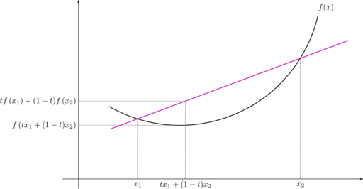

4. **Expand and rearrange:** Expand the logarithm and rearrange the terms:
   ```
   log p(x) ≥ ∫ q(z|x) log p(x, z) dz - ∫ q(z|x) log q(z|x) dz
   ```

5. **Identify ELBO and KL divergence:** The right-hand side of the inequality is the ELBO:
   ```
   ELBO = ∫ q(z|x) log p(x, z) dz - ∫ q(z|x) log q(z|x) dz
   ```
   The second term is the negative KL divergence between q(z|x) and p(z|x):
   ```
   -KL(q(z|x) || p(z|x)) = - ∫ q(z|x) log [q(z|x) / p(z|x)] dz
   ```

6. **Final expression:** Combine the ELBO and KL divergence terms:
   ```
   log p(x) = ELBO + KL(q(z|x) || p(z|x))
   ```

Since KL divergence is always non-negative, we have:

```
log p(x) ≥ ELBO
```

This means the ELBO is a lower bound on the log-likelihood of the data. By maximizing the ELBO, we indirectly maximize the log-likelihood, which is the objective of the VAE.

**In summary:** The ELBO is derived by introducing a variational distribution to approximate the true posterior, applying Jensen's inequality, and rearranging terms to obtain a lower bound on the log-likelihood.


## Vector Quantization


### Example Setup

Assume we have:
- `embedding_dim = 1`: Each embedding vector is a single scalar value.
- `num_embeddings = 3`: We have 3 embeddings in the codebook.
- `input values` are scalars.

### Step-by-Step Process

1. **Initialization**:
   Let's initialize our codebook (`self.embeddings`) with the following scalars:
   ```
   embeddings = [0.5, 1.0, 1.5]
   ```

2. **Input**:
   Assume our input `x` has the following 2 scalar values:
   ```
   x = [0.6, 1.4]
   ```

3. **Flattening the Input**:
   Since our input is already a list of scalars, flattening is trivial:
   ```
   flattened = x = [0.6, 1.4]
   ```

4. **Finding the Closest Embedding (Quantization)**:
   We compute the distances between each input scalar and each embedding in the codebook.
   
   - For input value `0.6`:
     ```
     distances = [
       ||0.6 - 0.5||^2 = (0.6 - 0.5)^2 = 0.01,
       ||0.6 - 1.0||^2 = (0.6 - 1.0)^2 = 0.16,
       ||0.6 - 1.5||^2 = (0.6 - 1.5)^2 = 0.81
     ]
     Closest embedding index: 0
     ```
   
   - For input value `1.4`:
     ```
     distances = [
       ||1.4 - 0.5||^2 = (1.4 - 0.5)^2 = 0.81,
       ||1.4 - 1.0||^2 = (1.4 - 1.0)^2 = 0.16,
       ||1.4 - 1.5||^2 = (1.4 - 1.5)^2 = 0.01
     ]
     Closest embedding index: 2
     ```

5. **One-hot Encoding of Indices**:
   We convert the indices of the closest embeddings to one-hot encodings:
   ```
   encoding_indices = [0, 2]
   encodings = [
     [1, 0, 0],  # one-hot for index 0
     [0, 0, 1]   # one-hot for index 2
   ]
   ```

6. **Quantizing**:
   We use the one-hot encodings to retrieve the corresponding embedding values:
   ```
   quantized = encodings @ embeddings = [
     [1, 0, 0] @ [0.5, 1.0, 1.5] = 0.5,
     [0, 0, 1] @ [0.5, 1.0, 1.5] = 1.5
   ]
   ```

7. **Reshape to Original Input Shape**:
   In this example, the input shape is already a list of scalars, so no additional reshaping is necessary:
   ```
   quantized = [0.5, 1.5]
   ```

### Summary of the Process

- **Input Scalars**: `[0.6, 1.4]`
- **Codebook (Embeddings)**: `[0.5, 1.0, 1.5]`
- **Closest Embeddings**: For `0.6` it is `0.5` and for `1.4` it is `1.5`.
- **Quantized Scalars**: `[0.5, 1.5]`

This example clarifies the quantization process where each input scalar is replaced by the closest scalar from the codebook when `embedding_dim` is 1.


## Vector Quantized Variational Autoencoder (VQVAE)

In VQVAE, the Encoder learns intermediate encodings, which are then mapped to one of the K vectors in the codebook through nearest-neighbor search. The Decoder reconstructs the image from these latent codes.

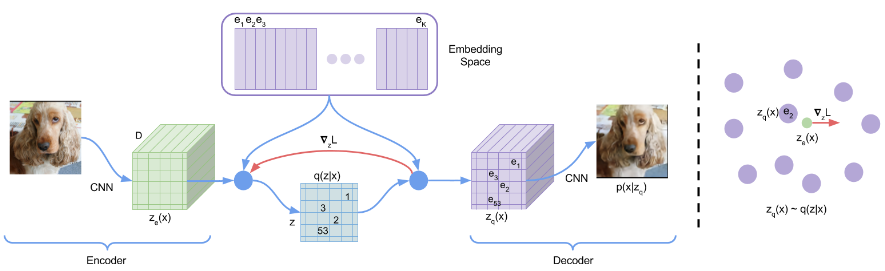

As an autoencoder, a notable feature of VQ-VAE is that the encoded vector is discrete. In other words, each element of the final encoded vector is an integer. This is the meaning of "Quantized", which we can refer to as "quantization" (similar to the term "quantum" in quantum mechanics, both implying discretization).

[The original paper](https://arxiv.org/abs/1711.00937) looks deliberately complicated. First, **VQ-VAE is actually an AE (autoencoder) rather than a VAE (variational autoencoder)** and "VQ-AE" might be a technically more precise term. The key evidence is that, even with a uniform prior, you cannot directly sample from the latent space to generate realistic images. Instead, you need a PixelCNN to model the distribution of the discrete codes and generate images sequentially. This suggests that **the latent space in VQ-VAE is more of a discrete representation rather than a probabilistic distribution**.

Secondly, one of the core steps of VQ-VAE is the **STE(Straight-Through Estimator)**, an optimization technique used to handle the non-differentiable nature of the quantization process. It allows gradients to flow through the quantization step during backpropagation by approximating the gradient. The original paper does not provide a slightly detailed explanation, making it necessary to look at the source code to understand it better.

Because nearest-neighbor search uses `argmax` to find the index in the codebook, it introduces a **non-differentiable problem**. VQVAE uses the **stop-gradient operation** to avoid this issue. This means that during the forward pass, gradients are stopped, and during the backward pass, the gradients from the decoder input are copied to the encoder output.

```python
quantize = input + (quantize - input).detach()
```

During forward propagation, it works as usual.
During backpropagation, the gradient for the detach() part is 0, and the gradients of _quantize_ and input are the same.
This effectively copies _quantize_ to input. A detailed pyton code is as follows:

```python
class VectorQuantizer(nn.Module):
    def __init__(self, num_embeddings, embedding_dim, beta=0.25):
        super().__init__()
        self.embedding_dim = embedding_dim
        self.num_embeddings = num_embeddings
        self.beta = beta
        self.embeddings = nn.Embedding(num_embeddings, embedding_dim)
        self.embeddings.weight.data.uniform_(-1 / num_embeddings, 1 / num_embeddings)

    def forward(self, x):
        flat_inputs = x.view(-1, self.embedding_dim)
        distances = (
                torch.sum(flat_inputs ** 2, dim=1, keepdim=True)
                + torch.sum(self.embeddings.weight ** 2, dim=1)
                - 2 * torch.matmul(flat_inputs, self.embeddings.weight.t())
        )
        encoding_indices = torch.argmin(distances, dim=1)
        encodings = F.one_hot(encoding_indices, self.num_embeddings).type(flat_inputs.dtype)
        quantized = torch.matmul(encodings, self.embeddings.weight).view_as(x)
        commitment_loss = F.mse_loss(quantized.detach(), x)
        codebook_loss = F.mse_loss(quantized, x.detach())
        loss = commitment_loss * self.beta + codebook_loss
        quantized = x + (quantized - x).detach()
        return quantized, loss, encoding_indices
```

**Key Differences Between VQVAE and VAE:**

1. **Discrete Values for Attributes**: VQVAE directly finds discrete values for each attribute by looking up the nearest neighbor in the codebook.
2. **Codebook**: By maintaining a codebook, VQVAE provides more controllable encoding ranges.
3. **Higher Quality Images**: VQVAE can generate larger and higher resolution images compared to VAE.

VQVAE's method of using a codebook to manage **discrete latent codes** lays the groundwork for later models like DALLE and VQGAN.

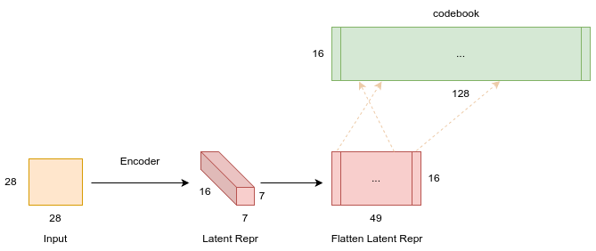

## PixelCNN

To trace the origin of VQ-VAE, we have to talk about autoregressive models. It can be said that the idea of VQ-VAE as a generative model stems from autoregressive models like PixelRNN and PixelCNN. These models take into account that the images we want to generate are discrete rather than continuous.

Take the images in CIFAR-10 as an example. They are 32x32 3-channel images, meaning they are 32x32x3 matrices where each element is an integer between 0 and 255. This way, we can consider it as a sentence of length 32x32x3=3072, with a vocabulary size of 256. We can then use language modeling methods to generate an image pixel by pixel, recursively (by passing in all previous pixels to predict the next pixel). This is the so-called autoregressive method:

p(x) = p(x1)p(x2|x1)...p(x3n2|x1, x2, ..., x3n2-1) (1)

where p(x1), p(x2|x1), ..., p(x3n2|x1, x2, ..., x3n2-1) are each 256-class classification problems, except that the conditions they depend on are different.

PixelRNN and PixelCNN have been widely discussed online, so I won't go into details here. Research on autoregressive models mainly focuses on two aspects: first, how to **design the recursive order** so that the model can better generate samples, because the image sequence is not a simple one-dimensional sequence, it is at least two-dimensional, and more often three-dimensional. In this case, whether you generate "from left to right and then from top to bottom", "from top to bottom and then from left to right", "from the middle to the surroundings", or other orders, it will greatly affect the generation effect. The second aspect is to research how to **speed up the sampling process**.

The autoregressive method is very stable and can effectively estimate probability, but it has a fatal flaw: **it's slow**. Because it generates pixel by pixel, it requires random sampling for each pixel. The CIFAR-10 example mentioned above is already considered a small image. Currently, image generation needs to be at least 128x128x3 to be convincing, which is close to 50,000 pixels (imagine generating a sentence of length 50,000). It would be very time-consuming to generate pixel by pixel. Moreover, for such long sequences, neither RNN nor CNN models can capture such long dependencies well.

The original autoregressive model also has another problem, which is that it cuts off the connection between categories. Although each pixel is discrete, so it can be seen as a 256-classification problem, the difference between consecutive pixels is actually very small, and **a pure classification problem cannot capture this connection**. More mathematically, our objective function, the cross-entropy, is -log(pt). If the target pixel is 100, and we predict it as 99, then pt is close to 0 because the categories are different, and -log(pt) will be very large, resulting in a large loss. But visually, there is not much difference between a pixel value of 100 or 99, so there should not be such a large loss.

## When generating images, why do we need PixelCNN for VQ-VAE, but not VAE?

The difference in image generation between VAE and VQ-VAE stems from the nature of their latent spaces:

**VAE (Variational Autoencoder):**

* **Latent Space:** Continuous
* **Image Generation:** The decoder of a VAE directly maps the continuous latent representation to an image. Since the latent space is continuous, it can directly be used to generate images by sampling from this space and then passing the samples through the decoder.

**VQ-VAE (Vector Quantized Variational Autoencoder):**

* **Latent Space:** Discrete
* **Image Generation:** The VQ-VAE's latent space is discrete due to vector quantization. This means it consists of a fixed set of vectors, and each encoded representation is assigned to one of these vectors.  This discrete nature makes it difficult to generate new images directly from the latent space, as there's no inherent way to interpolate or sample between the discrete vectors.

* **PixelCNN's Role:** This is where PixelCNN comes in.  It is trained on the discrete latent space to model the distribution of the discrete codes. It learns the probabilities of different codes occurring together, effectively capturing the dependencies between the image components represented by the codes. By sampling from this PixelCNN-learned distribution, you can then generate new, coherent sequences of discrete codes, which the VQ-VAE decoder can translate back into images.

**In summary:**

* **VAE:** The continuous latent space allows for direct image generation from the decoder.
* **VQ-VAE:** The discrete latent space requires a separate model (PixelCNN) to learn the distribution of discrete codes and generate new sequences of codes for image generation.

**Analogy:**

Think of the latent space as a map:

* **VAE:** The map is continuous, like a topographical map with smooth gradients. You can easily pinpoint any location on the map and use it for navigation.
* **VQ-VAE:** The map is discrete, like a city map with distinct blocks. You can't easily navigate just by looking at the map, you need additional information (the PixelCNN) to understand the relationships between the blocks and navigate effectively.


## Gumbel-Softmax vs STE (Straight-Through Estimator)

In the context of VQ-VAE (Vector Quantized Variational Autoencoder), Gumbel-Softmax is not directly used within the model itself. Instead, it's a technique that can be employed during training as an alternative to the standard straight-through estimator (STE) for backpropagating gradients through the non-differentiable quantization process.

**Why Gumbel-Softmax?**

* **Differentiable Approximation of Argmax:**  VQ-VAE involves selecting the closest embedding vector from a codebook based on the encoder's output. This is typically done using an argmax operation, which is non-differentiable. Gumbel-Softmax provides a differentiable approximation of the argmax, allowing for gradients to flow during training.

* **Softer Assignments:** Unlike the STE, which makes hard assignments to a single embedding vector, Gumbel-Softmax produces soft assignments where each embedding vector has a probability of being chosen. This can lead to smoother gradients and potentially better training.

**How Gumbel-Softmax Works**

1. **Adding Gumbel Noise:** Gumbel noise is added to the logits (unnormalized probabilities) produced by the encoder.

2. **Softmax:** The softmax function is applied to the perturbed logits to obtain a probability distribution over the embedding vectors.

3. **Sampling or Hardening:** During training, you can either sample from the distribution (Gumbel-Softmax sampling) or use a temperature parameter to harden the distribution and select the most likely embedding vector (Gumbel-Softmax relaxation).

**Alternatives to Gumbel-Softmax:**

* **Straight-Through Estimator (STE):** The default method in VQ-VAE, it simply copies gradients from the decoder to the encoder during backpropagation, ignoring the non-differentiable quantization step.
* **Other Differentiable Relaxations:** There are other techniques like Concrete distribution (another name for Gumbel-Softmax) or sparsemax that can also provide differentiable approximations of argmax.

**Choosing between Gumbel-Softmax and STE:**

Both Gumbel-Softmax and STE have been used successfully in VQ-VAE training. The choice often depends on the specific task and dataset.

* **Gumbel-Softmax:** Might be preferred when softer assignments and smoother gradients are desired. It can also be useful for exploring the continuous relaxation of discrete variables.

* **STE:** Might be preferred for its simplicity and computational efficiency. It often works well in practice and is the default choice in many VQ-VAE implementations.


## What are the Prior Distribution of z in AE, VAE, and VQ-VAE?

**VQ-VAE (Vector Quantized Variational Autoencoder):**

* **Latent Space:** Discrete (represented by indices of codebook entries)
* **Prior Distribution of z:** Implicitly defined by the distribution of codes in the learned codebook. This distribution is not necessarily uniform and can adapt to the data during training. It is not assumed to follow a k-dimensional multinomial distribution with equal probabilities.

**VAE (Variational Autoencoder):**

* **Latent Space:** Continuous
* **Prior Distribution of z:** Typically assumed to be a standard normal distribution (Gaussian with zero mean and unit variance). This is a design choice to encourage the model to learn a smooth and well-structured latent space.

**AE (Autoencoder):**

* **Latent Space:** Continuous
* **Prior Distribution of z:** No explicit prior assumption is made about the distribution of z. It is learned from the data during training and depends on the specific architecture of the encoder.

**Key Differences:**

| Feature        | VQ-VAE                                                                    | VAE                                                                     | AE                                                                          |
| :------------- |:--------------------------------------------------------------------------| :----------------------------------------------------------------------- |:----------------------------------------------------------------------------|
| Latent Space   | Discrete (codebook entries)                                               | Continuous                                                                | Continuous                                                                  |
| Prior of z     | Implicitly defined by the distribution of codes in the learned codebook   | Standard normal distribution (Gaussian with zero mean and unit variance) | No explicit assumption, depends on the data and encoder architecture        |
| Training       | Reconstruction loss + VQ loss(e.g. loss_codebook + beta * loss_commit)    | Reconstruction loss + KL divergence                                      | Reconstruction loss (e.g. MSE)                                              |
| Generation     | Requires PixelCNN or similar model to generate images from discrete codes | Decoder directly generates images from the continuous latent representation | Decoder directly generates images from the continuous latent representation |

> **VQ loss** is typically implemented by moving the encoder outputs towards their nearest codebook vectors (commitment loss) and moving the codebook vectors towards the encoder outputs (codebook update loss).

## Why there is no KL Divergence in VQ-VAE loss function?

The absence of the KL Divergence term in VQ-VAE (Vector Quantized Variational Autoencoder) is a deliberate design choice and a key difference compared to standard VAEs. Here's why:

1. **Discrete Latent Space:**

   * VQ-VAEs utilize a discrete latent space due to vector quantization. This means the latent representation is not a continuous probability distribution but a set of discrete codes. 
   * The KL divergence is a measure of the difference between two probability distributions. Since the VQ-VAE's latent space is not probabilistic, the KL divergence term doesn't apply in the traditional sense.

2. **Posterior Collapse Mitigation:**

   * In standard VAEs, the KL divergence term acts as a regularizer to prevent posterior collapse, where the latent representation becomes meaningless and the model simply learns to reconstruct the input without learning useful representations.
   * VQ-VAEs, however, address posterior collapse through the quantization process itself. The limited number of codebook entries forces the model to learn diverse and informative representations, even without the KL divergence term.

3. **Alternative Loss Function:**

   * VQ-VAEs use a different loss function that combines a reconstruction loss (to ensure accurate image reconstruction) and a codebook loss (to encourage the codebook vectors to be representative of the data). This loss function is sufficient for training VQ-VAEs effectively without the need for a KL divergence term.

4. **Potential Benefits:**

   * The absence of the KL divergence term in VQ-VAEs can lead to several benefits, including:
     * **Sharper Reconstructions:** Without the KL divergence term pushing the latent distribution towards a standard normal, VQ-VAEs can focus on accurate reconstruction, often resulting in sharper images.
     * **Simpler Training:** The loss function is simpler and easier to optimize without the KL divergence term.
     * **Better for Certain Tasks:**  VQ-VAEs have shown particular promise for tasks that benefit from a discrete latent space, such as image generation, compression, and discrete representation learning.

**Important Note:**

While VQ-VAEs don't use the KL divergence in their main loss function, they might still incorporate it in other ways. For example, some variants of VQ-VAEs use the KL divergence to measure the distance between the encoder's output and the quantized representation during training.

Overall, the absence of the KL divergence term in VQ-VAEs is a deliberate design choice that simplifies the model and allows it to focus on accurate reconstruction and learning a discrete latent space.

## sVAE

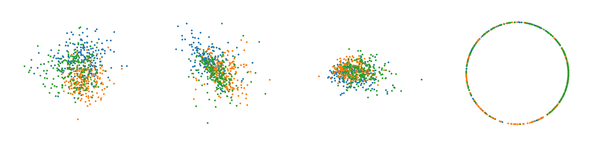

### Sampling

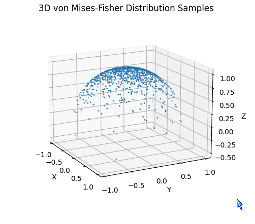


## Explain RVQ To Kids

Let's explain how RVQ (Residual Vector Quantization) works using the example of traveling to "600 Oracle Pkwy, Redwood City, CA 94065".

### 1. **Primary Quantization (Primary Codebook) – Major City Hubs**
First, consider "600 Oracle Pkwy, Redwood City, CA 94065" as a specific address. In RVQ, data points are initially mapped to a major region or hub. This is similar to flying from your original location to a major city hub, such as San Francisco International Airport (SFO).

### 2. **Residual Calculation – From Hub to Smaller Region**
Upon arriving at San Francisco International Airport, you have not yet reached your final destination. We need to calculate the difference or residual from San Francisco to Redwood City. In this step, the residual represents the difference between the original data point and the first quantized point (San Francisco).

### 3. **Secondary Quantization (Secondary Codebook) – From Major City to Smaller City**
Next, we quantize these residuals, which is similar to traveling from San Francisco to a smaller city or region like Redwood City. Here, Redwood City represents a secondary codebook entry, further refining the location of the data point.

### 4. **Multiple Quantization Levels – From Smaller City to Specific Address**
If more precision is needed, additional layers of quantization can be applied. For example, from the central point of Redwood City, we further refine down to the specific street address "600 Oracle Pkwy, Redwood City, CA 94065". This step involves quantizing from a smaller city's central point (like downtown Redwood City) down to specific streets and building numbers.

### Steps in Detail:
1. **Primary Quantization**: Map the data point to a primary hub, like San Francisco International Airport (SFO).
2. **Residual Calculation**: Calculate the difference (residual) between the original data point (600 Oracle Pkwy) and the hub (San Francisco International Airport).
3. **Secondary Quantization**: Quantize the residual to a secondary codebook, mapping to smaller regions like Redwood City.
4. **Multiple Quantization Levels**: Continue quantizing the residuals for higher precision, eventually refining to the specific street address.

### Advantages of RVQ:
Through this layered quantization process, RVQ can accurately represent data points while reducing the total number of vectors needed. Each level of codebook incrementally refines the position of the data point, increasing overall quantization precision and efficiency.

In summary, RVQ is like a step-by-step travel route, starting from major cities to smaller cities, and finally down to specific addresses, making data representation more efficient and accurate.

----

Let's delve into what the Primary Codebook and Secondary Codebook might look like with specific examples, using the context of air travel and geographic locations.

### Primary Codebook

The Primary Codebook represents major hubs or central points in the dataset. These could be major cities or key points of interest that serve as the first level of approximation for the data points.

#### Example:
- **Major Cities (Hubs)**:

| Primary Hub | Major Cities (Hubs) |
|-------------|----------------------|
| 1           | San Francisco (SFO)  |
| 2           | Los Angeles (LAX)    |
| 3           | Chicago (ORD)        |
| 4           | New York (JFK)       |
| 5           | Atlanta (ATL)        |

These major hubs provide a broad-level quantization of data points. Any location within a certain region will initially be approximated to one of these hubs.

### Secondary Codebook

The Secondary Codebook refines the approximation further, breaking down each major hub into smaller regions or cities. These could be smaller cities, districts, or neighborhoods within the broader region of the primary hub.

#### Example:
- **For San Francisco (SFO)**:

| Secondary Location | Smaller Cities/Towns      |
|--------------------|---------------------------|
|  1                 | Redwood City              |
|  2                 | Palo Alto                 |
|  3                 | San Mateo                 |
|  4                 | Mountain View             |
|  5                 | San Jose                  |

- **For Los Angeles (LAX)**:

| Secondary Location | Smaller Cities/Towns      |
|--------------------|---------------------------|
|  1                 | Santa Monica              |
|  2                 | Beverly Hills             |
|  3                 | Long Beach                |
|  4                 | Pasadena                  |
|  5                 | Anaheim                   |

These secondary locations provide a finer level of granularity, allowing for more precise quantization of data points within the vicinity of the primary hubs.

### Detailed Travel Example:

Let's say you're trying to map the location "600 Oracle Pkwy, Redwood City, CA 94065" using RVQ.

1. **Primary Codebook**:
   - The closest major hub from the primary codebook is **San Francisco (SFO)**.

2. **Secondary Codebook**:
   - Within the region of San Francisco, the closest secondary location from the secondary codebook is **Redwood City**.

3. **Residual Quantization**:
   - The remaining difference (residual) is the specific location within Redwood City, which can be further refined if needed.

### Conceptual Diagram:

1. **Primary Codebook Level**:
   ```
   Original Location → San Francisco (Primary Hub)
   ```

2. **Secondary Codebook Level**:
   ```
   San Francisco (Primary Hub) → Redwood City (Secondary Location)
   ```

3. **Further Refinement**:
   ```
   Redwood City → 600 Oracle Pkwy
   ```

In this way, RVQ uses multiple levels of codebooks to incrementally refine the representation of data points, allowing for efficient and accurate quantization.


## Explain GroupedRVQ To Kids with emphasis on its difference with Tertiary Codebook

**Grouped Residual Vector Quantization (GroupedResidualVQ)** is an extension of RVQ where the residual quantization process is grouped by certain attributes or features of the data, allowing for a more structured and efficient quantization process. Let's continue with the example of traveling to "600 Oracle Pkwy, Redwood City, CA 94065" and introduce the concept of GroupedResidualVQ.

#### Concept

1. **Primary Codebook**: Represents major hubs or central points.
2. **Secondary Codebook**: Breaks down each major hub into smaller regions.
3. **Grouped Residual Quantization**: Further groups within each region based on additional attributes (e.g., neighborhoods, specific landmarks).

### GroupedResidualVQ Example with Detailed Travel Steps

1. **Primary Codebook**: First, identify the nearest major hub.
    - **Major Hub**: San Francisco (SFO)

2. **Secondary Codebook**: Next, find the smaller city or region within the primary hub.
    - **Smaller City**: Redwood City

3. **Grouped Residual Quantization**: Further group within the smaller city based on additional attributes.
    - **Neighborhood**: Oracle Campus

### Detailed Breakdown

#### Primary Codebook

| Primary Hub | Major Cities (Hubs)   |
|-------------|------------------------|
| Hub 1       | San Francisco (SFO)    |
| Hub 2       | Los Angeles (LAX)      |
| Hub 3       | Chicago (ORD)          |
| Hub 4       | New York (JFK)         |
| Hub 5       | Atlanta (ATL)          |

#### Secondary Codebook for San Francisco (SFO)

| Secondary Location | Smaller Cities/Towns      |
|--------------------|---------------------------|
| Location 1         | Redwood City              |
| Location 2         | Palo Alto                 |
| Location 3         | San Mateo                 |
| Location 4         | Mountain View             |
| Location 5         | San Jose                  |

#### Grouped Residual Quantization for Redwood City

| Grouped Location   | Specific Attributes/Features   |
|--------------------|-------------------------------|
| Group 1            | **Commercial Areas**          |
|                    | Oracle Campus                 |
|                    | Redwood City Tech Park        |
| Group 2            | **Residential Areas**         |
|                    | Downtown Residential Area     |
|                    | Redwood Shores Residences     |
| Group 3            | **Parks and Recreation**      |
|                    | Emerald Hills Park Area       |
|                    | Woodside Trails               |

### Detailed Travel Path:

1. **Primary Quantization**:
    - Start from the original location.
    - Map to the nearest primary hub: **San Francisco (SFO)**.

2. **Secondary Quantization**:
    - From San Francisco, map to a smaller city: **Redwood City**.

3. **Grouped Residual Quantization**:
    - Within Redwood City, further refine the location to a specific commercial area: **Oracle Campus**.

4. **Final Quantization**:
    - Finally, pinpoint the exact address: **600 Oracle Pkwy, Oracle Campus, Redwood City, CA 94065**.


### Third Level of Codebook (Tertiary Codebook)

A Tertiary Codebook adds another level of uniform quantization, applying a hierarchical approach across the entire dataset. This method continues the hierarchical breakdown seen in the primary and secondary levels but goes further to refine data points within each secondary location.

**Tertiary Codebook for Redwood City**:

| Tertiary Location  | Neighborhoods/Streets     |
|--------------------|---------------------------|
| Location 1         | Oracle Parkway Area       |
| Location 2         | Downtown Redwood City     |
| Location 3         | Redwood Shores            |
| Location 4         | Emerald Hills             |
| Location 5         | Woodside                  |


### Comparison Table

| **Level**                | **Tertiary Codebook**                                      | **Grouped Residual Quantization**                                     |
|--------------------------|------------------------------------------------------------|----------------------------------------------------------------------|
| **Primary Codebook**     | San Francisco (SFO)                                        | San Francisco (SFO)                                                  |
| **Secondary Codebook**   | Redwood City, Palo Alto, San Mateo, Mountain View, San Jose| Redwood City, Palo Alto, San Mateo, Mountain View, San Jose           |
| **Third Level/Group**    | Oracle Parkway, Downtown, Redwood Shores, Emerald Hills, Woodside | Commercial Areas (Oracle Campus, Tech Park), Residential Areas (Downtown, Redwood Shores), Parks (Emerald Hills, Woodside) |

### Summary

- **Tertiary Codebook**: Adds another uniform level of quantization, dividing secondary locations into even finer sub-regions like neighborhoods or streets. Each level is treated uniformly without specific consideration of local attributes.
  
- **Grouped Residual Quantization**: Further refines residuals within each secondary location based on specific attributes or features (e.g., commercial, residential, parks). This approach allows for more localized and adaptive quantization, tailored to the characteristics of each secondary location.

In GroupedResidualVQ, after the primary and secondary quantizations, the residuals are further grouped by specific attributes or features within each secondary location. This method refines the quantization process even further, ensuring high precision while maintaining efficiency. For our example, this means mapping the travel route through major hubs, smaller cities, and then specific neighborhoods or landmarks before reaching the final address.

## Explain VQ to Kids

Sure, let's use the same example of traveling to "600 Oracle Pkwy, Redwood City, CA 94065" to explain how Vector Quantization (VQ) works. 

### Vector Quantization (VQ)

In VQ, each data point is replaced with its nearest code vector from a predefined set of code vectors (the codebook). This process quantizes the data into a smaller set of representative vectors.

#### Example:

Imagine VQ as a process where every specific address is replaced by its nearest town or city. 

1. **Codebook Creation**: A set of representative locations (code vectors) is chosen. These can be major towns or cities.

#### Example Codebook:

| Code Vector | Representative Location  |
|-------------|---------------------------|
| Vector 1    | San Francisco             |
| Vector 2    | Palo Alto                 |
| Vector 3    | San Mateo                 |
| Vector 4    | Mountain View             |
| Vector 5    | San Jose                  |
| Vector 6    | Redwood City              |
| Vector 7    | Sunnyvale                 |
| Vector 8    | Santa Clara               |

2. **Quantization**: Each specific address (data point) is replaced by the nearest representative location (code vector) from the codebook.

#### Quantization Example:

- **Original Address**: 600 Oracle Pkwy, Redwood City, CA 94065
- **Nearest Representative Location (Code Vector)**: Redwood City

In this example, the specific address "600 Oracle Pkwy" is quantized to "Redwood City", which is the nearest location in the codebook.

### Comparison with RVQ and Grouped Residual Quantization

To understand the difference, let's revisit RVQ and Grouped Residual Quantization using the same example.

### Residual Vector Quantization (RVQ)

RVQ uses multiple codebooks to refine the quantization process incrementally. 

#### Steps:
1. **Primary Codebook**: Major cities (hubs) like San Francisco.
2. **Secondary Codebook**: Smaller cities within the major hubs like Redwood City.
3. **Further Refinement**: Additional layers of quantization to refine the location further.

### Grouped Residual Quantization

Grouped Residual Quantization groups residuals within each secondary location based on specific attributes or features for localized refinement.

#### Example:
1. **Primary Codebook**: Major cities (hubs) like San Francisco.
2. **Secondary Codebook**: Smaller cities within the major hubs like Redwood City.
3. **Grouped Residual Quantization**:
    - **Commercial Areas**: Oracle Campus, Redwood City Tech Park.
    - **Residential Areas**: Downtown Residential Area, Redwood Shores Residences.
    - **Parks and Recreation**: Emerald Hills Park Area, Woodside Trails.

### Summary of Differences

| **Method**           | **Description**                                                                                                                                               | **Example with 600 Oracle Pkwy**                                                                                                                                  |
|----------------------|---------------------------------------------------------------------------------------------------------------------------------------------------------------|-------------------------------------------------------------------------------------------------------------------------------------------------------------------|
| **VQ** | Replace each specific address with the nearest representative location from a single codebook.                                                                | Quantize "600 Oracle Pkwy" to "Redwood City".                                                                                                                     |
| **RVQ**              | Use multiple levels of codebooks to incrementally refine the quantization from major hubs to smaller cities and then to specific locations.                    | Primary: San Francisco, Secondary: Redwood City, Further: Oracle Parkway.                                                                                         |
| **GRVQ**     | Further refine residuals within each secondary location based on specific attributes (e.g., commercial, residential, parks) for localized and flexible quantization. | Primary: San Francisco, Secondary: Redwood City, Grouped: Oracle Campus (commercial), Downtown Residential Area (residential), Emerald Hills Park Area (parks).   |

In essence, VQ simplifies the process by using a single codebook to replace each address with its nearest town or city, which can lead to a lot of vectors if the data is diverse and requires high precision. In contrast, RVQ and Grouped Residual Quantization offer more refined and efficient approaches by using multiple levels of codebooks and grouping based on specific attributes, respectively.

## What is Codebook Collapse? 

Codebook collapse is a common problem in training deep generative models with discrete representation spaces, such as Vector Quantized Variational Autoencoders (VQ-VAEs) and discrete variational autoencoders (dVAE). 

In these models, a codebook is a set of vectors used to represent the latent space. Ideally, each vector in the codebook should be used to represent a different feature or aspect of the data. However, in codebook collapse, the model learns to use only a small subset of the vectors in the codebook, leading to a loss of information and a decrease in the quality of the generated samples.

**Causes of Codebook Collapse:**

* **Overconfident probabilities:** The softmax function used to obtain a probability distribution over the codebook vectors can assign overconfident probabilities to the best matching vectors, leading to underutilization of other vectors.
* **Deterministic quantization:** The deterministic quantization process in VQ-VAEs can force the model to choose the closest vector in the codebook, even if it's not the best representation.

**Mitigation Strategies:**

* **Evidential Deep Learning (EDL):** Replacing the softmax function with EDL can help to mitigate codebook collapse by providing more accurate uncertainty estimates. (This is the approach used in EdVAE)
* **Probabilistic approaches:** Using probabilistic quantization instead of deterministic quantization can also help to avoid codebook collapse.
* **Codebook reset and hyperparameter tuning:** Resetting the codebook during training or adjusting hyperparameters can sometimes help to prevent or recover from codebook collapse.

### Examples

Imagine you are training a VQ-VAE to generate images of handwritten digits (0-9). You use a codebook with 128 vectors, each representing a different visual feature of the digits (like curves, lines, angles, etc.).

In an ideal scenario, each vector in the codebook would be used to represent a different feature, and the model would be able to generate a diverse set of digits. However, **due to codebook collapse, the model might only learn to use a small subset of vectors**, say 20. This means that even though you have a codebook of 128 vectors, only 20 of them are actually used to represent the data.

**Consequences:**

1. **Limited Diversity:** The generated digits will lack diversity. You might observe that the model only generates a few types of digits repeatedly because it's limited by the small subset of vectors it uses.
2. **Blurry Images:** The generated images might also appear blurry or less sharp because the model doesn't have access to the full range of visual features represented in the codebook.

**Real-World Example:**

A real-world example of codebook collapse was observed in the early versions of VQ-VAE-2, a model for generating high-resolution images. The researchers noticed that the model was only using a small portion of its codebook, leading to less diverse and lower quality images. They addressed this issue by introducing techniques like codebook reseeding and a diversity loss to encourage the model to use the full codebook.


## dVAE vs VQ-VAE

Both Discrete Variational Autoencoders (DVAEs) and Vector Quantized Variational Autoencoders (VQ-VAEs) are types of generative models that learn to encode data into discrete representations. However, they differ in their architecture and approach to discretization.

### Discrete Variational Autoencoders (DVAEs)

1. **Architecture**: DVAEs are built on the standard VAE framework but modify the **latent space to be discrete** rather than continuous.
2. **Discretization**: The latent space is modeled using discrete distributions, such as **categorical distributions**, instead of the Gaussian distributions used in standard VAEs.
3. **Training**: Training DVAEs involves **maximizing a variational lower bound on the data likelihood**. The reparameterization trick is adapted for discrete variables, often using techniques like **Gumbel-Softmax** to enable backpropagation.
4. **Purpose**: DVAEs aim to learn discrete latent representations, which can be more interpretable and suitable for tasks where discrete latent variables are natural, such as **text generation or clustering**.

### Vector Quantized Variational Autoencoders (VQ-VAEs)

1. **Architecture**: VQ-VAEs also modify the VAE framework but do so by introducing a **discrete codebook** of latent variables.
2. **Discretization**: In VQ-VAEs, the continuous latent vectors are quantized to the nearest entry in a codebook of discrete vectors during the encoding process. This quantization process is non-differentiable.
3. **Training**: VQ-VAEs bypass the need for the reparameterization trick by using a different approach for backpropagation. They use a combination of straight-through estimators and vector quantization techniques. The objective includes a reconstruction loss and a commitment loss to encourage the encoder to produce vectors close to the codebook entries.
4. **Purpose**: VQ-VAEs are particularly effective for high-dimensional data like images, where the discrete codebook can capture rich and diverse features. They are useful for tasks like **image generation and representation learning**.

### Key Differences
- **Discretization Method**: DVAEs use a discrete distribution (e.g., categorical), while VQ-VAEs use a codebook of discrete latent vectors.
- **Training Techniques**: DVAEs often require methods like Gumbel-Softmax for differentiability, whereas VQ-VAEs use vector quantization and straight-through estimators.
- **Application Focus**: DVAEs are often more interpretable and suited for tasks with natural discrete latent structures, while VQ-VAEs are powerful for high-dimensional data, capturing complex features through their codebook.

In summary, while both models aim to leverage discrete latent spaces, their approaches to discretization and training differ, making each suitable for different types of data and applications.

## Without Considering Commitment Weight, Is Commitment Loss Always Equal to CodeBook Loss in VQ? Why?

The following is the loss function of VQ-VAE model from the original paper [Neural Discrete Representation Learning](https://arxiv.org/abs/1711.00937):

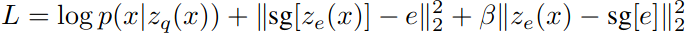

Actually, the commitment loss and codebook loss in VQ-VAE are always equal in forward process. The reason we use them is we want to update them differently in back-propagating via setting a commit loss weight. The two losses serve different purposes while having the same value in the forward pass without considering the weight. If the weight less 1, it means we want to prioritize updating encoder over codebook.

**The Loss Function Breakdown**

The VQ-VAE loss function has three main components:

1. **Reconstruction Loss (`log p(x|z_q(x))`)**:  This measures how well the decoder can reconstruct the original input `x` from the quantized latent representation `z_q(x)`.
2. **Codebook Loss (`||sg[z_e(x)] - e||^2`)**: This encourages the codebook vectors `e` to move closer to the encoder's output `z_e(x)`. The `sg` (stop gradient) operation prevents the encoder from being updated by this loss.
3. **Commitment Loss (`β||z_e(x) - sg[e]||^2`)**: This encourages the encoder's output `z_e(x)` to stay close to the quantized representation `sg[e]`. The stop gradient on `e` ensures the codebook isn't updated by this loss. `β` is a hyperparameter that balances the commitment loss with the reconstruction loss.

**Why the Losses are Different**

The key differences between the codebook loss and commitment loss arise from the use of stop gradients (`sg`):

* **Codebook Loss:** Only the codebook vectors are updated to move closer to the encoder's output. The encoder itself is not affected by this loss. This helps the codebook learn a better representation of the data.

* **Commitment Loss:** Only the encoder is updated to move its output closer to the codebook vectors. The codebook itself is not affected. This prevents the encoder from deviating too far from the discrete codebook space.

**Intuitive Explanation**

Think of the codebook vectors as anchor points in a latent space. The encoder wants to map input data to these anchor points.
* The codebook loss helps to adjust the anchor points so that they are more representative of the data distribution.
* The commitment loss encourages the encoder to "commit" to using these anchor points rather than generating outputs that fall far away from them.

**In Summary:**

Both the codebook loss and commitment loss work together to optimize the VQ-VAE model. They serve different purposes, and their magnitudes can vary depending on the specific data and hyperparameters used. By carefully balancing these losses, VQ-VAE can effectively learn discrete representations of data while maintaining good reconstruction quality.

> Ze(x) is the output of the encoder network, and e is the embedding. They are mutually-related, and both need to be optimized. In general, the separation using stop-gradients can be understood, in my opinion, as an Alternating Projections kind of optimization algorithm, where you need to simultaneously optimize 2 mutually-related subsystems, so you do it by "freezing" one while optimizing the other, so that the optimization will not "collapse" into a trivial wrong solution.
> 
> In the context of the VQ-VAE paper, this is almost the same as the way the k-means algorithm operates, by alternating between (phase 1) estimating centroids and (phase 2) deciding which element belongs to each centroid. You can see that equations (1) and (2) in the paper are essentially a k-means criterion.
> The similarity to a k-means criterion is not just my own opinion -- note in Appendix A.1 of the paper, where the authors explicitly mention this close similarity to k
-means.
> The paper further justifies the stop-gradient in the 2 paragraphs before equation (3), by emphasizing that the stop-gradient in different terms of the loss will cause the loss to effect learning (optimizing) in different subsystems of the overall system.
> - https://stats.stackexchange.com/questions/592742/vq-vae-why-do-we-need-to-separate-the-codebook-alignment-loss-and-the-commitme

## Masked Autoencoder (MAE)

Masked Autoencoders (MAE) are designed for vision tasks, such as image reconstruction, using a transformer-based architecture.

<p align="left">
  
</p>

```angular2html
🌳 MaskedAutoencoderViT<trainable_params:329239296,all_params:329541888,percentage:99.90818%>
├── PatchEmbed(patch_embed)
│   └── Conv2d(proj)|weight[1024,3,16,16]🇸 -(16, 16)|bias[1024]🇸 -(16, 16)
├── ModuleList(blocks)
│   └── 💠 Block(0-23)<🦜:12596224x24>
│       ┣━━ 💠 LayerNorm(norm1,norm2)<🦜:2048x2>|weight[1024]|bias[1024]
│       ┣━━ Attention(attn)
│       ┃   ┣━━ Linear(qkv)|weight[3072,1024]|bias[3072]
│       ┃   ┗━━ Linear(proj)|weight[1024,1024]|bias[1024]
│       ┗━━ Mlp(mlp)
│           ┣━━ Linear(fc1)|weight[4096,1024]|bias[4096]
│           ┗━━ Linear(fc2)|weight[1024,4096]|bias[1024]
├── LayerNorm(norm)|weight[1024]|bias[1024]
├── Linear(decoder_embed)|weight[512,1024]|bias[512]
├── ModuleList(decoder_blocks)
│   └── 💠 Block(0-7)<🦜:3152384x8>
│       ┣━━ 💠 LayerNorm(norm1,norm2)<🦜:1024x2>|weight[512]|bias[512]
│       ┣━━ Attention(attn)
│       ┃   ┣━━ Linear(qkv)|weight[1536,512]|bias[1536]
│       ┃   ┗━━ Linear(proj)|weight[512,512]|bias[512]
│       ┗━━ Mlp(mlp)
│           ┣━━ Linear(fc1)|weight[2048,512]|bias[2048]
│           ┗━━ Linear(fc2)|weight[512,2048]|bias[512]
├── LayerNorm(decoder_norm)|weight[512]|bias[512]
└── Linear(decoder_pred)|weight[768,512]|bias[768]
```

I feel the following image is better than the paper one. The encoder is deeper but shorter, compared with decoder.

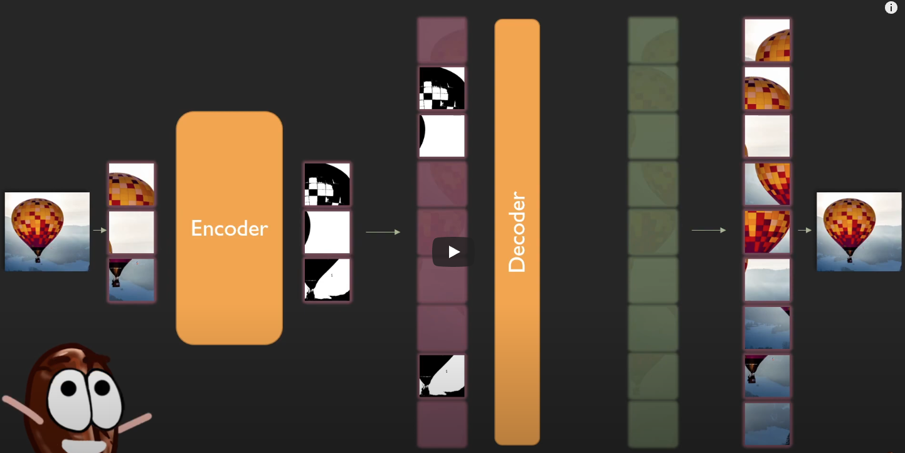

> **Question**:
> In Masked Autoencoders (MAE) for vision tasks, the encoder starts with patch embedding via a Conv2d to patchify image input. However, the decoder uses a linear layer instead of a transposed convolutional layer for the reconstruction of the image patches. We know transposed convolution (ConvTranspose2d) is an inverse operation to the Conv2d. Why not use ConvTranspose2d as the last layer?
> 
> **ChatGPT Answer**: The decision to use a linear layer in the decoder of Masked Autoencoders (MAE) instead of a transposed convolutional layer stems from a few key considerations specific to the architecture and design philosophy of transformers. While transposed convolutions (ConvTranspose2d) could be used as an inverse operation to Conv2d, the use of linear layers in the MAE decoder is driven by the need for architectural consistency, simplicity, and empirical effectiveness within the transformer framework. Linear layers provide a **direct and efficient mapping from token embeddings to pixel values**, aligning with the design principles of transformers and ensuring efficient and effective image reconstruction.

The running result from [the demo script](mae/demo_mae.py).

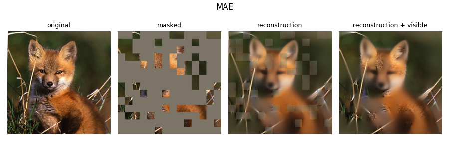

## Code Implementation

```python
from timm.models.vision_transformer import PatchEmbed, Block
from util.pos_embed import get_2d_sincos_pos_embed

class MaskedAutoencoderViT(nn.Module):
    def __init__(self, img_size=224, patch_size=16, in_chans=3, embed_dim=1024, depth=24, num_heads=16,
                 decoder_embed_dim=512, decoder_depth=8, decoder_num_heads=16, mlp_ratio=4., 
                 norm_layer=nn.LayerNorm, norm_pix_loss=False):
        super().__init__()
        self.patch_embed = PatchEmbed(img_size, patch_size, in_chans, embed_dim)
        self.cls_token = nn.Parameter(torch.zeros(1, 1, embed_dim))
        self.pos_embed = nn.Parameter(torch.zeros(1, self.patch_embed.num_patches + 1, embed_dim), requires_grad=False)
        self.blocks = nn.ModuleList([Block(embed_dim, num_heads, mlp_ratio, qkv_bias=True, norm_layer=norm_layer) for i in range(depth)])
        self.norm = norm_layer(embed_dim)
        self.decoder_embed = nn.Linear(embed_dim, decoder_embed_dim, bias=True)
        self.mask_token = nn.Parameter(torch.zeros(1, 1, decoder_embed_dim))
        self.decoder_pos_embed = nn.Parameter(torch.zeros(1, self.patch_embed.num_patches + 1, decoder_embed_dim), requires_grad=False)
        self.decoder_blocks = nn.ModuleList([Block(decoder_embed_dim, decoder_num_heads, mlp_ratio, qkv_bias=True, norm_layer=norm_layer)
                                             for i in range(decoder_depth)])
        self.decoder_norm = norm_layer(decoder_embed_dim)
        self.decoder_pred = nn.Linear(decoder_embed_dim, patch_size**2 * in_chans, bias=True)
        self.norm_pix_loss = norm_pix_loss
        self.initialize_weights()

    def initialize_weights(self):
        pos_embed = get_2d_sincos_pos_embed(self.pos_embed.shape[-1], int(self.patch_embed.num_patches**.5), cls_token=True)
        self.pos_embed.data.copy_(torch.from_numpy(pos_embed).float().unsqueeze(0))
        decoder_pos_embed = get_2d_sincos_pos_embed(self.decoder_pos_embed.shape[-1], int(self.patch_embed.num_patches**.5),
                                                    cls_token=True)
        self.decoder_pos_embed.data.copy_(torch.from_numpy(decoder_pos_embed).float().unsqueeze(0))
        torch.nn.init.xavier_uniform_(self.patch_embed.proj.weight.data.view([self.patch_embed.proj.weight.data.shape[0], -1]))
        torch.nn.init.normal_(self.cls_token, std=.02)
        torch.nn.init.normal_(self.mask_token, std=.02)
        self.apply(self._init_weights)

    def _init_weights(self, m):
        if isinstance(m, nn.Linear):
            torch.nn.init.xavier_uniform_(m.weight)
            if m.bias is not None:
                nn.init.constant_(m.bias, 0)
        elif isinstance(m, nn.LayerNorm):
            nn.init.constant_(m.bias, 0)
            nn.init.constant_(m.weight, 1.0)

    def patchify(self, imgs):
        p = self.patch_embed.patch_size[0]
        h = w = imgs.shape[2] // p
        x = imgs.reshape(shape=(imgs.shape[0], 3, h, p, w, p))
        x = torch.einsum('nchpwq->nhwpqc', x).reshape(shape=(imgs.shape[0], h * w, p**2 * 3))
        return x

    def unpatchify(self, x):
        p = self.patch_embed.patch_size[0]
        h = w = int(x.shape[1]**.5)
        x = x.reshape(shape=(x.shape[0], h, w, p, p, 3))
        imgs = torch.einsum('nhwpqc->nchpwq', x).reshape(shape=(x.shape[0], 3, h * p, h * p))
        return imgs

    def random_masking(self, x, mask_ratio):
        N, L, D = x.shape
        len_keep = int(L * (1 - mask_ratio))
        noise = torch.rand(N, L, device=x.device)
        ids_shuffle = torch.argsort(noise, dim=1)
        ids_restore = torch.argsort(ids_shuffle, dim=1)
        ids_keep = ids_shuffle[:, :len_keep]
        x_masked = torch.gather(x, dim=1, index=ids_keep.unsqueeze(-1).repeat(1, 1, D))
        mask = torch.ones([N, L], device=x.device)
        mask[:, :len_keep] = 0
        mask = torch.gather(mask, dim=1, index=ids_restore)
        return x_masked, mask, ids_restore

    def forward_encoder(self, x, mask_ratio):
        x = self.patch_embed(x) + self.pos_embed[:, 1:, :]
        x, mask, ids_restore = self.random_masking(x, mask_ratio)
        cls_tokens = self.cls_token + self.pos_embed[:, :1, :].expand(x.shape[0], -1, -1)
        x = torch.cat((cls_tokens, x), dim=1)
        for blk in self.blocks:
            x = blk(x)
        x = self.norm(x)
        return x, mask, ids_restore

    def forward_decoder(self, x, ids_restore):
        x = self.decoder_embed(x)
        mask_tokens = self.mask_token.repeat(x.shape[0], ids_restore.shape[1] + 1 - x.shape[1], 1)
        x_ = torch.cat([x[:, 1:, :], mask_tokens], dim=1)
        x_ = torch.gather(x_, dim=1, index=ids_restore.unsqueeze(-1).repeat(1, 1, x.shape[2]))
        x = torch.cat([x[:, :1, :], x_], dim=1) + self.decoder_pos_embed
        for blk in self.decoder_blocks:
            x = blk(x)
        x = self.decoder_norm(x)
        x = self.decoder_pred(x)[:, 1:, :]
        return x

    def forward_loss(self, imgs, pred, mask):
        target = self.patchify(imgs)
        if self.norm_pix_loss:
            target = (target - target.mean(dim=-1, keepdim=True)) / (target.var(dim=-1, keepdim=True) + 1.e-6)**.5
        loss = ((pred - target) ** 2).mean(dim=-1)
        loss = (loss * mask).sum() / mask.sum()
        return loss

    def forward(self, imgs, mask_ratio=0.75):
        latent, mask, ids_restore = self.forward_encoder(imgs, mask_ratio)
        pred = self.forward_decoder(latent, ids_restore)
        loss = self.forward_loss(imgs, pred, mask)
        return loss, pred, mask
```

- https://github.com/facebookresearch/mae/blob/main/models_mae.py
- https://youtu.be/Dp6iICL2dVI?si=_0LGQk-kSvy_iQnE&t=507

## Reference

- [Math - Latent space and generative modeling, autoencoders, and variational autoencoders](https://learning-oreilly-com.rpa.sccl.org/library/view/math-and-architectures/9781617296482/OEBPS/Text/14.html#sec-generative-classifiers)
- [漫谈VAE和VQVAE，从连续分布到离散分布](https://zhuanlan.zhihu.com/p/388299884) 
- [自编码器AE、VAE、dVAE、VQ-VAE、VQ-VAE2](https://www.p-chao.com/2024-01-28/%E8%87%AA%E7%BC%96%E7%A0%81%E5%99%A8ae%E3%80%81vae%E3%80%81dvae%E3%80%81vq-vae%E3%80%81vq-vae2/)
- [生成模型之VAE与VQ-VAE](https://blog.csdn.net/m0_56214772/article/details/129711670)
- [GAN 和 VAE 的本质区别是什么？为什么两者总是同时被提起？](https://www.zhihu.com/question/317623081/answer/1994238294)
- [DALL-E论文笔记](https://www.p-chao.com/2024-01-21/dall-e%e8%ae%ba%e6%96%87%e7%ac%94%e8%ae%b0/#dVAE)
- [Deep Generative Modeling of Sequential Data with Dynamical Variational Autoencoders 2021](https://dynamicalvae.github.io/tuto_icassp2021/DVAE_tutorial.html#152)
- VQ-GAN https://www.youtube.com/watch?v=wcqLFDXaDO8&ab_channel=Outlier
