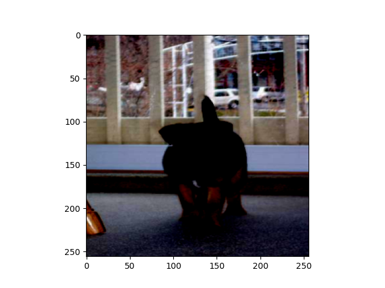

```
conda create --name genai python=3.11
pip install -r requirements.txt
```


- TINY

```
python train_titok.py --dataset imagenet-1k --depth 6 --mlp_dim 768 --batch_size 128
```

## Debug

- Oneliner to show image
```bash
> x[0].shape
Out[8]: torch.Size([3, 256, 256])
> import matplotlib.pyplot as plt; plt.imshow(x[0].permute(1, 2, 0).cpu().numpy()); plt.show()
```

