# GAN

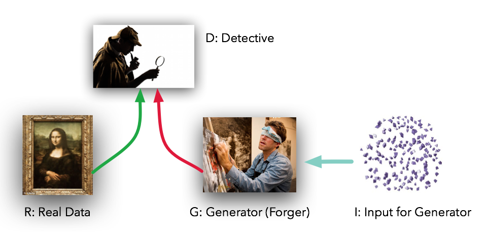

## MiniMax Loss


**GANs: A Two-Player Game**

A GAN is composed of two neural networks working in tandem:

* **Generator (G):** This network takes random noise as input and tries to generate data that resembles the real data distribution.
* **Discriminator (D):** This network takes in either real data or generated data and tries to classify it as real or fake.

The generator and discriminator are engaged in a constant game of improvement:

1. The generator tries to produce data that fools the discriminator into thinking it's real.
2. The discriminator tries to get better at distinguishing real data from the generator's fakes.

**GAN Loss Function**

The core idea behind GANs is that this adversarial training process will eventually lead to a generator that can produce highly realistic data. To achieve this, we need a way to quantify how well both networks are doing. That's where the loss function comes in.

The standard GAN loss function is often called the **Minimax Loss** or the **original GAN loss**. It combines the objectives of both the generator and discriminator:

```
min G max D [ log(D(x)) + log(1 - D(G(z))) ]
```

Where:
* `x` is a sample from the real data distribution.
* `z` is a sample from the noise distribution (input to the generator).
* `D(x)` is the discriminator's probability that `x` is real.
* `D(G(z))` is the discriminator's probability that the generated sample `G(z)` is real.

**Understanding the Minimax Loss**

This loss function has two parts:

* **Discriminator's Goal:** The `max D` part indicates the discriminator wants to maximize the combined expression. It achieves this by:
    * Assigning high probabilities to real data samples (`D(x)` close to 1).
    * Assigning low probabilities to generated samples (`D(G(z))` close to 0).
* **Generator's Goal:** The `min G` part means the generator wants to minimize the same expression. The only way the generator can influence the loss is through the `D(G(z))` term. To minimize the loss, the generator aims to produce samples that make `D(G(z))` close to 1 (fooling the discriminator).

**Deduction of the Minimax Loss**

The minimax loss is derived from the idea of a zero-sum game between the generator and discriminator. It's a framework where one player's gain is the other player's loss. In this case, the discriminator's success is the generator's failure, and vice-versa.  The loss function is formulated to encourage this competition, pushing both networks to improve over time.

**Key Points and Considerations**

* **Training Dynamics:** Training GANs with the minimax loss can be challenging due to issues like vanishing gradients and mode collapse.
* **Alternative Loss Functions:** Many alternative GAN loss functions have been proposed to address the limitations of the minimax loss, such as Wasserstein GANs and Least Squares GANs.

> - Understanding GAN Loss Functions https://neptune.ai/blog/gan-loss-functions


## What is Wasserstein Loss?

The Wasserstein loss, used in Wasserstein GANs (WGANs), is a prime example of an alternative loss function designed to address the stability and convergence issues often encountered with the original minimax loss in GANs.

**Why Wasserstein Loss?**

The original minimax loss can suffer from problems like:

* **Vanishing Gradients:**  When the discriminator becomes too good, the generator's gradients can become very small, hindering its learning.
* **Mode Collapse:** The generator might get stuck **producing only a limited variety of samples**, failing to capture the full diversity of the real data distribution.

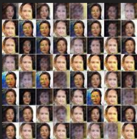

The Wasserstein loss, also known as **the Earth Mover's Distance**, provides a more meaningful and smoother measure of the distance between the real and generated data distributions. This leads to several advantages:

* **Improved Stability:** WGANs tend to be more stable during training and are less prone to mode collapse.
* **Meaningful Loss:** The Wasserstein loss provides a clearer signal about the quality of the generated samples, even when the discriminator is strong.
* **Less Sensitive to Architecture:** WGANs are less sensitive to the specific architecture choices for the generator and discriminator.

**How Does Wasserstein Loss Work?**

The Wasserstein loss encourages the discriminator (often called the "critic" in WGANs) to learn a smooth function that estimates the Wasserstein distance between the real and generated data distributions.  The generator then tries to minimize this distance. 

A key constraint in WGANs is that the critic must be a 1-Lipschitz function, meaning it shouldn't have overly steep gradients. To enforce this constraint, weight clipping or gradient penalty techniques are typically used during training.

**Implementation**

Implementing WGANs requires some modifications to the standard GAN architecture:

1. **Remove the sigmoid activation** from the last layer of the critic (discriminator).
2. **Use the Wasserstein loss** instead of the minimax loss.
3. **Enforce the 1-Lipschitz constraint** on the critic using weight clipping or gradient penalty.

**Benefits of WGANs**

WGANs and their variants have proven to be a significant advancement in GAN research. They often produce higher quality samples and exhibit more stable training dynamics compared to traditional GANs with the minimax loss.

**Caveats**

While WGANs offer many advantages, they are not without challenges. Enforcing the 1-Lipschitz constraint can be tricky, and training can sometimes be slower compared to standard GANs. However, the potential benefits in terms of stability and sample quality often outweigh these challenges.

> - https://jonathan-hui.medium.com/gan-wasserstein-gan-wgan-gp-6a1a2aa1b490

## Learning Curves of GAN Training

While the loss curve can provide some insights into GAN training progress, it's crucial to remember that **GANs have unique dynamics that make it challenging to solely rely on the loss to assess their performance**.

**Interpreting GAN Loss Curves with Caution**

* **Adversarial Nature:** The generator and discriminator losses are intertwined in a competitive game. A decrease in the discriminator loss often means the generator is improving, but it can also indicate the discriminator is getting worse. Conversely, an increase in generator loss might suggest the discriminator is becoming stronger.
* **No Direct Measure of Sample Quality:** The loss values themselves don't directly translate to the quality of generated samples. A GAN with low loss might still produce unrealistic or poor quality outputs.

**Tips for Monitoring GAN Training**

1. **Visualize Generated Samples:** Regularly inspect the images or data your generator produces throughout training. This is the most reliable way to judge the progress and quality of your GAN. Are the samples becoming more realistic and diverse?
2. **Track Loss Trends:** While the absolute loss values might not be definitive, observe the general trends. You might expect:
    * **Discriminator:**  Initial decrease as it learns to distinguish real from fake, followed by fluctuations as the generator improves.
    * **Generator:** Initial increase as the discriminator gets better, followed by a decrease as the generator learns to fool the discriminator.
3. **Look for Stability:** Ideally, you'd like to see the losses stabilize somewhat over time, indicating a balance between the generator and discriminator. However, some fluctuations are normal due to the adversarial nature of GANs.
4. **Use Quantitative Metrics:**  If applicable, consider using quantitative metrics like [⬆**Inception Score (IS)**](https://en.wikipedia.org/wiki/Inception_score) or [⬇**Fréchet Inception Distance (FID)**](https://en.wikipedia.org/wiki/Fr%C3%A9chet_inception_distance) to evaluate the quality and diversity of generated samples.


5. **Consider Human Evaluation:** In some cases, human judgment might be the best way to assess the realism and quality of generated content, especially for complex domains like art or music.

**Validation Loss in GANs**

While common in supervised learning, using a separate validation set in GANs is less straightforward. Since there's no ground truth label for generated samples, it's difficult to calculate a meaningful validation loss. However, you could still use a holdout set of real data to periodically evaluate the discriminator's performance on unseen examples. This can help detect overfitting or other issues with the discriminator.

**Key Takeaways**

* Don't rely solely on loss curves to judge GAN performance.
* Visualize generated samples regularly and use quantitative metrics if possible.
* Consider human evaluation for complex domains.
* Validation sets can be used to monitor the discriminator's performance.

### Example - Trainning MNIST with GAN

**Epoch 150**

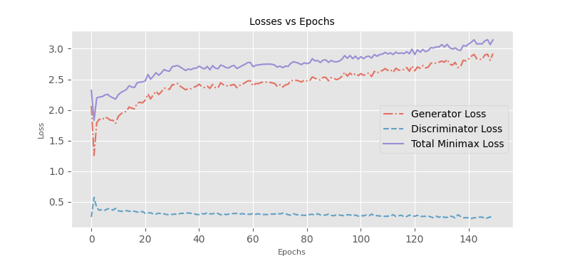

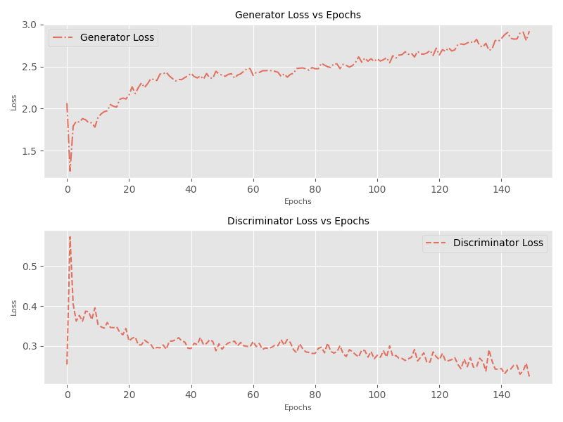

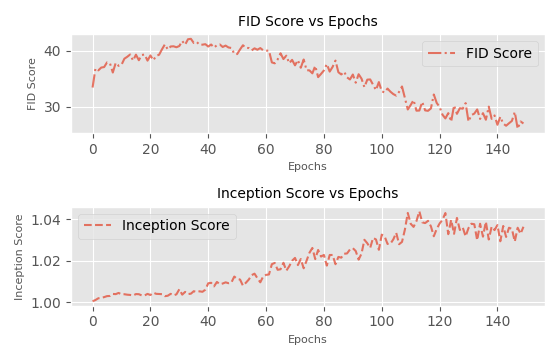


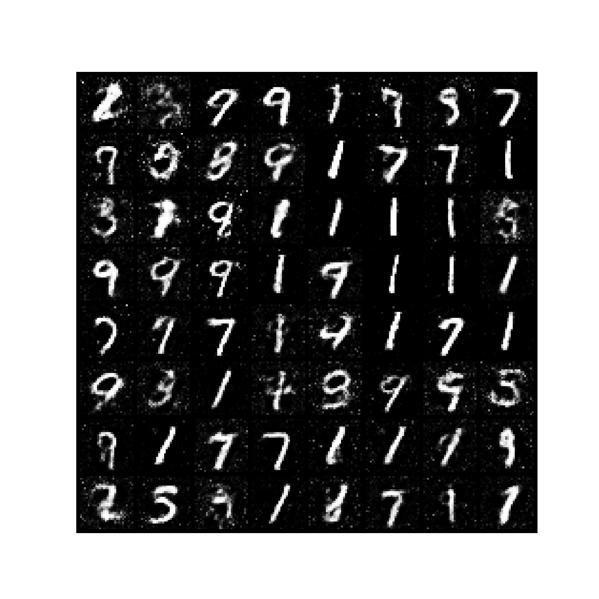

**Epoch 500**

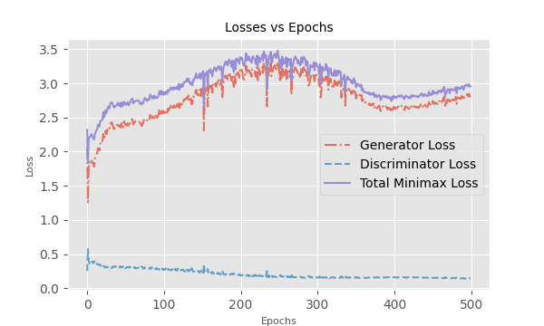

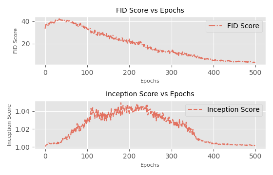

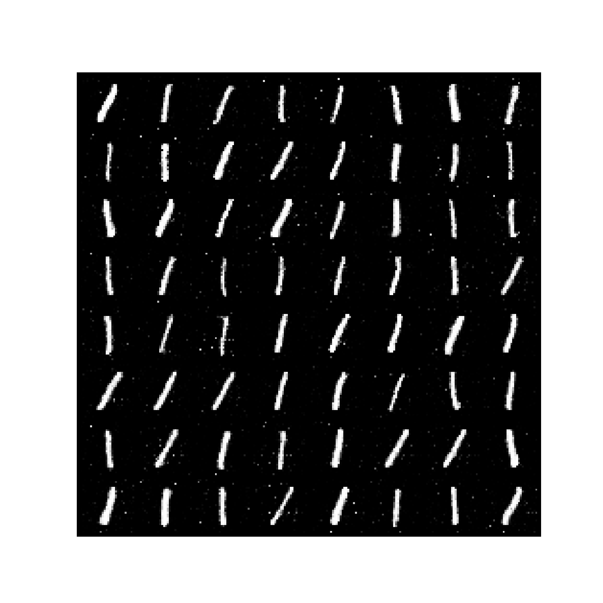


## VQGAN

VQGAN (Vector Quantized Generative Adversarial Network) is a neural network architecture designed for **high-quality image synthesis**. It combines elements of VQ-VAE (Vector Quantized Variational Autoencoder) with GANs (Generative Adversarial Networks).

### 🐒 Problems VQGAN Solves
1. **Image Synthesis Quality**: VQGAN generates _higher-quality images_ that are often more detailed and realistic compared to traditional GANs.
2. **Compression**: By using a discrete latent space, VQGAN can compress images efficiently, which is useful for tasks requiring _high-quality image reconstruction_ from a compressed representation.
3. **Training Stability**: The integration of VQ-VAE and GAN helps improve the stability of training, a common challenge in GAN-based models.
4. **Representation Learning**: VQGAN learns a _discrete representation_ of the image, which can be beneficial for various downstream tasks such as image editing, style transfer, and conditional image generation.

### 🦦 Loss Functions

| **Loss Function**                  | **Description**                                                                                  |
|------------------------------------|--------------------------------------------------------------------------------------------------|
| **Reconstruction Loss**            | Measures the pixel-wise differences between the original and reconstructed images (MSE or L1).  |
| **Perceptual Loss💥**              | Compares high-level features from a pre-trained neural network (like VGG) between original and reconstructed images. |
| **Adversarial Loss💥**             | Used to train the generator and discriminator in a GAN setup, encouraging the generator to produce realistic images. |
| **Codebook Loss**                  | Ensures encoder outputs are close to the nearest codebook vectors, includes commitment and embedding losses. |
| **Total Variation Loss**(optional) | Reduces noise and smooths the generated images by penalizing the total variation in image intensity. |

**Note:** The specific implementation details and weighting of each loss function can vary depending on the exact VQGAN architecture and training objectives.


### 🌋 Cons of VQGAN
1. **Complexity**: The architecture is more complex compared to traditional GANs or VAEs, which can make it harder to implement and understand.
2. **Computationally Intensive**: Training VQGAN requires significant computational resources, including powerful GPUs and large amounts of memory. The training process can be time-consuming due to the complexity of the model and the need for extensive tuning of hyperparameters.
3. **Discrete Bottleneck**: While the discrete latent space has benefits, it can also introduce challenges in terms of gradient propagation and requires careful handling.
4. **Scalability**: Scaling VQGAN to very high resolutions or large datasets can be challenging and resource-intensive.

Repo:
- https://github.com/CompVis/taming-transformers
- https://github.com/Shubhamai/pytorch-vqgan
- https://github.com/joanrod/ocr-vqgan

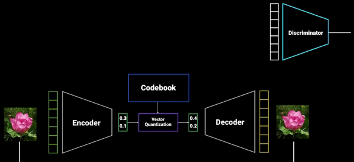

> Image Credit: VQ-GAN | PyTorch Implementation https://www.youtube.com/watch?v=_Br5WRwUz_U&ab_channel=Outlier

### Variants of VQGAN

- [Taming/Vanilla/Official VQGAN](https://github.com/CompVis/taming-transformers/tree/master): CNN-based encoder and decoder with [self-attention mechanism, or Non-Local Block](https://github.com/CompVis/taming-transformers/blob/master/taming/modules/diffusionmodules/model.py#L140) in the [founding paper](https://arxiv.org/abs/2012.09841).

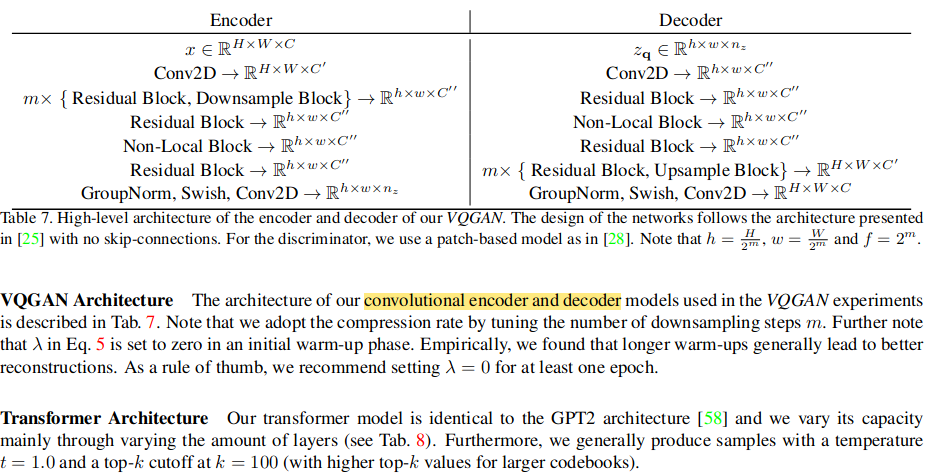

- [Google MaskGIT VQGAN](https://github.com/google-research/maskgit/blob/main/maskgit/nets/vqgan_tokenizer.py): a reimplementation of [Taming VQGAN](https://arxiv.org/abs/2012.09841)
with several modifications. **The non-local layers are removed** from Taming VQGAN for faster speed.

- [Valeo MaskGIT VQGAN](https://github.com/valeoai/Maskgit-pytorch?tab=readme-ov-file): The same as [Taming or Official VQGAN](https://github.com/CompVis/taming-transformers/tree/master).

- [Open-Muse VQGAN](https://github.com/huggingface/open-muse): The same as [Google MaskGIT VQGAN](https://github.com/google-research/maskgit/blob/main/maskgit/nets/vqgan_tokenizer.py).

- [aMUSEd VQGAN](https://github.com/huggingface/amused.git): We trained a 146M parameter VQ-GAN (Esser et al. (2021)) **with no self-attention layers**, a vocab size of 8192, and a latent dimension of 64. Our VQ-GAN downsamples resolutions by 16x, e.g. a 256x256 (512x512) resolution image is reduced to 16x16 (32x32) latent codes. We trained our VQ-GAN for 2.5M steps. To improve the reconstruction of high-resolution images, we further fine-tuned the VQ-GAN decoder on a dataset of images greater than 1024x1024 resolution. The VQ-GAN decoder was finetuned on 2 8xA100 servers for 200,000 steps and used a per GPU batch size of 16 for a total batch size of 256.
- [Asymmetric VQGAN](https://arxiv.org/abs/2306.04632): Asymmetric VQGAN involves two core designs compared with the original VQGAN as shown in the figure. First, we introduce a conditional branch into the decoder of the VQGAN which aims to handle the conditional input for image manipulation tasks. Second, we design a larger decoder for VQGAN to better recover the losing details of the quantized codes. It has a heavier [decoder](https://github.com/buxiangzhiren/Asymmetric_VQGAN/blob/main/ldm/modules/diffusionmodules/model.py#L462) than [encoder](https://github.com/buxiangzhiren/Asymmetric_VQGAN/blob/main/ldm/modules/diffusionmodules/model.py#L368).
- [OmniTokenizer](https://arxiv.org/pdf/2406.09399v1)
- [Open-MAGVIT2](https://github.com/TencentARC/Open-MAGVIT2): It reduces the VQ-VAE codebook’s embedding dimension to zero, aka Lookup-free quantization([LFQ](https://github.com/TencentARC/Open-MAGVIT2/blob/main/taming/models/lfqgan.py#L18)) LFQGAN.
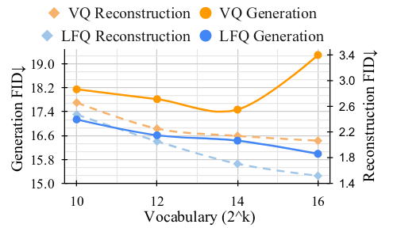
- [LlamaGen VQGAN](https://github.com/FoundationVision/LlamaGen): It uses the same architecture as Taming-VQGAN, encoder-quantizer-decoder. Following [VIM](https://arxiv.org/pdf/2110.04627), it also uses ℓ2-normalization to codebook vectors, low codebook vector dimension C, and large codebook size K. These designs significantly improve reconstruction quality and codebook usage.
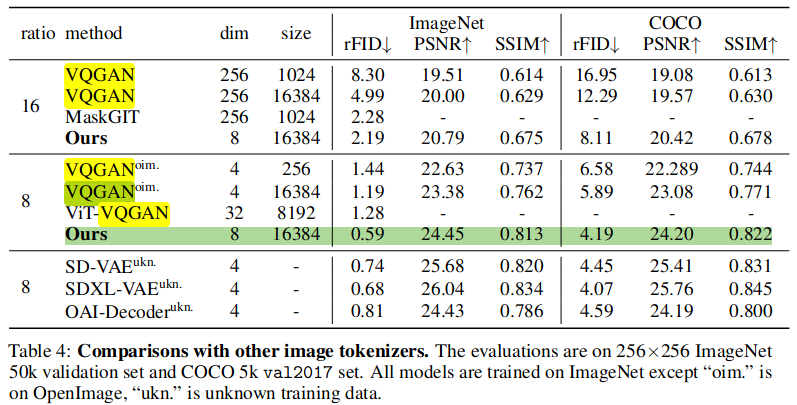
- [ViT-VQGAN(aka VIM)](https://arxiv.org/abs/2110.04627): It proposes multiple improvements over vanilla VQGAN from architecture to codebook learning, yielding better efficiency and reconstruction fidelity. [Unoffical Code](https://github.com/thuanz123/enhancing-transformers).
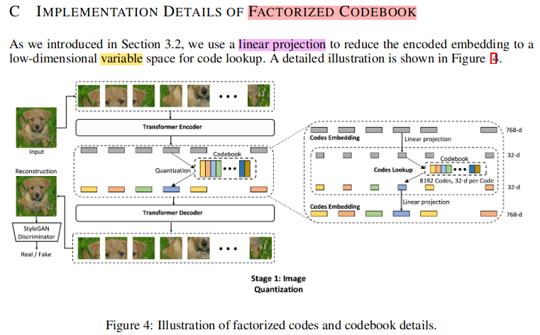

### Quantitative Comparison

Reconstruction performance of different tokenizers on 256x256 ImageNet 50k validation set.

|     Method      | Token Type | #Tokens | Train Data | Codebook Size | rFID | PSNR  | Codebook Utilization | Checkpoint |
|:---------------:|:----:|:-----:|:-----:|:-------------:|:----:|:----:|:--------------------:|:----------:|
|      VQGAN      | 2D | 16 x 16 | 256 x 256 ImageNet  | 1024 | 7.94 | 19.4 |          -           |     -      |
|    SD-VQGAN     | 2D | 16 x 16 | OpenImages | 16384 | 5.15 | - |          -           |     -      |
|     MaskGIT     | 2D | 16 x 16 | 256 x 256 ImageNet  | 1024 | 2.28 | - |          -           |     -      |
|    LlamaGen     | 2D | 16 x 16 | 256 x 256 ImageNet  | 16384 | 2.19  | 20.79 |         97%          |     -      |
|**Open-MAGVIT2** | 2D | 16 x 16 | 256 x 256 ImageNet | 262144 | **1.53** | **21.53** |       **100%**       |     -      |
|    ViT-VQGAN    | 2D | 32 x 32 | 256 x 256 ImageNet | 8192 | 1.28 |  - |          -           |     -      |
|      VQGAN      | 2D | 32 x 32 | OpenImages | 16384 | 1.19 | 23.38 |          -           |     -      |
|    SD-VQGAN     | 2D | 32 x 32 | OpenImages | 16384 | 1.14 | - |          -           |     -      |
|OmniTokenizer-VQ | 2D | 32 x 32 | 256 x 256 ImageNet | 8192 | 1.11 | -|          -           |     -      |
|    LlamaGen     | 2D | 32 x 32 | 256 x 256 ImageNet | 16384 | 0.59 | 24.45 |        97.6%         |     -      |
|**Open-MAGVIT2** | 2D | 32 x 32 | 128 x 128 ImageNet | 262144 | **0.39** | **25.78** |       **100%**       |     -      |
|    SD-VQGAN     | 2D | 64 x 64 | OpenImages | 16384 | 0.58 | - |          -           |     -      |
|     TiTok-L     | 1D | 32 |  256 x 256 ImageNet | 4096 | 2.21 | - |          -           |     -      |
|     TiTok-B     | 1D | 64 |  256 x 256 ImageNet | 4096 | 1.70 | - |          -           |     -      | 
|     TiTok-S     | 1D | 128 | 256 x 256 ImageNet | 4096  | 1.71 | - |          -           |     -      |

Credit: Open-MAGVIT2

## StyleGAN Series (Chinese)

- https://zhuanlan.zhihu.com/p/599336868
- https://zhuanlan.zhihu.com/p/605911886
- https://zhuanlan.zhihu.com/p/611310561

- https://baijiahao.baidu.com/s?id=1756421492448260680&wfr=spider&for=pc


## Reference

- VQ-GAN https://www.youtube.com/watch?v=wcqLFDXaDO8&ab_channel=Outlier

