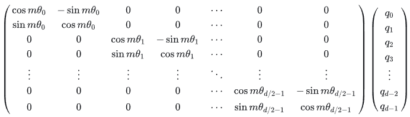
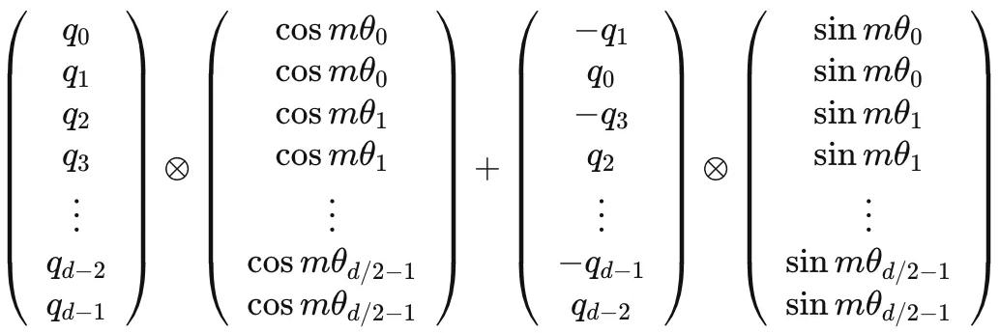
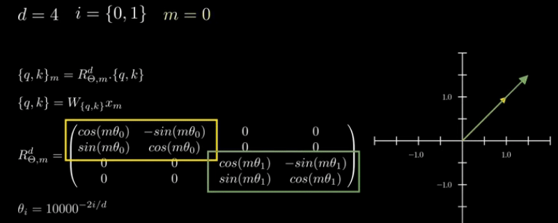
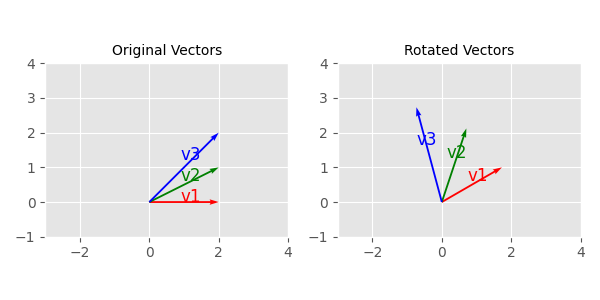
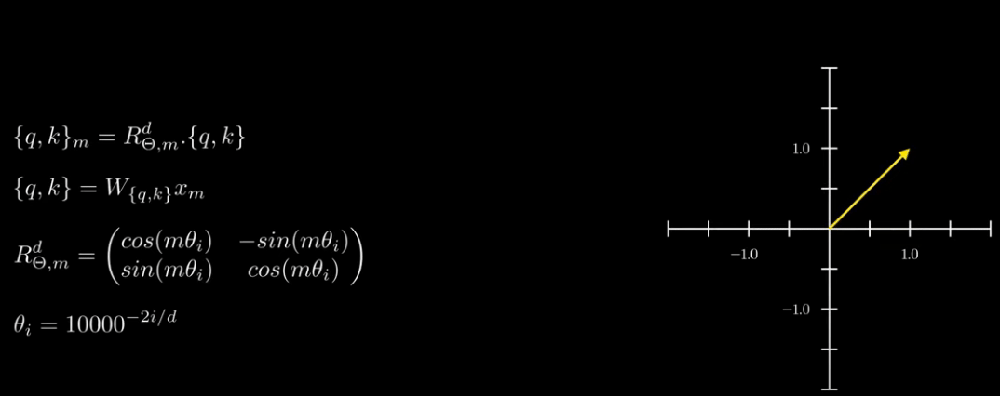
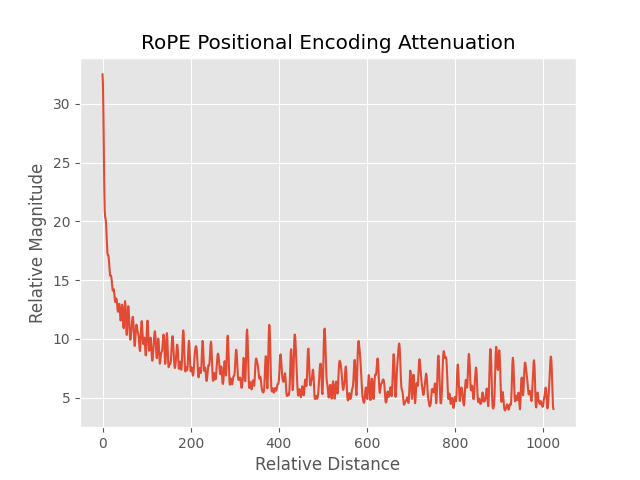
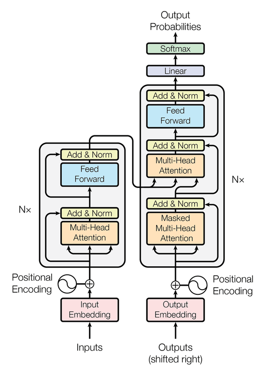
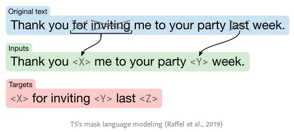
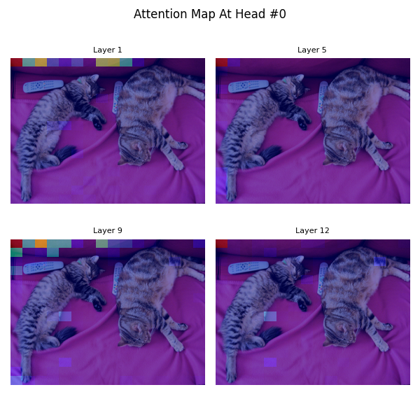
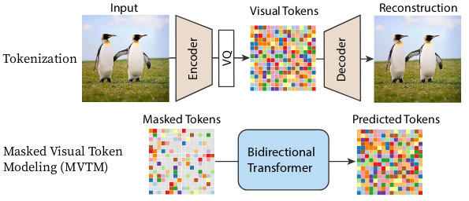

# Transformer

## Why use `Softmax` in Scaled Dot Product Formula in Transformer?

When you set `output_attentions=True` in the Hugging Face `transformers` library for BERT, the output includes attention matrices. These matrices are the result of applying the softmax function to the scaled dot-product of the query (Q) and key (K) matrices:

```
softmax(Q * K^T / sqrt(d_k))
```

This process yields attention probabilities, indicating the relative importance of each token in the input sequence when attending to other tokens.

Now, let's clarify the value of d_k in BERT. While BERT's hidden dimension (the size of its word embeddings) is 768, this dimension is split across multiple attention heads. BERT-base has 12 heads, meaning each head operates on a 64-dimensional subspace of the 768-dimensional hidden state.

Therefore, d_k in BERT, which represents the dimensionality of the key vectors *per head*, is 64. This splitting allows BERT to focus on different aspects of the input simultaneously, enhancing its ability to model complex relationships in language.


```python
import numpy as np
import torch
from transformers import BertModel, BertTokenizer
from hiq import read_file

model_name = "bert-base-uncased"
tokenizer = BertTokenizer.from_pretrained(model_name)
model = BertModel.from_pretrained(model_name)
input_text = read_file("500.txt", by_line=False)
inputs = tokenizer(input_text, return_tensors="pt")
# Forward pass with output_hidden_states=True to extract Q and K
outputs = model(**inputs, output_attentions=True, output_hidden_states=True)
# Extract attention matrices
attentions = outputs.attentions
# Extract Q and K for the first layer and first head
layer_idx, head_idx = 0, 0
hidden_states = outputs.hidden_states[layer_idx]  # Hidden states for the first layer
# Linear projections for Q, K, V
query_layer = model.encoder.layer[layer_idx].attention.self.query(hidden_states)
key_layer = model.encoder.layer[layer_idx].attention.self.key(hidden_states)
# Reshape to (batch_size, num_heads, seq_length, head_dim)
batch_size, seq_length, hidden_dim = query_layer.size()
num_heads = model.config.num_attention_heads
head_dim = hidden_dim // num_heads
query_layer = query_layer.view(batch_size, seq_length, num_heads, head_dim).transpose(1, 2)
key_layer = key_layer.view(batch_size, seq_length, num_heads, head_dim).transpose(1, 2)
# Select the first head
Q = query_layer[:, head_idx, :, :]  # (batch_size, seq_length, head_dim)
K = key_layer[:, head_idx, :, :]  # (batch_size, seq_length, head_dim)
# Compute Q * K^T / sqrt(d_k)
d_k = head_dim
scores = torch.matmul(Q, K.transpose(-2, -1)) / np.sqrt(d_k)
# Check the shape and rank of the resulting matrix for the first item in the batch
scores_np = scores[0].detach().numpy()
print("Shape of Q * K^T:", scores_np.shape)
print("Rank of Q * K^T:", np.linalg.matrix_rank(scores_np))
```

The rank of a matrix is the maximum number of linearly independent rows (or columns) it has.  **When you multiply two matrices, the rank of the resulting matrix cannot be greater than the rank of either of the original matrices.**

- To verify idea in blog: https://kexue.fm/archives/8338
- https://kexue.fm/archives/6853

## Where is the quadratic time complexity from? Why linear transformer doesn't work well?

The softmax operation in attention mechanisms does indeed introduce a quadratic complexity of O(n^2) due to the calculation of the n x n matrix QK^T. If softmax were removed, you could leverage the associativity of matrix multiplication to compute K^T * V first (resulting in a d x d matrix) and then multiply it with Q. This would significantly reduce the complexity to approximately O(n), as the dominant operation would be Q multiplying a d x d matrix, where d is much smaller than n.

This linear complexity, O(n), is precisely the goal of Linear Attention mechanisms. However, removing softmax entirely is not a straightforward solution, as it plays a crucial role in normalizing attention weights and ensuring they sum to 1 across all tokens in the sequence. This normalization is important for the model to learn and interpret the attention distribution effectively.

Therefore, the challenge lies in finding alternative attention mechanisms that can approximate the effect of softmax while maintaining linear complexity. Several research directions are exploring this, including the use of kernel functions and low-rank matrix factorizations to achieve efficient and expressive attention mechanisms without the computational burden of softmax.

- Why need softmax: https://kexue.fm/archives/7546
- Linear Transformer is not what you want: https://kexue.fm/archives/8610
- VQ一下Key，Transformer的复杂度就变成线性了 https://kexue.fm/archives/9844

## Why scale factor is `sqrt(d_k)` in Scaled Dot Product? Google's T5 doesn't use scale factor, why the training still converges?

## In scaled dot product, why we don't divide Q\*K_T with ||Q||\*||K||?

In scaled dot-product attention, the goal is to compute a similarity score between pairs of query (Q) and key (K) vectors. This is done by taking their dot product, which gives a measure of how aligned the two vectors are.

Dividing the dot product by the square root of the dimensionality of the vectors (√d_k) is done to stabilize the gradients during training. Here's why:

* **Variance of Dot Products:** If the elements of Q and K are independent random variables with zero mean and unit variance, then their dot product Q*K_T will have a variance of d_k. As the dimensionality increases, the variance of the dot product also increases.
* **Impact on Softmax:** The attention mechanism often uses a softmax function to normalize the similarity scores. Large dot products can push the softmax into regions where its gradients are very small, leading to slow learning.
* **Scaling to Unit Variance:** Dividing by √d_k scales the dot product to have approximately unit variance, which helps to prevent the softmax from saturating and improves the training stability.

**Why not divide by ||Q||*||K||?**

Dividing by the product of the magnitudes of Q and K (||Q||*||K||) would normalize the dot product to be the cosine similarity between the two vectors. While cosine similarity is a valid measure of similarity, it's not the primary goal of scaled dot-product attention.

The main focus is on:

1. **Preserving Relative Similarities:** Scaling by √d_k maintains the relative order of the similarity scores, ensuring that the most similar pairs remain the most similar even after scaling.
2. **Gradient Stability:** The scaling helps to prevent the softmax from saturating, leading to more stable gradients during training.

## Implement ROPE in PyTorch





## Explain how Rotary Position Embedding (RoPE) in any even-dimensional space can be represented as a concatenation of 2D cases



### Concept Explanation

Rotary Position Embedding (RoPE) applies a rotation to pairs of dimensions in a high-dimensional space to encode positional information. This rotation is performed using sine and cosine functions. The key idea is that any even-dimensional space can be decomposed into multiple 2D subspaces, and RoPE can be applied to each of these subspaces independently.

### Detailed Explanation

1. **Decomposing High-Dimensional Space**:
   - Suppose we have a high-dimensional space with dimension \(d\) (where \(d\) is even). We can split this space into \(d/2\) pairs of dimensions.
   - For example, if \(d = 6\), we can decompose it into three 2D subspaces: \((x_0, x_1)\), \((x_2, x_3)\), and \((x_4, x_5)\).

2. **Applying 2D Rotation**:
   - In each 2D subspace, we apply a 2D rotation matrix. The rotation matrix for an angle \(theta\) is given by:
   - The rotation matrix looks like:

    ```
    R(theta) = [cos(theta)  -sin(theta)]
               [sin(theta)   cos(theta)]
    ```
    where `theta` is the rotation angle.
   - This rotation matrix is orthogonal, meaning it preserves the length and orthogonality of the vectors.

3. **Independent Rotation in Each Subspace**:
   - We apply the 2D rotation matrix independently to each pair of dimensions. This means that each pair is rotated according to the angle defined for its specific position.
   - For instance, if the angles for the three 2D subspaces are \(theta_1\), \(theta_2\), and \(theta_3\), we apply these angles to the corresponding pairs.

4. **Concatenating the Results**:
   - After rotating each 2D subspace independently, we concatenate the results to obtain the final rotated high-dimensional vector.
   - This concatenation essentially combines the rotated vectors from each 2D subspace back into the original high-dimensional space.

### Why This Works

- **Linear Superposition**: The dot product (inner product) is a linear operation, meaning that the dot product of a sum of vectors is equal to the sum of the dot products. This property allows us to decompose the high-dimensional rotation into independent 2D rotations.
- **Orthogonality**: The 2D rotation matrices are orthogonal, preserving the orthogonality and length of the vectors, which is crucial for maintaining the geometric properties of the embeddings.

### Visual Example

Imagine a 6-dimensional vector decomposed into three 2D vectors:
- Original Vectors: \([x_0, x_1]\), \([x_2, x_3]\), \([x_4, x_5]\)
- Rotated Vectors: Each 2D pair is rotated independently.


### Conclusion

By decomposing the high-dimensional space into multiple orthogonal 2D subspaces and applying 2D rotations to each subspace independently, we can effectively implement Rotary Position Embedding (RoPE) in any even-dimensional space. This approach leverages the linearity of the dot product and the properties of **orthogonal transformations** to encode positional information efficiently.

- 一文让你通俗易懂的理解正交变换和正交矩阵 https://blog.csdn.net/MoreAction_/article/details/105442932
- 现在主流位置编码都用的是旋转位置编码了吗？ https://www.zhihu.com/question/606813543
- 直观理解 rotary embedding https://zhuanlan.zhihu.com/p/693736727

## 🐒 What is position attenuation in ROPE?


Position attenuation in ROPE means positional sensitivity gracefully diminishes as the distance between tokens increases.



**The Essence of Attenuation:**

In many sequence modeling tasks, it's desirable for the model to **pay more attention to nearby tokens and less attention to distant ones**. This concept aligns with the intuition that words closer together in a sentence often have stronger semantic relationships. RoPE inherently incorporates this behavior through its rotational mechanism.

**How RoPE Achieves Attenuation:**

1. **Angular Frequency:** Each dimension within a RoPE embedding is associated with a specific angular frequency.  Lower frequencies capture broader, long-range patterns, while higher frequencies focus on finer-grained, local details.

2. **Rotation Angles:** The rotation angle applied to each dimension is proportional to the token's position and its associated frequency.  As the position increases, so does the rotation angle, but at varying rates depending on the frequency.

3. **Dot Product Interaction:** The attention mechanism in Transformers relies on the dot product between query and key vectors.  When RoPE is applied, the dot product interaction between vectors from different positions is modulated by the cosine of the difference in their rotation angles.

4. **Attenuation Effect:** For nearby tokens, the difference in rotation angles is small, and the cosine term is close to 1, resulting in strong attention. However, as the distance between tokens increases, the difference in angles grows, causing the cosine term to decrease towards 0, thus attenuating the attention.

**Visualizing Attenuation:**

Let's illustrate this with a simple code example using Python and matplotlib:

```python
import numpy as np
import matplotlib.pyplot as plt

plt.style.use('ggplot')

d = 128  # Dimension
theta = lambda t: 10000 ** (-2 * t / d)

def f(m):
    total = 0
    for j in range(d // 2):
        inner_sum = np.sum(np.exp(1j * m * theta(np.arange(j + 1))))
        total += np.linalg.norm(inner_sum)
    return total / (d / 2)

# Range of m values to evaluate
m_values = np.arange(0, 1024)  # Up to 256

# Calculate f(m) for each m
f_values = np.array([f(m) for m in m_values])

# Plotting
plt.plot(m_values, f_values)
plt.xlabel('Relative Distance')
plt.ylabel('Relative Magnitude')
plt.title('RoPE Positional Encoding Attenuation')
plt.savefig('pos_attenuation.png')
plt.show()

```

This code generates an attenuation matrix, where each element represents the cosine of the angle difference between two positions. The brighter colors indicate stronger attention, while darker colors represent weaker attention.  You'll notice that the attention gradually fades as you move away from the diagonal, which corresponds to the relative distance between tokens increasing.

**Key Takeaways:**

* RoPE's rotation mechanism naturally leads to an attenuation of positional sensitivity over longer distances.
* This behavior can be beneficial for modeling tasks where local context is more important than distant relationships.
* The degree of attenuation can be controlled by adjusting the base frequencies associated with each dimension.


https://docs.google.com/presentation/d/1OwRtQscMeIl3Zex8iJEAUeHM6QCM3sMxlg4Iy15HBBI/edit#slide=id.p


+ VIT in Action




## nanoBERT

```angular2html
🌳 NanoBertForClassification<all params:305123>
├── NanoBERT(nano_bert)
│   ├── BertEmbeddings(embedding)
│   │   ├── Embedding(word_embeddings)|weight[101522,3]
│   │   ├── Embedding(pos_embeddings)|weight[128,3]
│   │   └── LayerNorm(layer_norm)|weight[3]|bias[3]
│   ├── BertEncoder(encoder)
│   │   └── ModuleList(layers)
│   │       └── BertLayer(0)
│   │           ├── 💠 LayerNorm(layer_norm1,layer_norm2)<🦜:6x2>|weight[3]|bias[3]
│   │           ├── BertSelfAttention(self_attention)
│   │           │   ├── ModuleList(heads)
│   │           │   │   └── BertAttentionHead(0)
│   │           │   │       └── 💠 Linear(query,key,values)<🦜:12x3>|weight[3,3]|bias[3]
│   │           │   └── Linear(proj)|weight[3,3]|bias[3]
│   │           └── FeedForward(feed_forward)
│   │               └── Sequential(ffwd)
│   │                   ├── Linear(0)|weight[12,3]|bias[12]
│   │                   └── Linear(2)|weight[3,12]|bias[3]
│   └── BertPooler(pooler)
│       └── Linear(dense)|weight[3,3]|bias[3]
└── Linear(classifier)|weight[2,3]|bias[2]
```


## nanoGPT

## nanoT5

### How to preserve Token Order in High-Dimensional Space? Why we can add position and token embedding?

Each position has a unique encoding based on sine and cosine functions across different dimensions. Even though individual dimensions repeat periodically, the combination across dimensions remains unique for each position in practical sequence lengths.

The model uses the differences in positional encodings to understand the order. Since the positional encoding changes systematically with the position, even if two words are the same, their combined embeddings will differ due to their different positional encodings, allowing the model to distinguish not only which tokens are present but also their order in the sequence.

In high-dimensional space, the order of tokens is not directly apparent as in a 1D list of tokens. The tokens are encoded into the embeddings through mathematical transformations that integrate both the semantic and positional information. The Transformer uses these embeddings, combined with its attention mechanisms, to interpret and maintain the order of tokens throughout its processing layers. This method effectively retains the order information despite the embeddings being in a space where the original order is not immediately visible. So the order is preserved, but it is just not visible to human.

The order of a token significantly impacts its semantic meaning. In a one-dimensional context, semantic content and positional information seem like distinct concepts, often measured in different units, which makes direct addition non-intuitive. However, in a high-dimensional space, both types of information can be abstracted into similar forms, allowing them to be combined more seamlessly. Some variations might concatenate these vectors instead, but addition is preferred because it maintains the dimensionality and allows the model to directly learn interactions between the word's semantic content and its positional context.

Let's take the example for clarity and consistency in explaining how positional embeddings affect the interpretation of sentences:

#### Sentence Pair

1. "He will promise to mail the package tomorrow."
2. "Tomorrow, he will promise to mail the package."

These sentences illustrate the importance of word placement in defining when an action is scheduled versus when a commitment to the action is made:

- **Sentence 1**: "tomorrow" is associated with when the promise will be acted upon. Here, the promise to mail the package is being planned for today, but the mailing action itself is scheduled for tomorrow.
- **Sentence 2**: By starting with "Tomorrow," this sentence shifts the timing of making the promise itself to tomorrow. Thus, not only the action of mailing the package but also the commitment to it is deferred to the next day.

#### Detailed Analysis of Positional and Semantic Embeddings

- **Semantic Embedding**: Each word, such as "tomorrow," "will promise," and "mail," converts into a high-dimensional vector capturing its inherent meaning. "Tomorrow" still refers to a future time point, "will promise" indicates a future commitment, and "mail" continues to denote the action of sending.

- **Positional Embedding**:
  - In **Sentence 1**, "tomorrow" modifies the commitment related to "mail," implying that while the promise is made now, the fulfillment is set for the next day.
  - In **Sentence 2**, "Tomorrow" adjusts the timeline not only for the action but also for the promise, indicating a full deferral of all related activities to the next day.

- **Model Processing**: In Transformers, these embeddings help the model understand how each word affects others, especially regarding sequence and timing. The self-attention mechanism evaluates the positional relationships, using the differences in embeddings to determine that "tomorrow" in the first sentence affects the action timing, while in the second, it influences when the commitment is made.

#### Outcome and Applications

This distinction in timing, enabled by positional embeddings, allows Transformer models to handle subtleties in language that are crucial across various applications:
- **Dialogue Systems**: Understanding the nuance in planning and promises can significantly affect how responses are generated.
- **Scheduling and Planning Tools**: Accurate interpretation of timings in commitments and actions can aid in more effective scheduling, especially in automated systems that interact with human inputs.
- **Legal and Business Document Analysis**: In contexts where the timing of commitments can have legal or financial implications, correctly interpreting such nuances is essential.

These examples show how Transformers can effectively use positional embeddings to navigate the intricacies of language, providing nuanced understanding and responses based on the context provided by the positioning of words like "tomorrow."

### If my data is a time series data, like stock price, where data itself has time info, is sine and cosine position embedding a good choice?

For time series data like stock prices, using sinusoidal positional embeddings as done in NLP **may not be directly applicable or beneficial**. Instead, consider using time directly as a feature, applying transformations relevant to time series analysis, or experimenting with cyclical encoding methods tailored to the periodicity of your data. Always validate the effectiveness of these approaches based on your specific dataset and task requirements.

Transformers, originally developed for natural language processing tasks, have shown promising results in various domains, including time series data prediction. When considering their application for tasks such as predicting stock prices, there are several advantages and considerations to take into account.

#### Advantages of Using Transformers for Time Series Prediction:

1. **Handling Long Dependencies**: One of the key strengths of Transformers is their ability to handle long-range dependencies. In time series data like stock prices, being able to look back over extended periods to identify trends and patterns can be crucial. Transformers, with their self-attention mechanism, can weigh the importance of earlier points without the decay associated with RNNs and LSTMs.

2. **Parallel Computation**: Unlike RNNs, which process data sequentially, Transformers process all data points simultaneously. This parallel processing capability makes them faster and more efficient when training on large datasets.

3. **Flexibility and Customization**: Transformers can be customized with specific attention mechanisms that might be better suited for time series data. For instance, incorporating dilated attention can help focus on periodic patterns, which are common in financial data.

4. **Feature Integration**: Transformers allow for easy integration of various types of features (e.g., volume, open, close, high, low prices) into the model, treating them as additional dimensions in input embeddings.

#### Considerations and Challenges:

1. **Data Preprocessing**: Time series data requires careful preprocessing and normalization. Unlike text data, time series data might have trends, seasonality, and noise that need to be addressed through techniques like differencing, detrending, or seasonal adjustment.

2. **Overfitting Risk**: Given their complexity and capacity, Transformers can easily overfit on time series data, which is often noisy and non-stationary. Regularization, dropout, and proper training/validation splitting are essential to mitigate this.

3. **Lack of Inherent Temporal Order Processing**: Since Transformers do not inherently process temporal order (as they do not have recurrence), positional encodings (or other methods to incorporate time information) are necessary to maintain the sequence order of data.

4. **Computational Intensity**: Transformers require significant computational resources, especially when dealing with large datasets, which can be a limitation for some practical applications.

#### Applications in Stock Price Prediction:

Given these advantages and challenges, Transformers have been applied successfully in financial contexts, but often with modifications:

- **Temporal Fusion Transformers**: An architecture specifically designed for time series forecasting that combines typical Transformer advantages with a gating mechanism to handle the different types of time series-specific variabilities and dependencies.
- **Incorporating External Data**: Transformers can effectively handle additional inputs like news sentiment, economic indicators, or market conditions, integrating them into the stock price prediction model.

#### Example

Here is a simple example of how you might set up a Transformer model for stock price prediction using Python and PyTorch:

```python
import torch
import torch.nn as nn
from torch.utils.data import DataLoader, TensorDataset

# Define a simple Transformer model (for illustration purposes)
class StockPriceTransformer(nn.Module):
    def __init__(self, feature_size, num_layers, nhead):
        super(StockPriceTransformer, self).__init__()
        self.embedding = nn.Linear(feature_size, feature_size)
        encoder_layer = nn.TransformerEncoderLayer(d_model=feature_size, nhead=nhead)
        self.transformer_encoder = nn.TransformerEncoder(encoder_layer, num_layers=num_layers)
        self.decoder = nn.Linear(feature_size, 1)

    def forward(self, src):
        src = self.embedding(src)
        output = self.transformer_encoder(src)
        output = self.decoder(output[-1])
        return output

# Example usage
feature_size = 10  # e.g., open, high, low, close, volume + other features
num_layers = 2
nhead = 2
model = StockPriceTransformer(feature_size, num_layers, nhead)

# Dummy data
data = torch.rand(100, 30, feature_size)  # 100 samples, 30 time steps
labels = torch.rand(100, 1)  # 100 samples, 1 output per sample
dataset = TensorDataset(data, labels)
dataloader = DataLoader(dataset, batch_size=10)

# Example training loop
criterion = nn.MSELoss()
optimizer = torch.optim.Adam(model.parameters())
for epoch in range(2):
    for inputs, targets in dataloader:
        optimizer.zero_grad()
        outputs = model(inputs)
        loss = criterion(outputs, targets)
        loss.backward()
        optimizer.step()
```

#### Conclusion

Transformers can be a powerful tool for time series prediction like stock prices, provided that they are carefully adapted and tuned for the specific characteristics and requirements of financial data. Their ability to capture complex dependencies and integrate diverse types of data makes them an intriguing option for advanced forecasting models.

### What is the pretraining objective in T5?

T5 span-masked language modeling is a pre-training objective used for the T5 (Text-to-Text Transfer Transformer) model. It's a form of self-supervised learning where the model learns by predicting missing parts of its input.



**How it works:**

1. **Span Masking:** Instead of masking single tokens like in traditional masked language modeling (MLM), T5 masks entire spans of text. These spans can vary in length.
2. **Sentinel Tokens:** Unique tokens called "sentinel tokens" (e.g., <extra_id_0>, <extra_id_1>, etc.) are used to replace the masked spans. Each sentinel token indicates the start of a new masked span.
3. **Prediction Target:** The model's task is to predict the original masked spans in the correct order. The output sequence is a concatenation of the sentinel tokens and the corresponding masked spans.

**Example:**

Input sentence:  "The quick brown fox jumps over the lazy dog."

Masked sentence: "The quick <extra_id_0> jumps <extra_id_1> lazy dog."

Target sequence: "<extra_id_0> brown fox <extra_id_1> over the"

**Why span masking:**

* **Captures Longer Dependencies:** Span masking allows the model to learn relationships between words that are farther apart in a sentence, leading to better understanding of context.
* **More Challenging Task:** Predicting entire spans is more difficult than predicting single tokens, potentially leading to a more robust model.
* **Suitable for Text-to-Text Tasks:** Since T5 is designed for various text-to-text tasks (translation, summarization, etc.), span masking aligns well with the model's architecture and objectives.

**In the T5 model:**

Span-masked language modeling is a key component of T5's pre-training. It's one of the factors that contributes to T5's strong performance on a wide range of natural language processing tasks. The model learns to fill in the blanks, effectively understanding how different parts of a text relate to each other. This knowledge can then be transferred to other tasks by fine-tuning the model.

- T5: a detailed explanation https://medium.com/analytics-vidhya/t5-a-detailed-explanation-a0ac9bc53e51


## VIT (Vision Transformer)


```
🌳 ViT<all params:207786>
├── Conv2d(conv)|weight[16,1,4,4]🇸 -(4, 4)|bias[16]🇸 -(4, 4)
├── Linear(patch_emb)|weight[16,16]|bias[16]
├── TransformerEncoder(tranformer_enc)
│   └── ModuleList(layers)
│       └── 💠 TransformerEncoderLayer(0-2)<🦜:68752x3>
│           ┣━━ MultiheadAttention(self_attn)|in_proj_weight[48,16]|in_proj_bias[48]
│           ┃   ┗━━ NonDynamicallyQuantizableLinear(out_proj)|weight[16,16]|bias[16]
│           ┣━━ Linear(linear1)|weight[2048,16]|bias[2048]
│           ┣━━ Linear(linear2)|weight[16,2048]|bias[16]
│           ┗━━ 💠 LayerNorm(norm1,norm2)<🦜:32x2>|weight[16]|bias[16]
└── Linear(cls_linear)|weight[10,16]|bias[10]
```



In the resulting image, the red areas in the attention map over the cat's head indicate that these patches are receiving a high amount of attention. This means that the model is focusing heavily on these areas when processing the image. Specifically:

1. **High Attention Values**: The red areas correspond to high attention weights. This implies that the model considers the information from these patches (the cat's head) to be very important.

2. **Feature Importance**: The model is likely identifying the cat's head as a critical feature for understanding or classifying the image. In many tasks, the head of an animal can be a distinguishing feature due to the presence of eyes, nose, and other significant details.

3. **Contextual Relevance**: High attention on the cat's head suggests that these patches provide crucial contextual information. The model might be using these features to infer more about the rest of the image or to make sense of the scene.

### Summary of Attention Map Interpretation:
- **Red Areas**: High attention, indicating important features or context for the model.
- **Green/Yellow Areas**: Moderate attention, still relevant but less critical than red areas.
- **Blue Areas**: Low attention, indicating less relevance to the current focus of the model.

In this specific case, the model focuses heavily on the cat's head in the later layers (Layer 12), suggesting that it has learned to recognize the importance of this region for the image's overall interpretation. This is a common behavior in vision models, where certain key features (like faces or heads) are given more importance during the attention process.

## MaskGIT

[MaskGIT (Masked Generative Image Transformer)](https://arxiv.org/abs/2202.04200) generates images in parallel by predicting and refining masked tokens iteratively, utilizing a bidirectional non-autoregressive transformer trained with masked visual token modeling(MVTM) task. It represents another type of generative methods known as **Masked Generative models (MGM)**.



- Masked Auto-Encoders https://arxiv.org/pdf/2111.06377
- Language model beats diffusion – tokenizer is key to visual generation https://arxiv.org/abs/2310.05737


## 📌 Reference

- Transformer升级之路：1、Sinusoidal位置编码追根溯源 https://kexue.fm/archives/8231