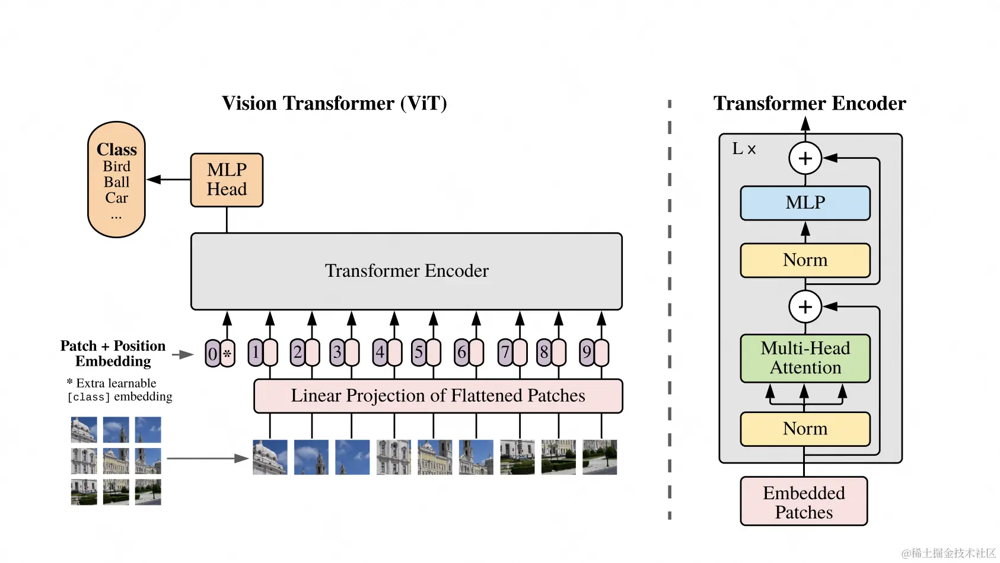

# mnist-vit

```angular2html
🌳 ViT<all params:207786>
├── Conv2d(conv)|weight[16,1,4,4]🇸 -(4, 4)|bias[16]🇸 -(4, 4)
├── Linear(patch_emb)|weight[16,16]|bias[16]
├── TransformerEncoder(tranformer_enc)
│   └── ModuleList(layers)
│       └── 💠 TransformerEncoderLayer(0-2)<🦜:68752x3>
│           ┣━━ MultiheadAttention(self_attn)|in_proj_weight[48,16]|in_proj_bias
│           ┃   [48]
│           ┃   ┗━━ NonDynamicallyQuantizableLinear(out_proj)|weight[16,16]|bias
│           ┃       [16]
│           ┣━━ Linear(linear1)|weight[2048,16]|bias[2048]
│           ┣━━ Linear(linear2)|weight[16,2048]|bias[16]
│           ┗━━ 💠 LayerNorm(norm1,norm2)<🦜:32x2>|weight[16]|bias[16]
└── Linear(cls_linear)|weight[10,16]|bias[10]
```

vision transformer on mnist dataset

基于mnist手写数字集训练的vision transformer模型，用作学习用途，只能预测0~9

## 模型

1x28x28图片输入，对每个1x4x4区域做conv转成16宽向量，整个图片变为7x7=49个16宽patch向量.

* 所有patch向量做linear转patch embedding
* cls embeeding可学习，直接拼到patch embedding序列头部

**vision transformer**



## 训练

python train.py 

稍微训练一会，loss基本收敛到如下水平：

```
epoch:0 iter:0,loss:0.025252344086766243
```

## 推理

python inference.py

```
正确分类: 5
预测分类: 5
```

