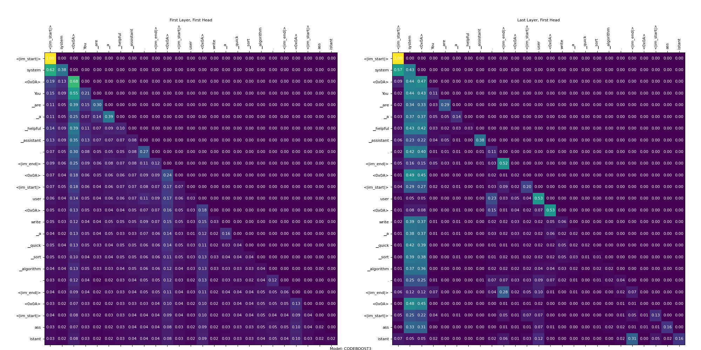

## Overview

Large language models (LLMs) introduce new security risks. They are increasingly trained on massive codebases and used to generate code better and better. However, LLMs [lack awareness of security and are found to frequently produce unsafe code.](https://arxiv.org/abs/2302.05319). The goal of this work is to ensure the generated code secure and compliant in real time.

## Background

We categorize the solutions to `basic rule-based pattern matching`, `advanced data and dependency based static analysis`, and `deep learning` methods as follows.

### Rule-Based Pattern Matching

Pattern-matching tools use predefined rules to identify known vulnerabilities. These tools scan the codebase for patterns that match known vulnerability signatures. We use Insecure Code Detector(ICD) as our baseline solution as it was originally designed by Meta to safeguard their code assist output. It is expandable and works in realtime, perfectly fit into our use case.

### Static Analysis

Static analysis tools perform a deep analysis of the codebase, going beyond just looking for patterns. It needs to understand the structure of the code, how different parts interact, and the flow of data. It requires **the code is compilable**. Compiling the code allows it to create an internal representation (often an intermediate representation like bytecode or an abstract syntax tree) that facilitates this in-depth analysis. For instance, taint analysis tracks the flow of data through the code to identify potential vulnerabilities. It marks potentially dangerous data (tainted data) and follows its flow through the application to see if it reaches sensitive areas without proper sanitization or validation.

#### CodeQL

CodeQL is a powerful tool that allows users to write queries to identify patterns of vulnerabilities in codebases. It is highly customizable and can be used to create complex rules for detecting specific security issues.

#### Fortify

Fortify is a static analysis tool that includes taint analysis capabilities. It helps identify vulnerabilities by examining data flows and identifying places where tainted data can cause security issues. The latency is 15-20 seconds according to my test.

#### Parfait

An Oracle product for static code analysis.

### Deep Learning

#### CodeLM

Deep learning has obtained encouraging results for software vulnerability, in particular using sequence- and graph-based techniques such as Bi-LSTM, Graph Neural Networks(GNN) and Transformers. These techniques attempt to embed syntactic and semantic information from the code explicitly, for example by using various dependency and data flow analyses to preprocess source code and extract various artefact such as code gadgets, control flow graphs and dependency graphs which are eventually fed to the respective neural network.

Several deep learning-based vulnerability detection tools have been proposed in recent years that attempt to learn vulnerable patterns from large corpora of code. This **eliminates the need for writing specific rules** for detecting vulnerabilities and has been made possible by the introduction of large real-world datasets like **CVEFixes** for Java. These tools leverage LLMs(DNN/GNN) to detect vulnerabilities by recognizing vulnerabilities in the code.

#### LLM

Recently, Large Language Models (LLMs), such as GPT-4 and CodeLlama, have demonstrated remarkable performance on code-related tasks. It has been found that LLMs can often perform better than existing static analysis and deep learning-based vulnerability detection tools, especially for certain classes of vulnerabilities. Moreover, LLMs also often provide reliable explanations, precisely identifying the vulnerable data flows in code. Fine-tuning smaller LLMs can outperform the larger LLMs.

## LLM vs. CodeLM vs. Static Analysis vs. Pattern Matching

While DNNs offer promising enhancements, especially in terms of adaptability and potentially improved accuracy, they are not yet a complete replacement for rule-based systems in static code analysis. A hybrid approach, where DNNs complement rule-based tools, is more effective, leveraging the strengths of both methodologies. For now, rule-based tools remain valuable due to their stability, interpretability, and extensive rule sets developed over years of security research and practice.

## Architecture

### Engine

The engine of the Secure Code Assistant is responsible for integrating various security detection tools and providing a unified interface for analyzing and generating secure code. It orchestrates the flow of data between the backend, frontend, and serving components.

### Backend

The backend handles the core logic of the Secure Code Assistant. It integrates with different security analysis tools, such as static analysis, taint analysis, and pattern-matching tools, to provide comprehensive security checks. The backend also manages the LLMs and their training data, ensuring they are up-to-date with the latest security practices.

### Frontend

The frontend provides a user-friendly interface for developers to interact with the Secure Code Assistant. It allows users to input code, receive security analysis reports, and generate secure code snippets. The frontend also provides visualizations and insights into the detected vulnerabilities and their severity.

### Serving

The serving component OKE handles the deployment and scaling of the Secure Code Assistant. It ensures that the service is available and responsive to user requests. The serving component also manages the load balancing and scaling of the backend services to handle varying workloads.

## Performance Benchmarking and Testing

Performance benchmarking and testing are critical to ensure that the Secure Code Assistant operates efficiently and effectively. Benchmarking involves measuring the performance of the system under different conditions to identify bottlenecks and optimize performance. Testing involves verifying that the system correctly identifies vulnerabilities and generates secure code.

## Latency Report

The latency report provides insights into the response times of the Secure Code Assistant. It measures the time taken for different components to process requests and provides a detailed analysis of any delays. This report helps in identifying areas where optimizations can be made to improve the overall performance of the system.

## Advancement in Security Detection

Advancements in security detection are continually being made to improve the effectiveness of the Secure Code Assistant. These advancements include:

- Improved Machine Learning Models: Enhancing the accuracy of LLMs to better detect vulnerabilities and generate secure code.
- Integration with New Tools: Adding support for new security analysis tools to provide more comprehensive security checks.
- Continuous Learning: Updating the LLMs with new training data to stay current with emerging security threats and best practices.

## Future Direction

The future direction for the Secure Code Assistant includes:

- Enhanced Real-time Analysis: Improving real-time analysis capabilities to provide instant feedback to developers as they write code.
- Broader Language Support: Expanding support for more programming languages to cater to a wider range of developers.
- Deeper Integration with Development Tools: Integrating more deeply with popular development environments and CI/CD pipelines to provide seamless security analysis.
- User Customization: Allowing users to customize security rules and analysis settings to better fit their specific needs and requirements.

## Reference

@article{sven-llm,
  author    = {Jingxuan He and Martin Vechev},
  title     = {Large Language Models for Code: Security Hardening and Adversarial Testing},
  journal   = {CoRR},
  volume    = {abs/2302.05319},
  year      = {2023},
  url       = {https://arxiv.org/abs/2302.05319},
}

Paper:

- Yujia Fu, Peng Liang, Amjed Tahir, Zengyang Li, Mojtaba Shahin, and Jiaxin Yu. 2023. Security Weaknesses of Copilot Generated Code in GitHub. arXiv preprint arXiv:2310.02059 (2023).
- Raphaël Khoury, Anderson R Avila, Jacob Brunelle, and Baba Mamadou Camara. 2023. How Secure is Code Generated by ChatGPT? arXiv preprint arXiv:2304.09655 (2023).
- Hammond Pearce, Baleegh Ahmad, Benjamin Tan, Brendan Dolan-Gavitt, and Ramesh Karri. 2022. Asleep at the Keyboard? Assessing the Security of GitHub Copilot’s Code Contributions. In 2022 IEEE Symposium on Security and Privacy (SP). 754–768. https://doi.org/10.1109/SP46214.2022.9833571
- SkipAnalyzer: A Tool for Static Code Analysis with Large Language Models based on ChatGPT (It can detect bugs, filter false positive warnings, and patch the detected bugs without human intervention.)
- Vulnerability Detection with Code Language Models: How Far Are We?

Code:

- LLMSecEval: Dataset of NL Prompts for Code Generation: https://github.com/tuhh-softsec/LLMSecEval/
- SVEN: Security Hardening and Adversarial Testing for Code LLMs: https://github.com/eth-sri/sven
- Codexity: Secure AI-assisted Code Generation https://github.com/Codexity-APR/Codexity Codexity, a security-focused code generation framework integrated with five LLMs.
- CVEFixes: https://paperswithcode.com/dataset/cvefixes
- PrimeVul: https://github.com/DLVulDet/PrimeVul
