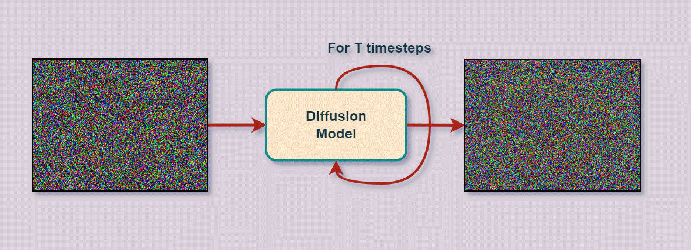
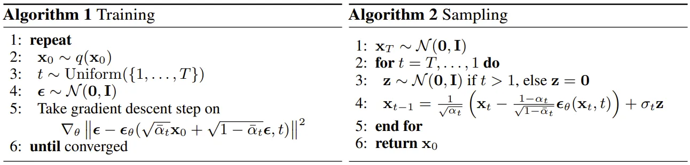
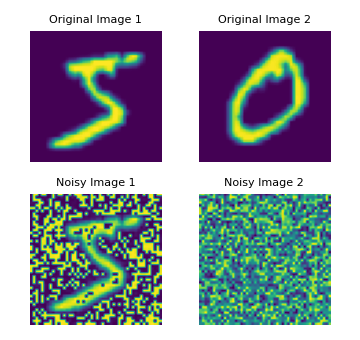
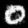
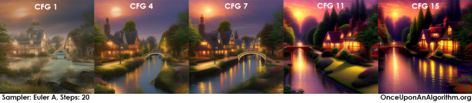

# Diffusion Model

Diffusion models are a class of generative models that have gained significant attention due to their ability to produce high-quality images. These models work by gradually transforming noise into a desired image through a series of steps. The core idea is to reverse a diffusion process that slowly adds noise to data, thereby generating data from noise.



Mathematically, diffusion models aim to capture the complex patterns within high-dimensional data. Instead of directly estimating the probability distribution of the data p(x) like traditional likelihood-based models, diffusion models focus on predicting the gradient of the log probability, also known as the **score function**:

$$
\nabla_x \log p(x)
$$

In python, it is like this:

```python
import torch

def score_function(x, model):
    """
    Computes the score function for a given data point x using a neural network model.
    Args:
        x (torch.Tensor): Input data point.
        model (torch.nn.Module): Neural network model trained to predict the score function.
    Returns:
        torch.Tensor: Score function evaluated at x.
    """
    x.requires_grad_(True)  # Enable gradient computation for x
    log_prob = model(x)    # Get log probability from the model
    score = torch.autograd.grad(log_prob.sum(), x)[0]  # Compute gradient w.r.t. x
    return score
```

This score function provides information about the direction in which the probability density increases most rapidly at a given point in the data space. By learning to predict the score function, diffusion models can generate new samples by iteratively refining a random noise input based on the predicted gradient information.

**How Diffusion Models Work (Simplified)**

- Forward Diffusion (Corrupting the Data): Begin with a piece of training data (e.g., an image of a cat). The diffusion model systematically adds small amounts of Gaussian noise to the image over many steps. Eventually, the original image becomes unrecognizable as pure noise.
- Reverse Diffusion (Learning to Clean): A neural network is trained to reverse this noise process. At each step, it's tasked with taking a slightly noisy image and trying to predict the original, less noisy image from the previous step.
- Generation: Once trained, the diffusion model can start with pure noise and run the reverse diffusion process repeatedly. This transforms the noise into a completely new sample similar to the data it was trained on (e.g., a new, unique image of a cat).


There are several types of diffusion models including Denoising Diffusion Probabilistic Models (DDPM), Denoising Diffusion Implicit Models (DDIM) and Latent Diffusion Models (LDM).

**DDPM** is a foundational type of diffusion model introduced by Jonathan Ho et al. in 2020. It uses a Markovian process to iteratively denoise a sample, starting from pure noise. It works by reversing a gradual noising process. The model is trained to predict the added noise at each step. It generates high-quality images, albeit with a relatively slow generation process due to the many steps involved.

**DDIM** is an extension of DDPM that introduces a non-Markovian forward process. This approach allows for fewer steps in the reverse process, speeding up generation while maintaining image quality. It provides a deterministic mapping from noise to data and reduces the number of steps required for generation, making it faster than DDPM.

**LDMs** are a variation of diffusion models that operate in a latent space rather than the pixel space. Because it applies the diffusion process in this compressed space and reconstructs high-resolution images from the latent space efficiently, this approach significantly reduces computational complexity and speeds up the generation process.

**Stable Diffusion** is a specific implementation of latent diffusion models developed by Stability AI. It's designed to be highly efficient and capable of generating high-resolution images quickly.

- **Versions**:
  - **SD v1**: The initial release, providing a solid foundation for stable and efficient image generation.
  - **SD v1.5**: An improved version with better stability and image quality.
  - **SD v2.1**: Further enhancements in image quality and generation speed.
  - **SD XL**: A version designed for even higher resolution and fidelity.
  - **SD 3**: The latest iteration with state-of-the-art improvements in stability, speed, and image quality.


Diffusion models, including DDPM, DDIM, and LDM, represent an exciting direction in generative modeling. They are particularly effective at generating high-quality images by reversing a noise process. Implementations like Stable Diffusion have brought these techniques into practical use, enabling the creation of impressive visuals with efficient computation.

## Denoising Diffusion Probabilistic Models (DDPM)

Denoising Diffusion Probabilistic Models (DDPM) are a type of generative model that have gained attention for their ability to generate high-quality images. DDPMs are built on the concept of diffusion, a process where data is gradually transformed into a simpler form by adding noise, and then reconstructed back by removing the noise.



### Model Training (Left Loop):

1. Loop over the epochs.
2. Sample a batch of images from the dataset.
3. For each image in the batch, sample a value of t uniformly.
4. Add noise to each image using a Gaussian Distribution with mean 0 and unit variance.
5. The model predicts the noise in each image at the given timestep t.
6. Compute the Mean Squared Error (MSE) loss between the sampled noise and the predicted noise for each image.

Instead of modeling the entire diffusion process as a single process, we can model each individual timestep separately. This approach speeds up training and likely results in a more stable training setting. By sampling the value of t uniformly for each training image, the model learns to handle all values of t while also learning the real image distribution.

### Image Generation/Sampling (Right Loop):

1. Sample noise from a Gaussian Distribution with mean 0 and unit variance. This represents the noisy image at time T.
2. Loop from time t = T to t = 1:
   - Sample new noise from a Gaussian Distribution to move the image to the previous timestep, t-1.
   - Using the trained model ε_θ, predict the noise at the current timestep. Remove this noise to move the image to the previous timestep t-1.
3. Repeat the loop until t = 1.
4. After completing all T iterations, a new image will be generated at timestep 0.

> [Code](vallina_ddpm_ddim/sampler/ddpm.py)



## Denoising Diffusion Implicit Models (DDIM)

DDIM is an extension and improvement of DDPM. DDIMs enhance the diffusion-based generative modeling framework by introducing a non-Markovian reverse diffusion process. This modification results in faster and higher-quality image generation while retaining the robustness of the training phase seen in DDPMs. By leveraging deterministic transformations during the reverse process, DDIMs provide an efficient and effective way to generate realistic images from noise.

### How DDIM Works?

#### Training Phase

There is no difference between DDPM (Denoising Diffusion Probabilistic Models) and DDIM (Denoising Diffusion Implicit Models) in the training stage. Both models are trained using the same objective: to predict the noise that was added to the original data.

#### Generation/Sampling Phase (Reverse Diffusion Process with DDIM)

The key difference between DDIM and DDPM lies in the reverse diffusion process. In the sampling process, DDPM focuses solely on predicting the noise at each timestep. It starts from pure noise and iteratively denoises it based on the predicted noise at each step, eventually arriving at the generated image. DDIM modifies the reverse diffusion to be **non-Markovian**, meaning that the generation process does not depend solely on the previous timestep but can incorporate a more flexible transformation. DDIM's sampling process, however, incorporates information about both **the predicted noise** and **the current state of the image at each timestep**. This allows DDIM to take more direct "steps" towards the final image, resulting in faster sampling. In other words, DDIM's sampling process can be seen as having a more "goal-oriented" approach compared to DDPM's more "noise-focused" approach. This allows it to generate high-quality samples in fewer steps.

1. **Initialize with Noise**: Start with noise sampled from a Gaussian Distribution with mean 0 and unit variance. This represents the noisy image at time T.
2. **Non-Markovian Reverse Process**:
   - Loop from time t = T to t = 1 with a more flexible step size.
   - Instead of using new noise for each timestep, DDIM uses a deterministic approach that transforms the noisy image at the current timestep to the previous timestep directly.
   - The transformation is guided by the trained model (denoted as ε_θ) to predict the noise and adjust the image accordingly.
3. **Repeat**: Continue this process until t = 1.
4. **Final Image**: After completing all T iterations, the final generated image at timestep 0 is obtained.

[Code](vallina_ddpm_ddim/sampler/ddim.py)

## Conditional Diffusion

A crucial aspect of image generation is conditioning the sampling process to manipulate the generated samples. Here, this is also referred to as conditional or guided diffusion.

### Sample Code

[Code](ddpm-pt-mnist-cond-unet/unet.py)

While this implementation doesn't explicitly follow the typical CFG procedure of performing two samplings, it still leverages conditional information directly within the generative process. This approach can be seen as a simplified or modified version of CFG, where the guidance is embedded into the model's architecture and training process.

[Model Checkpoint](https://drive.google.com/file/d/1EPAEqMTVnOacVbZsaJcj2zajaQ9N99Ju/view?usp=drive_link)

| Label | DDPM | DDIM |
|-------|------|------|
| 0     |  |  |


### Classifier Guidance

Classifier Guidance was introduced by [Dhariwal and Nichol in 2021](https://paperswithcode.com/method/classifier-guidance) as a method to improve the quality of samples generated by diffusion models.

### How Classifier Guidance Works

#### Training Phase

During the training phase, classifier guidance doesn't require special training steps. The focus is on training a separate classifier in addition to the diffusion model. The classifier is trained to classify generated images and provide gradient information for guiding the generation process.

```python
# Define a simple UNet model for the diffusion process
class UNet(nn.Module):
    def __init__(self):
        super(UNet, self).__init__()
        # Define your UNet architecture here
    def forward(self, x, t):
        # Implement the forward pass
        pass
# Define a simple classifier model
class Classifier(nn.Module):
    def __init__(self):
        super(Classifier, self).__init__()
        # Define your classifier architecture here
    def forward(self, x):
        # Implement the forward pass
        pass
# Initialize models
diffusion_model = UNet()
classifier = Classifier()
# Define optimizers
diffusion_optimizer = optim.Adam(diffusion_model.parameters(), lr=1e-4)
classifier_optimizer = optim.Adam(classifier.parameters(), lr=1e-4)
# Training loop
for epoch in range(num_epochs):
    for batch in dataloader:
        images, labels = batch
        # Training the diffusion model
        diffusion_optimizer.zero_grad()
        noise = torch.randn_like(images)
        t = torch.randint(0, T, (images.size(0),)).to(images.device)
        noised_images = add_noise(images, noise, t)
        predicted_noise = diffusion_model(noised_images, t)
        loss = nn.MSELoss()(predicted_noise, noise)
        loss.backward()
        diffusion_optimizer.step()
        # Training the classifier
        classifier_optimizer.zero_grad()
        outputs = classifier(images)
        classification_loss = nn.CrossEntropyLoss()(outputs, labels)
        classification_loss.backward()
        classifier_optimizer.step()
```

#### Generation Phase

In the generation phase, classifier guidance operates through the following steps:

1. **Initialize Noise**: Sample noise from a Gaussian distribution to represent the initial noisy image.
2. **Reverse Diffusion Process**: Begin from the maximum timestep (T) and progressively denoise the image until timestep 1. At each timestep, the diffusion model predicts a denoised version of the image based on the current noisy image.
3. **Classifier Guidance Adjustment**:
   - Use the pre-trained classifier to classify the current denoised image and compute the classification loss.
   - Adjust the diffusion model's denoising prediction based on the gradient of the classification loss. Specifically, the classifier's gradients guide the diffusion model to generate images that conform to the desired class.
4. **Generate Sample**: Repeat these steps until reaching timestep 1, resulting in the final generated sample.

```python
def generate_sample_with_classifier_guidance(diffusion_model, classifier, condition, noise, alpha=0.5):
    x = noise
    for t in reversed(range(1, T + 1)):
        # Diffusion model predicts noise
        pred_noise = diffusion_model(x, t)
        # Use classifier to calculate gradients
        x_denoised = x - pred_noise
        x_denoised.requires_grad_(True)
        logits = classifier(x_denoised)
        classification_loss = nn.CrossEntropyLoss()(logits, condition)
        grad = torch.autograd.grad(classification_loss, x_denoised)[0]
        # Adjust the prediction with classifier guidance
        x = x - alpha * grad + pred_noise.detach()
    return x
# Sampling example
condition = ...  # e.g., target class labels
noise = torch.randn((batch_size, num_channels, height, width)).to(device)  # Gaussian noise
samples = generate_sample_with_classifier_guidance(diffusion_model, classifier, condition, noise)
```

This method leverages the gradient information from the classifier to generate higher-quality samples that align with the desired class, but it also introduces additional computational overhead, especially during the generation phase, due to the need for gradient computation at each step.

### Pros and Cons of Classifier Guidance

**Pros**:
- **High-Quality Samples**: Utilizing the classifier's gradient information helps generate samples that are more aligned with the desired conditions, leading to higher quality.
- **Explicit Control**: The classifier's loss function provides explicit control over the generation process, ensuring the generated samples meet the desired criteria.

**Cons**:
- **Training Complexity**: An additional classifier needs to be trained, and gradient computations during the generation phase add complexity and computational overhead.
- **Slower Generation**: The need to compute gradients from the classifier at each step significantly slows down the generation process.

### Classifier-Free Guidance (CFG)

Classifier-Free Guidance (CFG) is a commonly used technique in generative models, especially diffusion models, to improve the quality and diversity of generated samples. Unlike classifier guidance, CFG does not rely on an auxiliary classifier to guide the generation process. Instead, it directly applies techniques within the generative model during training and sampling to achieve this goal.

### Basic Principles of CFG

#### 1. Training Phase

In the training phase, the model learns to extract features from the data distribution. To implement classifier-free guidance, the training process can include two modes:

- **Conditional Mode**: The model generates samples based on certain conditional information, such as labels or textual descriptions. In this mode, the model learns not only the distribution of the data itself but also the relationship between the conditional information and the data.
  
- **Unconditional Mode**: The model generates samples without relying on any conditional information, learning only the distribution of the data itself.

#### 2. Sampling Phase

In the sampling phase, CFG guides the generation of samples by mixing conditional and unconditional predictions. This process typically involves the following steps:

1. **Unconditional Prediction**: The generative model produces an unconditional prediction without any conditional information.
2. **Conditional Prediction**: The generative model produces a prediction based on given conditional information (e.g., labels or descriptions).
3. **Guided Sampling**: The final sample is generated by combining the unconditional and conditional predictions. This is usually done using a weighted average or other blending strategies, as follows:

   \[
   \text{CFG}_\text{output} = (1 - w) \times \text{Unconditional Prediction} + w \times \text{Conditional Prediction}
   \]

   where \( w \) is a weight parameter that controls the mix between the unconditional and conditional predictions.

```python
def generate_sample(model, condition, noise, cfg_weight=0.5):
    # Unconditional prediction
    unconditional_pred = model(noise, condition=None)
    # Conditional prediction
    conditional_pred = model(noise, condition=condition)
    # Combine the two predictions
    final_pred = (1 - cfg_weight) * unconditional_pred + cfg_weight * conditional_pred
    return final_pred

# Sampling example
condition = ...  # e.g., label embedding
noise = ...  # Gaussian noise
sample = generate_sample(model, condition, noise)
```

### Advantages of CFG

1. **Improved Quality**: By guiding the model with conditional information, CFG helps generate samples that better align with the given conditions, thereby improving the quality of the generated samples.
2. **Enhanced Diversity**: Combining conditional and unconditional predictions helps maintain the diversity of the samples while ensuring their authenticity.
3. **Reduced Dependency on Classifiers**: CFG does not require training a separate classifier to guide the generation process, simplifying model training and application.

### Summary

Classifier-Free Guidance (CFG) is an effective technique for guiding generative models by combining conditional and unconditional predictions during the generation process. This approach improves the quality and diversity of generated samples while simplifying the training and application of the models. CFG has been widely applied in diffusion models and other generative models, demonstrating its strong potential in generative tasks.

> CFG is primarily a sampling technique. You don't change the loss function or the training objective itself. The modifications are solely in how you pass class embeddings and interpret the model's output.

Simply put, the CFG scale (classifier-free guidance scale) or guidance scale is a parameter that controls how much the image generation process follows the text prompt. The higher the value, the more the image sticks to a given text input. But this does not mean that the value should always be set to maximum, as more guidance means less diversity and quality.




- https://blog.easydiffusion.online/the-cfg-scale-in-stable-diffusion/

一文解释 Diffusion Model (一) DDPM 理论推导

- https://zhuanlan.zhihu.com/p/565901160
- https://zhuanlan.zhihu.com/p/589106222 (https://zhuanlan.zhihu.com/p/594007789)
- https://fanpu.io/blog/2023/score-based-diffusion-models/

